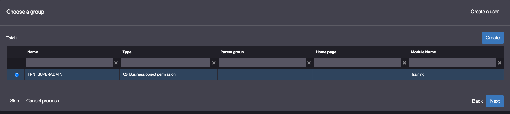
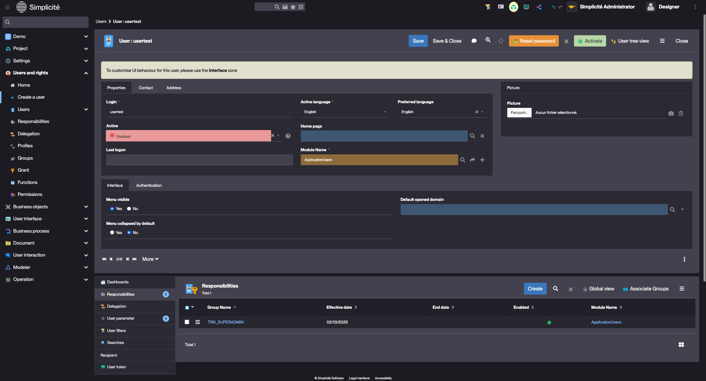
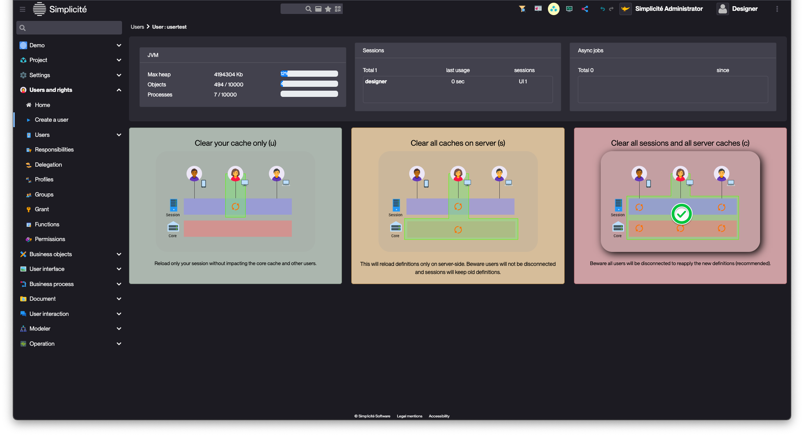
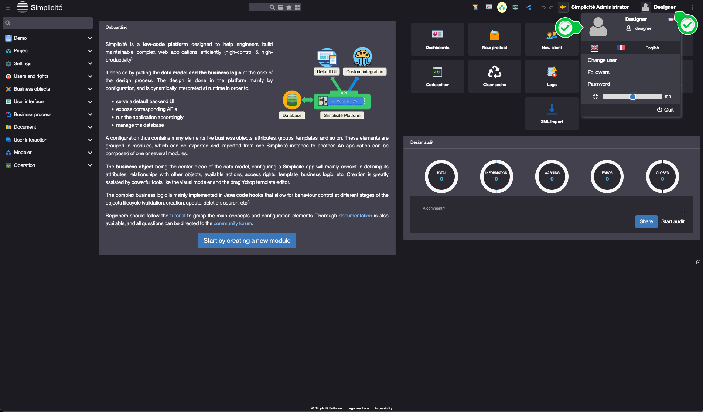

# Building the "Order Management" Training App : Creating a User

> Prerequisite : [A Business object with a field must be created before starting this tutorial](/tutorial/getting-started/object)

## What is a User ?

Users belong to Groups, and each user-group relationship is defined by a Responsibility. Groups are granted to Business object CRUD functions, in turn granting a User to a Business Object... [Learn more](/make/usersrights/users)

## Creating a User

To create a test user, follow the steps below :

1. Click **Create a user** in Users and rights and fill in the User information like so :
    - Login : **usertest**
    
3. Click **Next**
4. Choose a [previously](/tutorial/getting-started/module) created Group :
    - **TRN_SUPER_ADMIN** *if exists, this should be selected by default*
    
5. Click **Next**
6. Create a Responsibility, click **Next**
    
    > For more information about Domains, see the [Responsibility](/make/usersrights/responsibilities) section.
7. Choose a new group :
    - For now, select **no**
8. Click **Next**

:::tip[Success]
The <b>usertest</b> User is created and opened
    
:::

## Activating and testing the User

To connect to the application with **usertest**, follow the steps below :

1. Click 
2. Click 
    - Click **Yes**
    - Copy the password displayed in the popup
    - Click **Ok**
3. Empty the platform's cache :
    - Via the header menu :
        - Click on the menu in the top-right corner, click **Clear cache**
        
        - Click **Clear all sessions and all server caches**
        
    - Via the keyboard shortcut : [ <kbd>Alt</kbd>+<kbd>C</kbd>+<kbd>C</kbd> ]
    <!-- > For more information about the cache, see the [Platform cache](/docs/core/objects/platform-cache) section.  -->

4. Log-in using **usertest** :
    - Login : **usertest**
    - Password : *previously reset password*
5. Click **Connection**
6. Create a new password
7. Click **Save**

You should now be connected with **usertest**

:::tip[Success]
<b>Expected result :</b>

- A Menu entry is visible
- The list of Suppliers is displayed when the menu is clicked

    
:::

:::info[Log back in with `designer`]
- Click the username in the top-right of the platform

- Click **Quit**

:::

## Adding `designer` to TRN_SUPERADMIN {#designer-superadmin}

Before moving on, and to make testing / configuration easier, we will add the `designer` (*or the user used to design the application*) user to the **TRN_SUPERADMIN** Group.

To do so, follow the steps below :

1. Click on **Designer** in the top right corner of the App, and open the **Designer** user
    
    > You can also access the user's form via the **Users and rights > Users > Show all** menu
2. In the **Responsibilities** list linked to the User, click **Associate Groups**
    
3. Select **TRN_SUPERADMIN** and click **Apply the selection**
    
4. On the **Create Responsibility** pop-up, click **Save & Close**
5. Empty the platform's cache :
    - Via the header menu :
        - Click on the menu in the top-right corner, click **Clear cache**
        
        - Click **Clear all sessions and all server caches**
        
    - Via the keyboard shortcut : [ <kbd>Alt</kbd>+<kbd>C</kbd>+<kbd>C</kbd> ]
6. Log back in using `designer` (*or the user used to design the application*)

:::tip[Success]
  <b>Expected result :</b>

- "My App" Menu is visible
- The list of Suppliers is displayed when the menu is clicked

    
:::

***

## Troubleshooting
> These steps must be done using the **designer** user with **no active module filter**, see [Module filter](/make/project/module#module-filtering-and-default-module)

"Authentication error" when logging in, check that :

    - **usertest** is active
    - password is reset

No menu is displayed when logged in, check that :

- The the Domain exist, contains **TrnSupplier** and is granted to **TRN_SUPERADMIN** :

    - In **Business objects > Domains**
    - Open **TrnDomain** :
        - The Domain is granted to **TRN_SUPERADMIN** :
            - In the **Permissions** tab, there should **TRN_SUPERADMIN**
                > If not, create it
        - The Domain contains the **TrnSupplier** Business object :
            - In the **Main menu** tab, there should be **TrnSupplier**
                > If not, create it

        

- **TrnSupplier** has a CRUD Function, and is granted to **TRN_SUPERADMIN**
    - In **Business objects > Business objects**
    - Open **TrnSupplier** :
        - In the **Functions** panel linked to the Object :
            - There should be a **Read, create, update and delete** Function (TRN_SUP_CRUD)
                > If not, create it

            

            - Open the **TRN_SUP_CRUD** Function :
                - In the **Grant** panel linked to the Function :
                    - There should be the **TRN_SUPERADMIN** Group
                        > If not, create it

            

- **usertest** has the **TRN_SUPERADMIN** Responsibility :
    - In **Users and rights > Users > Show all**
    - Open **usertest** :
        - In the **Responsibilities** panel linked to the user :
            - There should be **TRN_SUPERADMIN**
                > If not, create it

        