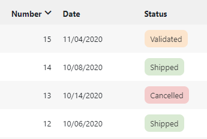

Version 5.1.x release note
==========================

:::danger[Warning]

This legacy minor version of major version 5 is **not maintained anymore**.

Make sure you upgrade to the current minor version of major version 5 (especially if you plan to upgrade to major version 6).

:::

Compatibility breaking changes
------------------------------

### Log4j

Due to dependencies requirements the **Log4j** component has been upgraded from version 1 to version 2.

This change has nearly no impact on default logs produced by the platform
and does not change anything on its application logger class (`AppLog`).

But if you have customized your `log4j.xml` configuration (for version 1) file
you **must** migrate these customization to the `log4j2.xml` (for version 2) which uses a different XML syntax.

> **Note**: Log4J 2 has suffered from some critical vulnerabilities. Patched Log4J libs have been (and will always be)
> upgraded **as soon as** they have been released by the Apache Software Foundation. See bellow.

### Bootstrap

**Bootstrap v4** has been added since major Simplicité version 5.0 to **replace** Bootstrap v3 which was used in previous major Simplicité version 4.0.

This minor Simplicité version 5.1 still have the 2 versions of Bootstrap but the **v3** will not be supported anymore.

Bootstrap v3 will definitely be removed in next minor Simplicité version 5.2.

### Unit tests

The `unitTests` method signatures for shared code and platform hooks have been aligned,
if you have implemented such methods you must refactor them.

Core changes
------------

- Upgraded third party libs
- Removed legacy Grant cache
- `postSave`, `postCreate` and `postUpdate` can return a `javascript` or a `redirect` statement.
- State transition and related Action can return a `javascript` or a `redirect` statement.
- Supports referenced object on Action fields
- Token calls from server now passes client ID and secret as HTTP basic auth header
- Precision min/max on number field (integer, float and big decimal) is checked during validation
- `Grant.getDBToday()` to get the current DB date syntax (without time: `today` on hsql, `curdate()` on mysql, `current_date` on postgresql...)
- Object indexation:
  - bulk indexation: faster processing using paginated searches instead of each record selection
  - single object: now object action `Rebuild indexes` force its fulltext re-indexation
  - new logs to control progression and durations
- Optim fulltext search on PostgreSQL
- Full redolog to store all changes from UI and cascading updates by code
- Added the `customStartPage` platform hook to implement a custom page for `/`
- Refactored Scripted entities to use the new `ScriptAgent`
- New system parameter `EXPORT_MAX_ROWS` to limit export (to CSV, Excel and PDF), the parameter can be set at object level (postLoad)
- Added core directories checksum verification at startup
- Added new business object hooks: `preCount`, `preCrosstabSearch` and `postCrosstabSearch`,
  for backward compatibility these hooks calls `pre/postSearch` by default
- The module's models images are now inlined in the Markdown documentation
- Added `Tool.getWeekOfYear` with locale
- Added Keycloak&reg; tools
- Added new get methods on `BusinessObjectTool`
- Added `Tool.getWeekOfYear` and `Tool.getDayOfWeek` with locale
- Added object hook `boolean canPreview(field, doc)` and platform hook `boolean canPreviewDocument(grant, doc)`
- Added `Tool.shiftTime` tool method to shift time fields (by seconds)
- Added support for calculated fields on pivot tables
- Prevented adding custom code on core system objects, external objects and workflows
- Notepads auto-upgrade to JSON format when rendering becomes `Users activities`
- Removed insecure (and useless) `X-Simplicite-SessionID` HTTP header
- UI persistent user token cookies are now HTTP-only and secure
- Added `Tool.join` and `Tool.split` methods
- Refactored legacy user's prefs on edit-list
- Allows stamps into DocuSign signatures
- Added flexibility on `EncryptionTool`
- Changed the name of the exported module info file from `package.json` to `module-info.json`
  (the old naming `package.json` is still taken into account as a backward compatibility fallback)
- The resources are now excluded from the JAR built from the module's `pom.xml` in an IDE
- Added `if="null"` keyword on XML fields
- It is now possible to pass a dedicated I/O and Git password for the privileged user (`designer`)
  using the `io.password` JVM argument or the `IO_PASSWORD` environment variable (the legacy `EAI designer` system parameter can also still be used).
- When cloning/creating modules' Git repositories the `core.crlf` is now forced to `true`
- Maven repository is now in "snapshot" mode for all the branches (the Maven version is now `x.y-SNAPSHOT`)
- Added a CSRF token logic on forms
- Backported module configuration capabilities for **custom** Maven settings and Sonar setting
- Changed JSR223 Rhino engine (for compliance with JVM 16)
- Keycloak `setUserByLogon` without API calls
- Backported a new adapter helper using Apache commons CSV lib: `ApacheCommonsCSVAdapter`
- Redolog in API REST access
- Added `[URL]` substitution pattern for publication templates and alert contents
- Added cloud storage overrides properties configuration capabilities
- Added JWT token validation to `AuthTool`
- Simple sort and filter on object `UserSession` (current sessions in memory)
- `CloudStorageTool` using file stream (put with a path and openStream)
- Added local-only module's Git branch create/checkout
- Backported font type for resources
- `BusinessObjectTool` with redolog parameter
- Pivot table export to CSV and Excel with rows+cols totals
- Added Luhn algorithm check helper method in `Tool`

UI changes
----------

- Social post: supports markdown syntax + @LOGIN mention to send alert `SocialPostMention`
- Show filter badge with user-key label on foreign-key filter
- Supports `inlined fields` rendering on link:
  - in case of optional link (0,1): a switch button allows to create or remove the linked object
  - in case of mandatory link (1,1): the area is always displayed
  - Sample: the main address of supplier through (0,1) link with the `inline fields` property

- Datamap completion: search in the mapped object instead of the source column
- Completion spinner during server search
- New rendering on long-text with **characters counter**

- Menu with direct access to list per simple enum code (not only status)

- Long text with **`Markdown`** rendering:
  - Display the compiled HTML on form
  - Use `widget.editMarkdown` to open a dialog with ACE editor with a preview area:

- Added a close button on top of docked search form
- Added error messages on create through a link pillbox
- Added the `data-field` attribute on table `<td>` to simplify CSS customization per field
- Apply the linkmap rules with filters:
  - on the foreign-key completion (using the new index search with filters)
  - on the association picker (through N,N)

- Supports svg + png + gif + jpg in **ICONS** set of Theme and **IMAGES** set of resources
- All static PNG icons and images has been replaced by SVG images (PNG files are still packaged but will be removed in V5.2)
- `system` and `color` sets contain only SVG images
- Other static sets `black`, `grey` and `purple` of PNG images has been removed from the icons picker.
  It is recommended to use only the font-awesome for mono-chrome images/icons.

- Display colored enum as **tag on list**

- Search by date on list: date picker and reset button launch a new search
- Added title & addon resources for auth pages:
  - `LOGON_PROVIDERS_TITLE` and `LOGON_PROVIDERS_ADDON` for the auth providers selection page
  - `LOGON_TITLE` (and still the existing `LOGON_ADDON`) for the internal auth provider's logon page
- Added fetch on diagram container
- Improved print styles
- The template editor now uses the syntax convention for the foreign key naming proposals
- Status colors are used in metrics dashboard

- User min rows / max rows are now optional
- The screenflow road has been refactored as a steps-timeline on desktop device:

- Theme supports Google fonts with italic and weight, ex: `Roboto:ital,wght@0,400;0,700;1,400;1,700`

- Specify the Y axis of values on pivot table (left or right)

- New flags on object definition:
  - Fields sortable:
    - allows ordering on UI column (default true)
    - with accessors `setSortableOnList` and `isSortableOnList`
    - all blob fields (html, grid rendering, notepad...) are forced to false by the runtime
  - Areas visible on list:
    - allows to show/hide areas on list header (default visible)
    - with accessors `setAreaVisibleOnList` and `isAreaVisibleOnList`

- Added a `Create` button on `select` activity
- `$ui.openURL` force now the `rel=opener` to set the window.opener (Chrome 88 has changed to `noopener` by default)
- Export list to ZIP: xlsx and joined documents
- Crosstab chart on TEXT columns
- Search lookup on all referenced sub-objects

- New display option in form template:
  - inline the field help in from: `
`
  - insert field help after the label+input: `
`
  - new CSS class `.field-help`

Fixes
-----

- Removed false-positive errors on sequence creation on PostgreSQL
- Changed JWT token decoding (the previous claims parsing is now done as fallback in JWT token's payload decoding)
- Robustness fix on PostgreSQL sequences
- Increased robustness on `PlatformHooks.parseAuth` calls
- Limited associate on panel to current foreign keys
- HTML escape on log viewer
- Fixed potential infinite loop in `setRootField`
- Create exception in logs
- Added missing partial clear cache on print templates and pivot tables
- Disabled constraints on template editor
- Removed UI popup in case of error on getting news
- Fixed download issues for file names with unusual characters (e.g. `,`)
- Removed, for security reasons, commented stacktrace from the legacy low-level error pages
- Fixed a minor XSS vulnerability on the download/preview file popup's title
- Fixed configuration audit warnings on news objects
- Fixed upsert list on resize
- Grant cache cleaning robustness
- Fixed module import from Git repository in "exploded" mode
- Fixed module diff in "exploded" mode or not
- Fixed websocket concurrent access
- Fixed generic OpenIDConnect logout management
- Docusign fixes
- Fix on metrics dashboard
- Fixed `ObjectCore.toHTML()`
- Fix on module exports: the `package.json` file is not considered as a conditional artifact anymore
  and the `.gitignore` file is now generated only once at the repository creation
- Added missing icons
- Fixed column size for `lov_code`
- Help on _Import XML_ page
- Fixed title padding on diagrams
- Fixed module's Git repository deletion when deleting module
- Added `Tool` methods for date manipulation
- Fixed filter on modeler for non string fields
- Fixed KeyCloak logout
- Fixed issue on importing a module with `MDDocument` or `MDImage` items
- Fixed pagination in some cases (e.g; in REST-mapped APIs)
- Updated `Markdown` optional module
- Aligned default working dir locations variables vs corresponding system parameters
- Robustness fix on `ExcelTool`
- Substituted dots in exports' filenames
- Fixed pivot table charts' legend
- Fixed a minor XSS vulnerability in the object export popup
- Fixed a minor SQL injection vulnerability on the document servlet
- Custom error pages for all HTTP codes
- Fixed KeyCloak language default
- Fixed enum multiple filter
- Fixed take picture feature for BS4
- Fixed optional language patches application for secondary system patches
- Fixed "group-by" list when select row is false
- Fixed HTML/markdown module documentation type
- Fixed Gson classes shaded duplicates by upgrading Jclouds libs
- Fixed front constraints pseudo-resource's MIME type
- Fixed disabled buttons on screen resize
- Fixed compatibility with `obo_srh_predef` values in old exports
- Oracle driver workaround: forced `TYPE_SCROLL_INSENSITIVE` in queries
- Fixed opened by default domain on menu
- Fixed compatibility with `obo_historic` values in old module exports
- Fixed create state from diagram
- Fixed big number validation
- Fixed list display when pagination=no
- Inhibited "class not found" warning during loading process
- Core cache loading optimization for HSQLDB
- Changed `Mail` SMTP authentication
- Simple XML file import not stopped upon error
- Performance fix on date picker
- Fixed empty MIME types list = all MIME types allowed for multiple document fields
- Robustness fix on object locking action
- Increased robustness for thumbnail generation for unhandled images types (e.g. TIFF)
- Added reflexive links recycling for experimental "exploded mode" modules imports
- Uniformed CR/LF to LF in XML/JSON exports + added `.gitattribute` in module's Git exports
- Fixed full input substitution in SQL
- Fixed checkbox on search on multiple enumeration field
- Added info on Docker image in `/health`
- Robustness fix on search spec preprocessing
- Fixed adding class to object not taken into account before a full clear cache

Post-release
------------

### 5.1.0 (2021-09-01) - initial release

See above

### 5.1.1 (2021-09-08)

- Added defautl value on `utk_creationdate` (useful when using 3rd party authentication tokens on the API endpoint)
- Backported minimalistic and **experimental** 2FA feature (triggered by the system/user parameter `USE_MFA` = `yes`)
  using email by default but overridable using the `initMFA` and `checkMFA` platform hooks
- Backported compile all action
- Backported enum fields in timesheets

### 5.1.2 (2021-09-14)

- Backported inclusion of a a TOTP Java library and associated tool methods to ease custom MFA implementations
  **Warning**: in next minor version 5.2 the MFA configuration and implementation have been refactored to be
  simply configurable at user level, including for TOTP (see the [minor version 5.2 release note](v5-2.md) for details)
  Custom implementations done in minor version 5.1 _will_ need refactoring in minor version 5.2.
- Fixed list export when object has several pillbox N-N links
- Fixed `getTargetObject`hook in case of copy
- Backported the new `customAlert` business object hook and media type for custom notification implementation for BPM alerts

### 5.1.3 (2021-09-23)

- The force change password flag is now checked for I/O access, preventing using default `designer`'s password on this endpoint
- Fixed multiple pillboxes context
- Improved robustness on remote Simplicité objects vs multiple leading slashes in URI
- Backported code formatter feature in the code editor
- Backported import modules at startup using import specification
- Fixed token expiry for remote Simplicite objects

### 5.1.4 (2021-09-29)

- Tools backports
- No system protection on disposition resources update (`STYLES`, `SCRIPT`, `ABOUT`, `FOOTER`, ...)
- Fixed search for export

### 5.1.5 (2021-10-01)

- Fixed errors on edit list with group-by
- Avoid creation on list with N,N pillbox
- Fixed granted pivot table with several groups
- Backported shared unit tests callable from I/O
- Backported improvements on import modules at startup or from I/O (Note: changed import specification syntax from array to object)

### 5.1.6 (2021-10-06)

- Backported encrypted passwords allowed for I/O password passed as JVM argument or environment variable
- Fixed required default module during registration
- Backported change default module's import directory location outside of DBDoc

### 5.1.7 (2021-10-11)

- Added XML resource type
- Backported: using an older webapp on an upgraded database is now causing a **FATAL** error that prevents platform
  to start up (this is to avoid unexpected side effects in this non supported case)
- Backported `beforesave` object UI hook
- Fixed `ScriptInterpreter is not defined` issue

### 5.1.8 (2021-10-15)

- Fixed areas colspan in sticky-header
- Fixed older platform check that was erroneous in some cases
- Fixed one syntaxically incorrect MySQL statement in upgrade database patch

### 5.1.9 (2021-10-19)

- Added use of `metadata.create|del` in `displayReferencePillbox`
- Fixed setValues in case of group-by
- Added UI support of `field.ui.updatable` on foreign-key

### 5.1.10 (2021-10-21)

- More/less on lists' columns without animation
- Fixed workflow pagination bar
- Fixed CSS on multiple document fields
- Added empty default transition name
- Fixed create initial values for links on diagrams when direct creation is not possible

### 5.1.11 (2021-10-28)

- Fixed state-model screenflow with responsive table
- Added parent context of pillbox on edit list
- Fixed `getNextIdFromDB` with external MySQL datasource
- Added accents conversion for field logical and physical name proposals in the template editor
- Fixed `importSAX`
- Backported non execution of platform hooks for `system` user
- Backported UI preferences `ZOOM` factor and `COMPACT` mode per scope
- Upgraded **HSQLDB** lib from 2.5.1 to 2.5.2
  (**ZZZ** downgrading to previous revision - which is not recommended anyway - may not be possible for HSQLDB instances **ZZZ**)

### 5.1.12 (2021-11-08)

- Backported flexibility on naming of the URL token parameter
- Ignored cross-domain error in `$ui.getTop`
- Fixed validate during a reset of required document
- Fixed errors on list upsert

### 5.1.13 (2021-11-22)

- Removed Google API key (and associated URLs) by default on public pages
- Backported **Timesheets** with a state models per line to lock the data when inputs are validated
- Fixed form navigation within panel records
- Fixed inherited clone object
- Fixed multi-modal Y-scroll
- Fixed template editor auto-scroll
- Restore object context on unload of template editor
- Backported `USE_API_TESTER` system parameter to enable/disable the API tester page
- Backported `USE_HEALTH` system parameter to enable/disable the health check page/service
- Fixed not deleted token on logout from NPM lib
- Fixed `PredefinedSearch.apply` for ENUM with multiple codes
- Changed: display logon addon event if there is only one provider enabled

### 5.1.14 (2021-11-30)

- Added `netty-handler-proxy` and `netty-codec-socks` libs
- Preserve a shared session within multiple browser tabs
- Apply linked lists to referenced enum fields
- Auto-save parent form during a save of panel edit list
- Menu "show all" remove all enum filters
- Fixed `initRefSelect` and `initDatamapSelect` parent context on edit-list
- Fixed export POI with reflexive links with same objects
- Backported import dataset at startup after importing modules

### 5.1.15 (2021-12-08)

- Changed `pom.xml` content with explicit module's parent Maven project name setting
- Added auto-save on parent form when cancelling edit-list
- Fixed `Grant.reinit` to preserve AUTH context
- Fixed `@<username>` completion on social posts
- Fixed XSS vulnerability on deep links

### 5.1.16 (2021-12-11)

- Updated **Log4J2** libs (to version 2.15.0) impacted by a critical security vulnerability alert
  (see [this CVE alert](https://cve.mitre.org/cgi-bin/cvename.cgi?name=CVE-2021-44228))
- Backported `USE_MAVEN` system parameter to enable/disable the Maven repository exposed by the instance
- POST calls on health check page now returns JSON format by default (no change on GET calls)
- Backported `platform.godmode=true|false` JVM arg to globally enable/disable the god mode feature
  (which still requires to be individually granted using the `GOD_MODE_USER` system parameter)
- Backported refactoring of platform hooks methods `preAuth` and `postAuth` to allow returning an explicit error message

### 5.1.17 (2021-12-14)

- Updated **Log4J2** (to version 2.16.0) libs
- Fixed list display of URL fields using expressions

### 5.1.18 (2021-12-19)

- Fixed multiple documents export in the "Archive" format
- Simplified transposition of `URI_MAPPINGS` to the API valve's matching patterns
- Fixed UI to hide the download button when a doc has been rejected during save
- Added number of Tomcat level active sessions in the health check
- Fixed non-thread safe issue on mapped REST services

### 5.1.19 (2021-12-20)

- Updated **Log4J2** (to version 2.17.0) libs
- Added new attributes to the platform's JMX (MBean) services

### 5.1.20 (2021-12-21)

- Fixed partial clear cache on overridden system params using `sys_value2`
- Improved external objects pooling on the API endpoint
- Fixed template editor for regexp type fields
- Fixed bread-crumb and form title with very long user-key label

### 5.1.21 (2021-12-23)

- Fixed template editor unload
- Fixed character counter in "compact" mode
- Fixed regression from revision 5.1.20 on `ObjectCore.getParentIdx`
- Improved API valve on extra patterns (e.g. ignore duplicates)

### 5.1.22 (2021-12-30)

- Updated **Log4J2** (to version 2.17.1) libs
- Backported ping service can be called even if `USE_HEALTH` is set to `no`

### 5.1.23 (2022-01-08)

- Fixed ThemeDefault sticky header background
- Added `.tox-tinymce` min-width on edit-list
- Fixed backward compatibility on outdated legacy OAuth2 provider configurations
- Fixed validation of DATETIME field with rendering to year/month/day
- Fixed `$ui.backgroundMessages` loosing labels
- Increased robustness on SAML relay state parsing

### 5.1.24 (2022-01-16)

- Changed SAML relay state format
- Improved API cache flushing at logout

### 5.1.25 (2022-01-20)

- Backported `ObjectField.addValue` and `ObjectField.removeValue`
- Fixed init/destroy fields of inlined 0,1 link
- Backported place map refactoring (API + UI)
- Fixed `ENUM_MULTI` type field' `hasChanged` without old value

### 5.1.26 (2022-01-22)

- Silent exception if no compiler (case of plain JRE deployments with precompiled module's code as JAR shared code)

### 5.1.27 (2022-01-29)

- Fixed import XML to support reset of optional FK
- Backported: support `usr_login` with simple quote
- Backported: support for list pagination in activity workflows
- Backported: improved `CloudStorage.list` method (added max results argument in variant + created date in results)
- Inhibited I/O notifications if I/O endpoint is disabled

### 5.1.28 (2022-02-04)

- Fixed: Uniformized auth token duration in all cases
- Backported: improved auth token refresh for remote Simplicité services objects

### 5.1.29 (2022-02-12)

- Backported new business object hook `isExportAllowed` to allow/prevent exporting based on custom business rules
- Reinforced redirect URI checking for OAuth2/OpenIdConnect authentication
- Fixed delete cascade with positive cardinality

### 5.1.30 (2022-02-23)

- Robustness fix: prevent references loop in object loader
- Added JFIF image format support
- Backported: required global variables for using the NPM JS lib from within de generic web UI
- Backported: added an `init` hook on `ResponsiveExternalObject`
- Improved legacy password checking on the API endpoint when calling services with basic auth credentials.
  Note that this credential passing mode is deprecated as of next minor version 5.2
  (see [the release note](v5-2#compatibility-breaking-changes) for details)

### 5.1.31 (2022-02-28)

- Fixed code update on module Git push
- Added control during edit list cancellation with changes
- Backported: exportable flag methods on fields
- UI styles fixes/improvements

### 5.1.32 (2022-03-03)

- Updated **Log4J2** (to version 2.17.2) libs
- Additional debug/error/warning messages to help identifying auth provider's configuration issues
- Backported JWT token validation on the API endpoint

### 5.1.33 (2022-03-04)

- Fixed: avoid user picture deletion on synced external auth without user picture
- Additional debug/error messages to help identifying auth provider's configuration issues
- Fixed: uniformized token expiry date checking to avoid comparing ms and s in some particular cases

### 5.1.34 (2022-03-09)

- Backported: configurable JWT tokens' issuer using the `USERTOKENS_ISSUER` system parameter
- Backported: use a single initial (last name) to replace the empty avatar picture
- Backported: create button and search capability on the agenda
- Backported: styles class names hook for the agenda
- Fixed: avoid reset of token expiry date when calling a grant reinit

### 5.1.35 (2022-03-19)

- Added AWS encryption 3rd party lib
- Fixed resource and theme styles compilation/minification (Note that this is related to a more general
  improvement that allows accessing the content of the business object's uploaded document before saving the record)
- `DocumentDB.getBytes(true)` improvement during import XML/ZIP with documents
- Fixed: inlined link 0,1 now displays singular label
- Fixed XML import using `<oldobject>` tag
- Backported the new `Tool.toPlainText` method to clean HTML content and decode HTML entities (used in exports)
- Apply constraints on inlined 0,1 link in form
- Associate popup: highlight existing links (no more pre-selection)

### 5.1.36 (2022-03-25)

- Backported: `AppLog` now logs as system grant when passed grant is not yet loaded
- Display contextual message on UI from `iniList` using legacy `getContext().addMessage`
- Improved right checking on log viewer data service
- Added `ignore` keywork on OAuth2/OpenIDConnect user info language mapping to ignore language from user sync
- Improved `DocumentParser` helper class (Tika wrapper) to allow explicit write limit.

### 5.1.37 (2022-04-05)

- Backported: added Java documentation plugin in the generated module's `pom.xml`
- Backported: changed JGit SSH implementation from JSch to Apache Mina

### 5.1.38 (2022-04-09)

- Fixed unauthorized object after update (message + redirect to list)
- Fixed export POI Excel of pivot table with textual content
- Removed the AWS encryption wrapper lib (this lib is useless without the full AWS SDK which is not included in the platform)
- Updated BountyCastle encryption libs
- Fixed export ZIP without document
- Fixed missing context URL in the grant APIs
- Changed error to warning in case of changes in the lib dir (e.g. adding libs can be legitimate)

### 5.1.39 (2022-04-14)

- Reset confirm fields before `initAction`
- Improved application server type and version automatic detection (for Tomcat and Jetty)
- Fixed constraint based on `[STATUS]` on list when status field is hidden

### 5.1.40 (2022-04-21)

- Confirm popup posts all updatable fields

### 5.1.41 (2022-04-22)

- Fixed timesheet and `Tool.diffDate` rounding issue
- Improved `populateForeignKey` with ambiguous fields

### 5.1.42 (2022-04-28) - maintenance revision

- Backported: added `Parameters.setHeader` (only relevant for unit testing)
- Backported: SQL script I/O service is now restricted to system admin users and operators
- Improved user session information

### 5.1.43 (2022-04-30) - maintenance revision

- Fixed `ObjectField.isEmpty` for multi-documents rendering

### 5.1.44 (2022-05-11) - maintenance revision

- Allowed update through transition buttons even if the status field is read-only
- Fixed single menu with closed sub-domain

### 5.1.45 (2022-05-26) - maintenance revision

- Fixed 'update all' without selected field
- Fixed completion of object with specific 'select'
- Fixed object usage with empty avatar icons after saving form
- Fixed required multi-doc message on field
- Fixed multi-docs with constraint
- Fixed contextual help on delete confirmation popup
- Fixed concurrent access issue on remote Simplicité objects

### 5.1.46 (2022-06-05) - maintenance revision

- Fixed/improved some Ace editor snippets
- Backported **experimental** platform annotations `com.simplicite.util.annotations`
- Fixed `Grant.getLang_ISO_639_1(lang)`
- No reformatting of invalid date entries

### 5.1.47 (2022-07-09) - maintenance revision

- Rebind save handlers after creation to apply rules from `initUpdate` (e.g. `setSaveAndClose`)
- Backported: Document local dir as secondary fallback in all cases
- Backported: Paginated search helper methods in `BusinessObjectTool`
- Backported: `USE_IO` and `USE_GIT` system parameters checked vs database value instead of cache value

### 5.1.48 (2022-07-23) - maintenance revision

- Fixed `queryWithHead` with limit (the `limit` argument was not taken into account)
- Backported optimizations: on session creation (avoid global sync on `UserToken` system object) and on business object historization object
- Fixed broken social post history
- Fixed initial model import issue

### 5.1.49 (2022-09-07) - maintenance revision

- Backported change on `DROP/CREATE` order for database indexes
- Backported multi-modal backdrop with closer `z-index`

### 5.1.50 (2022-09-24) - maintenance revision

- Backported improvements on the register form
- Fixed unsplit screen with maximized part
- Security fix on the I/O page for UI

### 5.1.51 (2022-10-07) - post-maintenance revision

- Backported fix on `populateForeignKey` in the case of multi-level search of objects
- Backported hard removal of potential `<script>` tags in social post messages and news tite and description
- Backported `CronManager.lock` robustness to re-affect the `CRON_LOCK`
- Backported XSS vulnerability fix on URL fields on lists

### 5.1.52 (2022-10-13) - post-maintenance revision

- Backported fix on disposition Java code default snippet
- Backported date/datetime interval syntax (`<min date>;<max date>`) for mapped APIs
- Backported fix on standard agenda when forcing FullCalendar to v5
- Backported fix on `initRefSelect` parent context on edit-list

### 5.1.53 (2022-10-21) - post-maintenance revision

- Backported up-to-date version check in the _About_ page
- Backported improvements on `MustacheTool`
- Backported improvements on the devinfo API (used by external IDEs)
- Backported smarter `setFilderDateMin/Max` for datetimes (now adds the hour part if missing)
- Backported fix on unique context message on UI
- Backported fix on `initRefSelect` parent context on edit-list
- Backported fix on export with user preferences

### 5.1.54 (2022-10-28) - post-maintenance revision

- Backported fox on export with user preferences
- Removed caching on the `USE_API_TESTER` system parameter + caching improvement on the `USE_API` system parameter
- Backported fix on save inlined 0,1 link to be done on the main instance (not the panel for stateful reason)
- Backported feature to rebuild automatically and asynchronously after a module import
  all objects DB indexes (UK+FKs) + data full-text indexes rebuilding (`m_index` table)
- Backported robustness fix for module imports using Git when adding/deleting arbitrary files in the `others` directory

### 5.1.55 (2022-12-09) - post-maintenance revision

- Backported security and robustness fixes

### 5.1.56 (2023-02-09) - post-maintenance revision

- Backported security and robustness fixes

### 5.1.57 (2023-02-22) - post-maintenance revision

- Bsckported security and robustness fixes

### 5.1.58 (2023-03-12) - post-maintenance revision

- Backported ecurity and robustness fixes

### 5.1.59 (2023-03-24) - post-maintenance revision

- Backported performance improvements

### 5.1.60 (2023-05-05) - post-maintenance revision

- Backported security and robustness fixes

### 5.1.61 (2023-07-28) - post-maintenance revision

- Backported robustness fixes

### 5.1.62 (2023-09-13) - post-maintenance revision

- Backported security and robustness fixes

### 5.1.63 (2023-09-26) - post-maintenance revision

- Backported security improvements

### 5.1.64 (2023-09-30) - post-maintenance revision

- Backported security fixes

### 5.1.65 (2023-10-14) - post-maintenance revision

- Backported security fixes
- Fixed `ALTER TABLE` syntax in the SQLServer SQL system patches
- Backported fix on service objects' action hook fallback to standard action mechanism

### 5.1.66 (2023-10-31) - final post-maintenance revision

- Backported security fix on document servlet
- Fixed full XML export with pagination and filters

> **Warning**: this is the **final** revision for this minor version 5.1, no further maintenance will be done on it.
> If you are still using it, please upgrade to the current minor version of major version 5.
