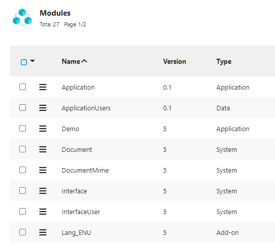

Version 5.2.x release note
==========================

:::danger
**Warning**: This legacy minor version of major version 5 is **not maintained anymore**.

Make sure you upgrade to the current minor version of major version 5 (especially if you plan to upgrade to major version 6).
:::

Compatibility breaking changes
------------------------------

### Module packaging

Legacy XML-based module packaging (as plain XML or as XML in ZIP format) is not changed.

The previous version's experimental JSON module packaging (as plain JSON or "exploded" JSON in ZIP format) has been completely refactored.
The "exploded" JSON files layout has been changed accordingly:

- Previous JSON packages (exploded or not) are not importable with this new version
- All modules in a JSON format **must** be re-exported (or committed/pushed) first to respect the new formats
  before any import (or pulling).
- Older experimental versions are not comparable with the new JSON format

### Bootstrap and icons

- As announced in previous release **Bootstrap V3** tools have been definitely removed.
- To support a good UI resizing at any scale, all static **PNG** icons and images has been removed,
  they have been replaced by **SVG** images. You must replace any static URI to image with the `.svg` extension
  from your specific UI (nothing to do in case of API usage `$ui.view.icon(name)`).
- Moreover, the static `black`, `grey` and `purple` PNG images have been removed,
  they must be replaced by their equivalent FontAwesome icons in your objects.

### HTTP Apache libs

- The legacy (and vulnerable) Apache commons' HTTP client lib version **3.1** has been removed.
  If your custom code uses it you must migrate to the current Apache HTTP Components' HTTP client lib version **4.x.y**

### JQPlot

- The location of the **jQPlot** libs has changed from the `scripts/jquery/jqplot` to `scripts/jqplot`
  if you have any hardcoded paths to these jQPlot libs you must change them accordingly

### JWT tokens

- The internal authentication provider is now using JWT tokens **by default** for both UI and API endpoints
  (this mode already existed in version 5.1 but was not the default).
- You can still switch back to the legacy dummy tokens by setting the `USERTOKEN_MODE` to `simple`.
- If you decide to use JWT tokens, all previously created dummy tokens must be deleted and don't forget to set
  a custom signature secret in the `USERTOKEN_SIGNATURE_SECRET` system parameter (note that changing this secret also
  causes all previously created tokens to become invalid).

### Required token credentials on API endpoint / public API

- **All** the API services exposed on the API endpoint `/api` now requires a token as credentials
  (passed either as an HTTP header `Authorization: Bearer <token>` or as a URL parameter).
- Username + password credentials are **only** accepted by the API **login service** (`api/login`) to deliver the above token.
  They are now **ignored** by all the other API services
- Calls done to the API services **without** a token is considered as done by the `public` user

> **Note**: if for some reason you have been using the `/` public UI endpoint for exposing some kind of "public API services",
> it **must** be refactored.
> This public UI endpoint has never been designed for API usage, it is an **UI** endpoint not suitable for providing API services:
> it is associated to a Tomcat session the must be maintained using a cookie, it has no scalability mechanisms, etc.
> using it was an anti-pattern.
> Prior to this minor version, the right pattern was to use a "technical" user on the API endpoint,
> now you can avoid this "technical" user.

### Deprecated "for removal" disposition hooks

The `displayHome` and `displayPublicHome` disposition hooks, which have been deprecated since version 4.0
(because they were used only by the legacy 3.x UI),have been marked as deprecated "for removal"
and will be definitely removed in next minor version.

If for any reason you are making any custom use of these hooks you **must** refactor this.
No standard use of these hooks is done since version 4.0.

### FullCalendar defaults to version 4

You can still remain on version 3 by setting the `FULLCALENDAR_VERSION` overridden value to `3`
but you should consider migrating your custom code using FullCalendar v3 to v4 or even v5
(which is still experimental in this minor release but will become the default version in next minor version 5.3).

See [this upgrading document](https://fullcalendar.io/upgrading-from-v3) for details on upgrading from FullCalendar v3.

### Foreign-keys completeness

The foreign-keys of object have to retrieve all the foreign user-key fields:

- Required for security reason when checking ID and user-keys consistency/unicity
- Required to re-import objects with the full referenced keys to find the corresponding local ID
- Required within API for the same reasons
- A warning is displayed on the object definition with the missing fields

All warnings have to be fixed by designers (right place in object, hidden or not...).

Core changes
------------

- The module's models images are now inlined in the Markdown documentation
- Added `Tool.getWeekOfYear` with locale
- Added Keycloak&reg; tools for OAuth2 and provisioning of user accounts
- Added new get methods on `BusinessObjectTool`
- Added `Tool.getWeekOfYear` and `Tool.getDayOfWeek` with locale
- Added object hook `boolean canPreview(field, doc)` and platform hook `boolean canPreviewDocument(grant, doc)`
- Added `Tool.shiftTime` tool method to shift time fields (by seconds)
- Added support for calculated fields on pivot tables
- Added [OpenHTMLToPDF libs](https://github.com/danfickle/openhtmltopdf) + added a new `HTMLToPDFTool` helper class
  and added new methods on `PrintTemplate`
- Prevented adding custom code on core system objects, external objects and workflows
- Notepads auto-upgrade to JSON format when rendering becomes `Users activities`
- Removed insecure (and useless) `X-Simplicite-SessionID` HTTP header
- UI persistent user token cookies are now HTTP-only and secure
- Added `Tool.join` and `Tool.split` methods
- Refactored legacy user's prefs on edit-list
- Allows stamps into DocuSign signatures
- Added flexibility on `EncryptionTool`
- Changed the name of the exported module info file from `package.json` to `module-info.json`
  (the old naming `package.json` is still taken into account as a backward compatibiliy fallback)
- Added `depth` parameter on the following I/O `purgelogs`, `purgejobs` and `purgesupervisions` services.
- Added a new "prune" action for supervisions configurable using the `PRUNE_SUPERV_DEPTH` system parameter
- Uniformized responses formats from I/O calls (with or without `log=true/false`) for most services
- The `version` parameter is not mandatory anymore for I/O module imports (and the `zip` parameter is automatically
  detected from file name extension when possible)
- The resources are now executed from the JAR built from the module's `pom.xml` in an IDE
- Added `Tool` methods for date manipulation
- It is now possible to pass a dedicated I/O and Git password for the privileged user (`designer`)
  using the `io.password` JVM argument or the `IO_PASSWORD` environment variable
  (the legacy `EAI designer` system parameter can also still be used).
- When cloning/creating modules' Git repositories the `core.crlf` is now forced to `true`
- Maven repository is now in "snapshot" mode for all the branches (the Maven version is now `x.y-SNAPSHOT`)
- Added a CSRF token logic on forms
- Added module configuration capabilities for **custom** Maven settings and Sonar settings, e.g.:

```json
{
	(...)
	"maven": {
		"name": "my_alternative_name",
		"description": "My alternative description",
		"url": "https://my.custom.url",
		"javaVersion": "17",
		"dependencies": [
			{
				"groupId": "group1",
				"artifactId": "artifact1",
				"version": "1"
			},
			{
				"groupId": "group2",
				"artifactId": "artifact2",
				"version": "2"
			}
		]
	},
	"sonar": {
		"projectKey": "MyProjectKey",
		"projectName": "MyProjectName",
		"projectVersion": "V5",
		"organization":"MyOrg",
		"host.url": "https://my.sonar.url"
	},
	(...)
}
```

- Changed JSR223 Rhino engine (for compliance with JVM 16)
- Added a new adapter helper using Apache commons CSV lib: `ApacheCommonsCSVAdapter`
- Redolog in API REST access
- Added `[URL]` substitution pattern for publication templates and alert contents
- Added cloud storage overrides properties configuration capabilities
- Added JWT token validation to `AuthTool`

- Fast XML/ZIP import with new options in interfaces:
  - `async` option: parallel loading of all `<data>` per `<object>`
  - `stopOnError` option: stop or continue processing when an error is detected
  - use only the SAX parser: DOM parsing has been removed to free memory
  - import module is 2 times faster on average
  - allows to solve cyclic relationships / cross-referenced objects in only one scan

- New module type to separate core `System` and `Add-on` with business modules (application, toolbox, data...)



- Added "font" type for resources
- Optim cron job: create the asynchronous Thread only at startup to limit the JVM usage

- Added method to ObjectDB:
  - `ObjectDB.addResource`: to add a front resource to object dynamically
  - `ObjectDB.setCxtHelp(context, help)`: to change easily one context help

```java
@Override
public void postLoad() {
	String ts = String.valueOf(new Date().getTime());
	addResource("SCRIPT",
		new Resource("", "SCRIPT", Resource.TYPE_JAVASCRIPT,
			"(function() { ... })()".getBytes(),
			false, ts));
	addResource("STYLES",
		new Resource("", "STYLES", Resource.TYPE_CSS,
			".myclass { color: red; } ...".getBytes(),
			false, ts));
}
@Override
public void initList(ObjectDB parent) {
	super.initList(parent);
	if (parent!=null)
		setCtxHelp(ObjectCtxHelp.CTXHELP_PANELLIST, "My panel help...");
}
```

- Added development information for IDE tools
- Added Luhn algorithm check helper method in `Tool`
- Added `obo_role` on object definition to identify business objects, configuration objects or system
- Added MFA (second authentication factor) feature including 3 out of the box methods :
  - OTP sent by email
  - OTP sent by SMS
  - Time-based OTP (TOTP) from authenticator apps
  plus a custom mode implementable using the `initMFA` and `checkMFA` platform hooks


for TOTP the QRCode to configure authenticator apps is displayed at first login but it can also be re-displayed on the user's form:


- New ability to rename table/column when installing a module with altered object's or field's name
  - `ObjectInternal` and `Field` have a new local history to trace naming changes
  - Export module: explains all old values in XML/JSON flows from local history
  - Import module: searches a definition with one of the older names to rename the table or column
  - When all DB are aligned (dev, test, prod...), histories can be removed to simplify module export
  - No more manual migration needed thru SQL

XML syntax example:

```xml
<data>
	<obo_name oldvalue="DemoSupplier2" oldvalue1="DemoSupplier">DemoSupplier3</obo_name>
	<obo_dbtable>demo_supplier3</obo_dbtable>
	...
</data>
...
<data>
	<fld_name oldvalue="demoSupWebsite2" oldvalue1="demoSupWebsite">demoSupWebsite3</fld_name>
	<fld_dbname>sup_website3</fld_dbname>
	...
</data>
```

JSON syntax example:

```json
"item": {
	"obo_name": {
		"value": "DemoSupplier3",
		"oldvalue": "DemoSupplier2",
		"oldvalue1": "DemoSupplier"
	},
	"obo_dbtable": "demo_supplier3",
	...
}
...
"item": {
	"fld_name": {
		"value": "demoSupWebsite3",
		"oldvalue": "demoSupWebsite2",
		"oldvalue1": "demoSupWebsite"
	},
	"fld_dbname": "sup_website3",
   ...
}
```

- Multiple `PlatformHooks*` for a best business isolation:
  - to allow different app/modules to have there own hooks implementation (`isMenuEnable`, `postSearchIndex`...)
  - the name of shared code must start with `PlatformHooks`
- Added a compile all action
- Added a new `customAlert` business object hook and media type for custom notification implementation for BPM alerts
- Force change password flag is now checked for I/O access, preventing using default `designer`'s password
- Added import modules at startup feature based on an import specification file (containing a JSON array of modules names and versions),
  example of a typical usage in Docker:

`Dockerfile` for building a custom image with the modules in it:

```text
FROM registry.simplicite.io/platform:<tag>
COPY modules webapps/ROOT/WEB-INF/modules
```

With the following content for the `modules` folder:

```text
modules
|_ Demo-importspec.json
|_ Demo-5.zip
|_ DemoAPIs-5.zip
```

And the following content for the `Demo-importspec.json` file):

```json
{
  "title": "Demo",
  "modules": [
    {
      "name": "Demo",
      "version": "5",
      "datasets": true
    },
    {
      "name": "DemoAPIs",
      "version": "5"
    }
  ]
}
```

This file can be generated from the top level module.

Note: At first startup the modules are imported, on subsequent startups a check is done on version number to prevent reimporting
already imported modules. This means this mechanism requires a proper modules' version management.

- User's grant parameter `USE_SOCIAL` depends only on responsibility `SOCIAL_USER` or `SOCIAL_ADMIN`.
  The system parameter `USE_SOCIAL` is deprecated and will be remove in release 5.3.
- Using an older webapp on an upgraded database is now causing a **FATAL** error that prevents platform
  to start up (this is to avoid unexpected side effects in this non supported case)
- Added `USE_API_TESTER` system parameter to enable/disable the API tester page
- Added `USE_HEALTH` system parameter to enable/disable the health check page/service
- Added `USE_MAVEN` system parameter to enable/disable the Maven repository exposed by the instance
- POST calls on health check page now returns JSON format by default (no change on GET calls)
- Added the `platform.godmode=true|false` JVM arg to globally enable/disable the god mode feature
  (which still requires to be individually granted using the `GOD_MODE_USER` system parameter)
- Refactored platform hooks methods `preAuth` and `postAuth` to allow returning an explicit error message
- Added number of Tomcat level active sessions in the health check
- Added enum multiple accessor `ObjectField.addValue` and `ObjectField.removeValue`
- Refactored services objects, especially the OpenDataSoft services objects that now supports version 2 of the underlying API
  and allows configuring an explicit list of fields (requires using version 2 of the API)
- Added an `init` hook on `ResponsiveExternalObject`
- Added tar.gz tools: `ZIPTool.tarGzip` and `ZIPTool.tarGzipExtract`
- Use tar.gz format to export module with exploded JSON files
- New adapter to import CSV with new lines support: `CSVAdapterCommon` based on Apache Common CSV
- Changed JGit SSH implementation from JSch to Apache Mina to support new SSH key formats

UI changes
----------

- Added title & addon resources for auth pages:
  - `LOGON_PROVIDERS_TITLE` and `LOGON_PROVIDERS_ADDON` for the auth providers selection page
  - `LOGON_TITLE` (and still the existing `LOGON_ADDON`) for the internal auth provider's logon page
- Added fetch on diagram container
- Improved print styles
- Status colors are now used in metrics dashboard
- The template editor now uses the syntax convention for the foreign key naming proposals
- User min rows / max rows are now optional
- Theme supports Google fonts with italic and weight, ex: `Roboto:ital,wght@0,400;0,700;1,400;1,700`
- Field `color` supports transparency with a new rendering `rgba`
- Display the activity info on the screen-flow road


- Limit fulltext search on selected objects
  - stored in `INDEX_OBJ_FILTER` parameter
  - accessible on UI with a filter button


- API tester refactored to bootstrap 4


- ENUM colors are used in charts of pivot table


- Added `Treeview item` in a `View` definition to embed tree on form from its root object


- Export CSV with technical fields or not for designer

- New import XML options:


- Theme editor with preview:
  - new constants in a less file to override default base themes
  - change globals CSS font, colors, backgrounds, borders, shadows, paddings
  - applies on main page, menu, panels, tabs, form and list
  - edit the addon styles for custom CSS

- Change event on View: `$ui.getUIView(ctn, obj, view).ui.change(function(e){...})`

- New Module panel to list all commits:
  - access the local GIT repository
  - with built-in list features: count, search and order by
  - with same actions: commit, push, pull and delete repository
  - and compare with previous/current commit


- New module commit to GIT:
  - format choice: new JSON hierarchy or legacy XML
  - and choice to explode all configuration files in a Module tree


- New module difference between JSON format
  - Hierarchical difference with a remote source
    - Remote instance thru I/O
    - Exported JSON file or ZIP
    - from a GIT commit
  - Partial push/pull:
    - Custom made local/remote XML patch
    - To be applied to local/remote instance
  - Can not be compared to a previous XML export

- Added a source format feature for Java, JavaScript, CSS/LESS and HTML sources on the code editor
- UI preferences `ZOOM` factor and `COMPACT` mode per scope
- Timesheet with a state models per line to lock the data when inputs are validated
- Chart palette of colors:- added in definition of Value axis per pivot table
  - added picker in View editor of crosstab item (new parameter `zpalette`)
- Ajax `getForCreate` with forced `values` with FK completion
- Item current position in form navbar
- Menu is now enabled unless explicitly disabled (this avoids no menu by default for users created from `SimpleUser` child object)

Backported
----------

- Tiny URL on resources
- `beforesave` object UI hook
- Access to search dialog within Agenda/Fullcalendar
- Added a group-by toggle button in header
- Associate a Bookshelf to any document field to specify accepted MIME types
- Added Min/Max times and End date field in Agenda model
- Simplified DocMIME functional key
- Allows to create links within N,N pillbox during creation
- Auto-fix wrong generated indexes on system tables
- Use the first colored enum on calendar events

Post-release
------------

### 5.2.0 (2022-04-22) - initial release

- Initial release for minor version 5.2. See above for details.

### 5.2.1 (2022-04-28)

- Backported: added `Parameters.setHeader` (only relevant for unit testing)
- Backported: added _Mockito_ testing lib
- Backported: SQL script I/O service is now restricted to system admin users and operators
- Backported: `DBAccess` select API services (JSON and CSV)
- Fixed: robustness on API external object return when external object is not granted
- Improved syntax conventions robustness
- Improved user session information
- Fixed: multiple document deletion when field is set to null

### 5.2.2 (2022-04-30)

- Fixed `ObjectField.isEmpty` for multi-documents rendering

### 5.2.3 (2022-05-11)

- Allowed update thru transition buttons even if the status field is read-only
- Added auto-fix to complete missing FK key fields when loading one object definition (permitted in 5.1 but required now,
  designer has to fix those objects)
- Fixed single menu with closed sub-domain

### 5.2.4 (2022-05-20)

- Fixed 'update all' without selected field
- Fixed completion of object with specific 'select'
- Fixed object usage with empty avatar icons after saving form
- Fixed required multi-doc message on field
- New methods for multi-docs field: `ObjectField.loadDocuments` and `ObjectField.getListOfDocuments`
- Confusing `ObjectField.getDocuments` is deprecated and replaced by `loadDocuments`
- Fixed disposition `responsive5` for hybrid app (cordova)

### 5.2.5 (2022-05-26)

- Added `DocumentDB.copyDocuments` helper method
- Changed textarea to an Ace editor on the `DBAccess` tool
- Fixed multi-docs with constraint
- Fixed contextual help on delete confirmation popup
- Fixed concurrent access issue on remote Simplicité objects

### 5.2.6 (2022-06-07)

- Fixed/improved some Ace editor snippets
- Backported **experimental** platform annotations `com.simplicite.util.annotations`
- Fixed `Grant.getLang_ISO_639_1(lang)`
- Added new languages in the `LANG_ISO_639_1` list of values
- No reformatting of invalid date entries
- Backported improvements on `UserSession`: added remote address and user agent

### 5.2.7 (2022-06-14)

- `DocTool.synchronize` file deletion quarantine (false positive)
- Rebind save handlers after creation to apply rules from `initUpdate` (e.g. `setSaveAndClose`)
- Improved HTML content detection for emails (e.g. alerts)
- Fixed default separator in some variants of `Tool.split/join`
- Fixed multiple enum fields in remote Simplicité objects

### 5.2.8 (2022-06-22)

- Fixed regression on `Tool.split` for empty string
- Backported refactoring of `StaticSiteExternalObject` + added `notfound` hook
- Fixed some sync cases between Module's settings and Module's Git repo configuration
- Robustness fixes on some import spec cases

### 5.2.9 (2022-07-04)

- Fixed XML patch generation in module diff with "insert"
- Fixed tree diff to ignore false positives `{ value:x } == x`
- Simplified JSON export (`fld_name` and `obo_name` without history)

### 5.2.10 (2022-07-09)

- Fixed index generation for Oracle
- Fixed `DataXML.fromJSON()` for multiple enums
- Backported: Document local dir as secondary fallback in all cases
- Backported: Paginated search helper methods in `BusinessObjectTool`
- Backported: `USE_IO` and `USE_GIT` system parameters checked vs database value instead of cache value

### 5.2.11 (2022-07-23)

- Fixed `queryWithHead` with limit (the `limit` argument was not taken into account)
- Added filter on panel export with meta-object link to parent
- Fixed list of values update in edit template
- Backported optimizations: on session creation (avoid global sync on `UserToken` system object) and on business object
  historization object
- Fixed broken social post history
- Backported: added moment-timezone.js lib
- Backported: changed packaging of FullCalendar v5 (same as v4 instead of a non extensible bundle packaging)
  (**Note**: in this version FullCalendar v4 is the default but if you have explicitly switched to v5
  **and** have customized the default `FULLCALENDAR_LIBS` system parameter you **must** realign it).
- Fixed initial model import issue

### 5.2.12 (2022-08-20)

- `loadUserFilters` called during `resetCacheGroups`
- Fixed `mergeObject` on tree views
- Fixed "exploded" XML module format import
- Changed `DROP/CREATE` order for database indexes

### 5.2.13 (2022-09-02)

- Fixed `timesheet` auto-save during bulk transitions
- Backported multi-modal backdrop with closer `z-index`
- Fixed 2FA check to be done only when using the internal auth provider
- Fixed regression on OpenIDConnect IdP logout URL redirection

### 5.2.14 (2022-09-10)

- Changed : lists loading using code if no translation is present + added corresponding audit warning
- Fixed search mode for main instance + `setListSearchMode`
- Fixed random bulk action lost
- Backported auth pages background image (`OAUTH2_BACKGROUND` resource)
- Backported minor changes on the theme editor
- Fixed usage of `ACE_OPTIONS` in UI components that are using Ace editor

### 5.2.15 (2022-09-19)

- Backported new UI parameter `Simplicite.UI.Globals.form.titleMax = 120`
- Fixed unsplit screen with maximized part
- Backported improvements on the register form
- UI styles fixes

### 5.2.16 (2022-09-24)

- `getUIField` improvement to find a foreign inlined field without index parameter
- Reference completion: ENTER will auto-select the first record of dropdown
- Backported configurable Ace editor theme and TinyMCE skin on the `Theme`object
- Optimization when stopping export: no more lock on main instance + break all searches
- List sticky header optimization
- Updated Log4J libs (2.19.0)

### 5.2.17 (2022-10-01)

- Security fix on the I/O page for UI
- Added hard removal of potential `<script>` tags in social post messages and news tite and description
- Platform properties fallback to prefixed environment variable
  (e.g. `platform.securelevel` property fallbacks to `SIMPLICITE_PLATFORM_SECURELEVEL` environment variable)
- Fixed `populateForeignKey` in the case of multi-level search of objects
- Backported `RESTMappedObjectsExternalObject` with redolog storage
- Fixed create Git repo for module without settings

### 5.2.18 (2022-10-07)

- Backported I/O tester page enabling system param (`USE_IO_TESTER`)
- Backported `addGmap` on external object
- Backported `CronManager.lock` robustness to re-affect the `CRON_LOCK`
- Fixed XSS vulnerability on URL fields on lists
- Fixed tree view accordion effect in main menu
- Backported: Added extra HTML contents methods for external objects

### 5.2.19 (2022-10-14)

- Fixed ENTER key on input-group opening a wrong help/popover or datetimepicker
- Updated application store module (version 1.6)
- Backported date/datetime interval syntax (`<min date>;<max date>`) for mapped APIs
- Fixed standard agenda when forcing FullCalendar to v5
- Added Apache Kafka client libs + experimental `KafkaTool` helper class
- Backported license key file (`<project dir>/licenses/license.<xml|json|yaml>`) or environment variable (`LICENSE_KEY`) import
  at startup

### 5.2.20 (2022-10-21)

- Backported `initAction` with `getParentObject` context
- Fixed unique context message on UI
- Fixed `initRefSelect` parent context on edit-list
- Backported confirm dialog with the returned error of backend action
- Backported up-to-date version check in the _About_ page
- Backported improvements on `MustacheTool`
- Backported improvements on the devinfo API (used by external IDEs)
- Backported smarter `setFilterDateMin/Max` for datetimes (now adds the hour part if missing)

### 5.2.21 (2022-10-30)

- Bootstrap 5 workaround input-group with transparent date picker
- Fixed export with user preferences
- Removed caching on the `USE_API_TESTER` system parameter + caching improvement on the `USE_API` system parameter
- Backported custom REST services annotations for OpenAPI/Swagger schemas
  (this applies to the `RESTServiceExternalObject` helper class)
- Fixed save inlined 0,1 link to be done on the main instance (not the panel for stateful reason)
- Backported: Rebuild automatically and asynchronously after a module import all objects DB indexes (UK+FKs)
  and data full-text indexes rebuilding (`m_index` table)
- Fixed theme editor multi-windows + has changed
- Backported improvements on `StaticSiteExternalObject`
- Robustness fix for module imports using Git when adding/deleting arbitrary files in the `others` directory

### 5.2.22 (2022-11-09)

- Fixed project POM properties
- Fixed clip-path size of sticky header
- Fixed inlined form metadata
- Added explicit `status: 200` on applicative errors returned by APIs
- Removed deprecated client ID cookie
- Fixed front-end inlined form metadata to apply back-end initUpdate rules during save
- Fixed import module with inherited objects
- Fixed referenced object table in other datasource

### 5.2.23 (2022-11-15)

- Various UI-level fixes in the case of objects using a custom row ID field
- Fixed documents indexation when `USE_DOC_INDEX=no` is not set
- Robustness fix on adapters called with null input stream

### 5.2.24 (2022-11-29)

- Fixed missing authtoken after reconnect using cookie
- Fixed `canGroupBy` to disable UI group-by on list
- Fixed pillbox to re-apply user's filters of the popup "select all"
- Fixed mime-type `application/vnd.ms-outlook` / `.msg` in multi-documents field

### 5.2.25 (2022-12-08)

- Show custom row ID in diagram of business objects
- Fixed close the confirm dialog on a status transition
- Fixed Redolog with empty JSON payload
- Backported input with percent rendering for decimal fields
- Fixed width of preference and export dialogs during UI zoom
- Updated Create field wizard to force UPPER/SNAKE case on codes of lov
- Fixed deleting directory `/jar` on `Save all` of source editor
- Allows uppercase expression (`IS NULL` and `IS NOT NULL`) on date filters

### 5.2.26 (2022-12-20)

- Fixed print one record without applying current filters
- Fixed change user based on a local storage to store the clientId (no more cookie for security reason)
- Changed `SQLTool.rebuildSequence` with simple warnings
- Removed some orphan constraint impacts
- Fixed missing delete cascade of ConstraintImpact when its action is deleted
- Action robustness to close the confirm dialog on abnormal response
- Fixed abusive Git repo init while processing import spec from external Git repo

### 5.2.27 (2023-01-08)

- Fixed `ObjectFieldModel` search-spec to show referenced fields in ModelBusinessObject
- Fixed `populate` service in case of a nullable field in a composite user-key
- SVG model with `sync: false` option to ignore data synchronization on open
- Fixed: "select" objects are now allowed to specify an external datasource
- Backported `ExcelTool` method for dates
- Fixed manual Git repository creation for modules without Git settings
- Backported the possibility to specify a reflexive link depth for REST mapped APIs
- TinyMCE cache busting with the `cache_suffix` parameter `?_=revision`

### 5.2.28 (2023-01-20)

- Fixed inlined form with a read-only foreign key during creation
- Backported menu with colored solid circle on enum items
- Backported optional checkstyle Maven plugin in the modules' `pom.xml`
- Fixed deep links and scope taken into account with LDAP auth provider
- Fixed UI index proposal on current selection
- Fixed inlined link 0,1 with UI template

### 5.2.29 (2023-01-27)

- Added support for HTTP digest authentication
- Fixed inactive users allowed on the I/O endpoint
- Improved logging on import spec (including better error reporting on YAM to JSON conversions)

### 5.2.30 (2023-02-02)

- Fixed form with several N,N pillboxes
- Fixed options to show the timestamp fields in search dialog
- Fixed dir checksums on non-root deployments
- Backported "no search on list" thru menu access
- Fixed datamap to reset output fields only
- Added social share icons
- Backported OpenIDConnect PKCE support

### 5.2.31 (2023-02-09)

- Backported new type of `Action` to launch long running job started thru UI in a `isolated session`
- Continued indexing of objects in case of user logout
- Fixed constraint with Create/Update/delete impact on object
- Simplified tooltip of URL field on list
- Fixed ZIP-related issue on exploded JSON module imports using Git
- Fixed `URI_MAPPINGS` and `HTTP_HEADER` reloading after module import

### 5.2.32 (2023-02-19)

- Prevent advanced XSS on social posts and news contents
- Fixed blur event on reference select box after picking a reference
- **Potential compatibility breaking change**: Backported: OAuth2/OpenIDConnect endpoints URLs are now forced to use SSL.
  This has no impact if the instance is using SSL which is an OAuth2 requirement anyway.
  (the configured URLs are now forced with `https://` even if they are configured with `http://`).
  This can be disabled by setting the `non_ssl_urls_allowed` as `true` in your provider's settings, but only if you have a good
  reason to do so
  (OAuth2/OpenIDConnect standards implies that SSL is always used)
- Backported unit tests execution thru import specification
- Fixed import CSV/XML action button
- Reset current selected Ids on new setSearchSpec
- Fixed CreateModule process - Domains are now granted to Groups
- Added module filter to group grid on `CreateStateModule` and fixed redirect at end of process

### 5.2.33 (2023-02-28)

- Fixed Tool.getCurrentDate(offset) for long offsets
- Backported an additional argument on REST mapped APIs' `addObject` init method to force pagination mode by default
  (and another argument to adjust default page size, if configured value does not fit)
- Backported security fixes (MFA check and less verbose error pages)
- Backported requirement to enter old password to change password

### 5.2.34 (2023-03-13)

- Backported support for custom row ID on `select` objects
- Backported support for zip and tar.gz module files with a first directory level (such as GitHub's releases archives)
- Backported language tag (`lang`) on the `<html>` tag
- Fixed missing parameters for asynchronous actions
- Fixed public session timeout taking over auth session timeout in some cases
- Backported experimental ServiceNow&reg; service objects
- Backported BigDecimal reading with only precision of 2 digits
- Fixed missing parenthesis around constraint expressions (it caused issues with granted constraints)
- Fixed non case-tolerant authentication provider name
- **Compatibility breaking change**: Backported structure change for exploded JSON module exports
  (depth of tree view has been changed to limit paths size to workaround MS Windows default file path limitations to 256 characters).
  This change has no impact on XML module exports (plain XML or ZIP, single file or exploded).

### 5.2.35 (2023-04-01)

- Backported improvements on the experimental ServiceNow&reg; service objects.
- Backported tool methods for OpenIDConnect/OAuth2 refresh tokens
- **Potential compatibility breaking change**: Backported length limitation on table aliases to 63 characters on PostgreSQL.
  This may have an impact on the custom code using hard coded table aliases of length > 63
  if the instance is using a PostgreSQL database.
- Backported ping platform nodes to clean `m_pf_node` periodically thru the cron HealthCheck
- Backported improved performance of fulltext indexation on PGSQL
- Fixed user preference menuCollapsed by default
- Fixed update cascade of updatable referenced fields
- Backported old hash password settings to allow signin in and force password change
- Backported additional OpenIDConnect setting for default scopes
- Fixed reordering fields of inherited object

### 5.2.36 (2023-04-05)

- Backported optimized list export to POI/CSV/PDF/ZIP without a long Ajax request
- Fixed Ajax create with partial foreign keys
- RedoLog with removed documents in HTML rendering
- Fixed XSS vulnerability on user's firstname and lastname (forced plain text when saving + safe display in the UI header)
- Restricted user picture's types to PNG and JPEG MIME types
- Fixed regression on pillboxes

### 5.2.37 (2023-04-14)

- Fixed export CSV with `csvtech` for designer
- Fixed remove remaining pillboxes during creation
- Backported take picture rendering on image fields
- Fixed `Mail(Tool)` missing document loading for attachments/inlines
- Fixed missing URl-encoding of entered email in the "forgot password" component
- Backported: configurable list on ServiceNow objects
- Fixed "random" basic authentication popups during clear cache

### 5.2.38 (2023-04-20)

- Fixed initialize fields of 0,1 link with inlined form
- Backported unaccentuated index search support (system param `USE_UNACCENTUATED_INDEX` , **note**: changing its value requires re-indexing)
- Fixed no tree depth=0 in case of meta-object link
- Fixed check on meta object links to remote objects
- Improved `JSONTool.jsonMetaObject` with field lists
- Improved translation routing to object/domain translation

### 5.2.39 (2023-05-02) - maintenance revision

- Backported support for JVM properties (`remote.git.username/password`) or environment variables (`REMOTE_GIT_USERNAME/PASSWORD`)
  to define a default value for modules' Git settings
- Fixed partial clear cache when deleting a user's group
- Fixed UI `change` handler on big decimal field
- Fixed SQL-injection vulnerabilities and increased robustness
- Improved error responses on the API endpoint
- Backported support for HTTP header `Accept: application/json` on the API login and logout endpoints

### 5.2.40 (2023-05-16) - maintenance revision

- Fixed `hasChanged` on big decimal during `form.onload`
- Backported improvements on N-N relationships pillboxes
- Backported JWT nonce checking for OpenIDConnect auth providers
- Backported distances tool methods in `Tool`

### 5.2.41 (2023-06-01) - maintenance revision

- Fixed view editor not allowing to remove the chart option
- Fixed check of user existence before trying to load it (avoid useless errors in the logs)
- Fixed adapter loading "empty" XML (without `<object>` blocks)
- Fixed merge container
- Fixed do not export `sys_value2` in module to keep overridden value on target platform

### 5.2.42 (2023-06-22) - maintenance revision

- Fixed cron workers to wait for job thread die
- Backported improvements on nonce management for internal auth provider

### 5.2.43 (2023-07-04) - maintenance revision

- Fixed display text-formatted messages returned by the hooks
- Backported extension of the `visible` flag in `AUTH_PROVIDERS`, it is now possible to specify a list of URLs
  on which the provider will be visible (`true/false` values are still taken into account)
- Restored basic auth from I/O form
- Added new LESS variables for scrollbar styles

### 5.2.44 (2023-07-28) - maintenance revision

- Added context `CONTEXT_UPDATE` or `CONTEXT_SEARCH` on `fieldCompletion` hook
- Fixed position of completion dropdown upon responsive table
- Improved robustness on module name changes
- Fixed NPE after logout with LDAP-only authentication
- Fixed health check JSON format

### 5.2.45 (2023-08-08) - maintenance revision

- Fixed missing URI filtering for `/health.json`
- Improved synchronization on API grant loading

### 5.2.46 (2023-08-25) - maintenance revision

- Fixed list export with columns preference of selected predefined search
- Added field isExportable on CSV export
- Fixed module JSON compare with meta-object
- Fixed `remote.git.username` loading

### 5.2.47 (2023-09-13) - maintenance revision

- Fixed columns size of `m_field_hist`
- Moved user status checking to re-allow creation in the `preLoadGrant` platform hook
- Improved `CSVTool` robustness
- Backported optional `_display` parameter on GET (search/select) mapped REST services to return displayable
  values instead of raw values

### 5.2.48 (2023-09-22) - maintenance revision

- Apply foreign key search spec from inherited objects
- Fixed missing support for Git remote username/password passed as environment variables or JVM properties
- Backported `USE_MANIFEST` flag to enable/disable the `manifest.json` for the UI pages

### 5.2.49 (2023-09-30) - final maintenance revision

- Backported security fix on XML import
- Backported 10 min cache on the `manifest.json` file

### 5.2.50 (2023-10-06) - post maintenance revision

- Backported security fixes

### 5.2.51 (2023-10-14) - post maintenance revision

- Backported fix on service objects' action hook fallback to standard action mechanism
- Fixed `ALTER TABLE` syntax in the SQLServer SQL system patches
- Backported fix on inhibition of left/right navigation swipe on the UI forms when the form is being edited
- Backported fix on document/image field reset after server-side error

### 5.2.52 (2023-10-31) - post-maintenance revision

- Backported security fix on document servlet

### 5.2.53 (2023-10-18) - post maintenance revision

- Fixed asynchronous exports when done across mounted volumes (e.g. in some Docker deployments)

### 5.2.54 (2024-01-31) - final post maintenance revision

- Backported security fix on document servlet
- Fixed full XML export with pagination and filters

> **Warning**: this is the **final** revision for this minor version 5.2, no further maintenance will be done on it.
> If you are still using it, please upgrade to the current minor version of major version 5.
