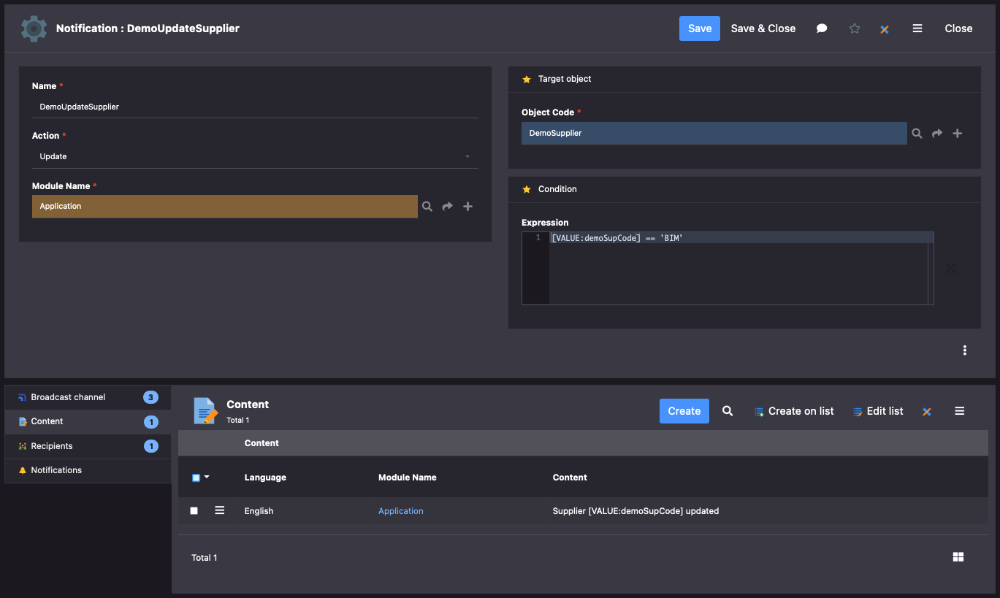
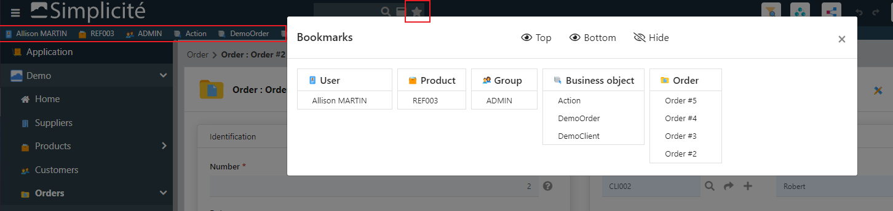
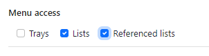

Version 5.3.x release note
==========================

:::warning
**Warning**: This minor version is the **last** version 5 minor version of major version 5.

Major version 5 is now in its **long term maintenance** period, please consider upgrading to the current major version 6.
:::

Compatibility breaking changes
------------------------------

### Bootstrap V5

- Bootstrap V4 is still the default renderer in release V5.x
- Bootstrap V5 `BOOTSTRAP_VERSION = 5` is supported since release V5.3 and will be the default at major release V6
- The disposition `responsive5` supports the 2 implementations
- `jQuery` is still supported to wrap constructor/events (but Bootstrap 5 uses pure javascript)
- Migration doc for specific front: https://getbootstrap.com/5.1/migration

### ECMAScript

- This version uses common ES6/7 features (const, let, lambda, promise, async/await...)
- IE11 is not supported anymore by all UI components

### ChartJS version 3

- `Chart.js` has been upgraded to V3 but V2 will be supported in all release V5
- Set the parameter `CHARTJS_VERSION` to specify the version 2 or 3
- The location of the chartjs libs has changed to `scripts/chartjs/v2` and `scripts/chartjs/v3`
- Migration guide for your specific charts: https://www.chartjs.org/latest/getting-started/v3-migration.html

### Marked version 4

- `Marked` JavaScript lib has been upgraded from version 3.x.y to version 4.x.y
- If you use it in your custom JS code you need to upgrade calls like `marked(...)` to `marked.parse(...)`

### FullCalendar version 5

- FullCalendar version 3 is now **deprecated** and will be removed in the next minor release (you can still use version 3 but you now **must**
  consider migrating your custom code to version 5 or at least version 4, see bellow)
- `FULLCALENDAR_VERSION` is now set to version 5 by default.
  Version 4 is still supported but you **should** consider migrating your custom code to FullCalendar version 5.

To upgrade your specific code see https://fullcalendar.io/upgrading-from-v3 or https://fullcalendar.io/upgrading-from-v4

### Export to XLSX

- The data export to XLSX format is now only implemented with Apache POI
- The legacy HTML format is deprecated/hidden by default, and will be removed in the next minor release

### Vue.js

The embedded Vue.js JS lib has been upgraded from version 2 to version 3. If you are using this lib in some of your custom components
you **must** refactor their code according to the [Vue 3 migration guide](https://v3-migration.vuejs.org/).

### No more user-key on huge fields

For index size limitation, some field types cannot be functional-key anymore:
- document
- image
- html
- notepad (structured JSON)
- very long text (more than 4000 characters)

You will have to change these user-keys if any.

### Same-site cookie policy default

The instance template and Docker images are now configured to implement a `lax` same-site policy by default.
This `lax` value the appropriate value when using external OpenIDConnect/SAML authentication. If you don't use such external authentication yu can set it to `strict`.

You can revert to Tomcat's default by setting it to `unset` in the `CookieProcessor` block of the `META-INF/context.xml` descriptor (or by commenting this block).

### EasyModeAdapter deprecated

Old adapters to import legacy settings thru `quick param` (V3 tooling) has been removed, and related code is deprecated.

### Mail service configuration

The possibility to configure the mail service at Tomcat level (in the `context.xml` file) is not possible anymore as the implementation
of the mail tool has now switched to the new `jakarta.mail` package.

If you still use this kind of configuration (although it was strongly discouraged since v4.0),
make sure to move your mail service configuration to the `MAIL_SERVICE` system parameter.

Core changes
------------

- Added accessors `Grant.getResource` to find Resources by code, type and/or target object name
- Added `MailTool.convertImages` to replace in email all HTML inlined images `` with attachments and ``
- The system parameter `USE_SOCIAL` has been removed, but still valued to true at logon if user has responsibility `SOCIAL_USER` or `SOCIAL_ADMIN` (for backward compatibility)
- Update of area position is synchronized in the object template
- Using an older webapp on an upgraded database is now causing a **FATAL** error that prevents platform
  to start up (this is to avoid unexpected side effects in this non supported case)
- New dedicated panel instance to merge links `Grant.getMergePanelObject` (against UI panel rules)
- Functional key property can be overridden in object field definition
- Bulk associate action added automatically in inherited links
- Associate a Bookshelf to any document field to specify accepted MIME types
- Simplify DocMIME functional key
- New adapter to import CSV with new lines support
	- `CSVAdapterOpen` based on Open CSV
- Import XML solves data-model cycle (not only reflexive errors)
- Rebuild automatically and asynchronously after a module import all objects DB indexes (UK+FKs) + data full-text indexes (m_index)

- New `DataLink` configuration to synchronize data between several applications
	- Set a list of named hosts with credentials to be accessed thru REST APIs
	- Define datalinks with primary/secondary hosts to synchronize objects changes
	- Master data updates are synchronized with other primaries/secondaries on the fly when systems are available
	- A new cron job `DataLink` is used as fallback when a system is down or temporarily unreachable
	- When operational again, it synchronizes all dataLinks with a primary from the last scan per object (stored in parameters `_SYNC_MASTER_<object>`)


- Added **experimental** platform annotations in the `com.simplicite.util.annotations` package
  these annotations have only "informative" function at that stage
  (using them also avoid false positive messages in some cases of code analysis)
  except for the `RESTServiceExternalObject` helper class which processes the `@RESTService*` annotations for building the OpenAPI/Swagger schema
  in the `openapi` hook default implementation/

- `CronManager.lock` robustness to re-affect the `CRON_LOCK`

- Added Apache Kafka client libs + experimental `KafkaTool` helper class
- Added license key file (`<project dir>/licenses/license.<xml|json|yaml>`) or environment variable (`LICENSE_KEY`) import at startup
- `initAction` with `getParentObject` context
- `initRefSelect` and `initDataMapSelect` with parent object set with DB old-values and UI current values
- Optimized asynchronous Data export of module

- Added a new property **Fixed filter** in field definition:
	- accessors `field.isFilterFixed()` and `field.setFilterFixed(fixed)`
	- `ObjectField.FIXED_FILTER_NOT` : default value, usual updatable end-user filter
	- `ObjectField.FIXED_FILTER_READ` : the filter is displayed on UI but in read-only
	- `ObjectField.FIXED_FILTER_HIDE` : the filter is hidden on UI

- New **Link filters** to specify filed filters on a panel search:
	- applied in the same time of the search specification SQL of link
	- useful to join heterogenous objects (from several datasources, object service...) when SQL is not permitted
	- JSON filters with common token, example:

```json
{
  "childField1" : ">=1000 and <=5000",
  "childField2" : "[VALUE:parentFieldName]",
  "order__childField3" : -1,
  "group__childField4" : 1
}
```

- New object hook `public String[] postSearchRow(String[] row)`:
	- Called on each record when fields are calculated and decrypted from DB
	- More efficient than a `postSearch` as it avoids a second loop over the records

- New type of `Action` to launch long running jobs started thru UI in a `isolated session`

- New message with **call to action** to ask the user to do something
	- action type must be hidden to be used only in this context
	- action is displayed only if the user is granted thru a function
	- action will call the front javascript or the back-end method

```java
// Single action
ObjectDB obj = this;
Action action = obj.getAction("MyAction_SendEmail");
return Message.formatCallToAction("WARNING", "Save is OK, do you want to send an email to client?", Message.WARN, null, obj, action);

// Or with several actions
List<Action> list = new ArrayList<>();
list.add(obj.getAction("MyAction_OptionA");
list.add(obj.getAction("MyAction_OptionB");
return Message.formatCallToAction("MYCODE", "What is the best option?", Message.WARN, null, obj, list);
```


- New `_tabId` in sessionStorage
	- to isolate objects of a same session (JSESSIONID) but accessed from different browser tabs
	- getter `Grant.getClientTabId()`

- New auto-incremental field
	- "Auto-incremental syntax" configuration field on Field object allows to automatically increment field value according to a specified syntax when creating a new record.

- Supports several Keycloak providers, names must start with `keycloak` to be identified in `AUTH_PROVIDERS`

- New monitoring of **JDBC pool size** (needs access to JMX/MBean)


- New **Notification** feature
	- Is defined by an Object, an Action, a Condition, Channels, Recipients and Content
	- Object : Object that is linked to the Notification
	- Action (Create, Update, Delete) : Action on the Object that will trigger the Notification
	- Condition : Expression to define in which Condition(s) the Notification should be pushed
	- Content can be overridden for each Channel and / or Recipient
	- Channels are globally defined at the Notification level but can be specific to a given Recipient
	- Users can subscribe / unsubscribe from their Notifications (requires the Notification to be non-mandatory and user is a Recipient of the Notification)
		- Subscriptions are based on the Notification / Channel couple - meaning that for a given Notification broadcasted over Mail and Internal channels, a user can unsubscribe from the Mail channel.
	- *Channels* :
		- Internal : Bell icon in header updated when a new Notification is received - Notifications are stored in a system table
		- Mail : Sends an email to recipients configured in the Notification
		- Specific : Calls a method defined in the Object
	- *Recipients* :
		- User : specific user that will receive the Notification
		- Group : users with active Resp will receive the Notification
		- SQL : user ids or emails to receive the Notification



- Modules can be merged together
- Ping platform nodes to clean `m_pf_node` periodically thru the cron HealthCheck

- Import License key file thru UI action


UI changes
----------

- UI extended controllers has been moved to `scripts/ui/tools`:
	- they are not included in the core packaging `ui-bundle.js`
	- to be loaded only if they are used by the UI engine
	- include calendar, charts, placemap, firebase, speech, tray and workflow

- Added resource `MENTIONS` to disposition `responsive5` to simplify the previous `FOOTER`
- Show bootstrap full version in `ABOUT` dialog


- Tiny URL on resources:
	- no more `objid` in URL is needed if the resource is unique by code, by object name and/or by type
	- `/r?c=MY_UNIQUE_CODE`: to find a unique-named resource
	- `/r?c=MY_CODE&o=MyObjectName`: to find a resource of a named object (disposition, internal/external object or process name)
	- `/r?c=MY_CODE&o=MyObjectName&t=IMG`: to find a typed resource of a named object

- New module template to categorize publications:


- Added a `beforesave` and `aftersave` object UI hook

- User's **bookmarks** with fast access to favorite objects:
	- Granted to user with new group `BOOKMARK`
	- New popup with all bookmarks stored as JSON in user's parameter `BOOKMARKS <home>`
	- Ability to dock the bookmarks bar on top or bottom (except on mobile)
	- Add/remove each bookmark in object's form
	- New generic Action `bookmark` associated to new button property: visible (default), hidden (no bookmark) or in 'plus' menu



- Added Bootstrap icons 1.5.0 from https://icons.getbootstrap.com


- New triggers `ui.field.visible`, `ui.area.visible`, `ui.view.visible` and `ui.action.visible`
  to add specific code to a listener component when something is shown or hidden dynamically.

```javascript
$(div).addClass("js-field-visible").on("ui.field.visible", (e,field,vis) => { /* do something */ });
$(div).addClass("js-area-visible").on("ui.area.visible", (e,area,vis) => { /* do something */ });
$(div).addClass("js-view-visible").on("ui.view.visible", (e,view,vis) => { /* do something */ });
$(div).addClass("js-action-visible").on("ui.action.visible", (e,action,vis) => { /* do something */ });
```
- Allows to create links within N,N pillbox during creation
	- stored in memory on form or edit-list object
	- then saved when the object is created

- `Simplicite.Ajax` with Class and Promises:
	- old syntax with a callback function as first parameter is still supported
	- new syntax calls return Promises, examples:

```javascript
app.setSysParam("MYPARAM", "value")
.then(() => { /* ... */ });

obj.search({ field: "abc" })    // no more callback in parameters
.then(list => { /* ... */ }) // then: new callback
.catch(err => { /* ... */ }) // catch: replace old parameter 'error' callback
.finally(() => { /* ... */ }); // finally: do something on both success or reject

obj.get(rowId)
.then(item => {
	item.field = "123";
	return obj.save(item);
})
.then(() => alert("saved!"))
.catch(err => { /* ... */ })
.finally(() => { /* ... */ });

```

- New bar with overflow items `$ui.view.widget.barOverflow`:
	- the horizontal must have a limited CSS height
	- change an horizontal bar to flex with a dropdown button to show hidden items on demand
	- caller must trigger a 'ui.resize' to (re)build the dropdown menu when the bar is visible or the container has been resized
	- bring hidden item to first or last visible tab
	- caller can bind a 'ui.bar.click' on bar
	- Usage in a tabs with overflow:

```javascript
let tabs = $ui.view.tools.tabs({
	id: "mytabs",
	overflow: { // use a bar-overflow for hidden tabs
		icon: "fas/angle-double-right", // not the default caret icon
		show: "last", // bring hidden item visible at last position
		count: true   // display a badge to count hidden items
	},
	tabs: [{ title, icon, key, click... }, ... ]
});
...
// resize when tabs is displayed on screen = rebuild dropdown
let bar = $(".bar-overflow",tabs).trigger("ui.resize");
// click on overflow item
bar.on("ui.bar.click", (_,t) => {
	// save positions in user's preference...
});
```

- New code editor features:
	- Added a "close all" button to code editor (save all + close all tabs)
	- Tabs overflow in a dropdown on the right side


- New sub-filter on the global search per domain


- Merge screen with links picker to limit relationships to merge (not available on meta-links)

- New Image field rendering:
	- Take a picture (ex: expense report on mobile)
	- Take a selfie (ex: customer profile)
	- Signature dialog or inlined into form (ex: sign a receipt)
	- Scratch pad (simple note)

Take a picture


Image with signature in a dialog


Embedded signature into form


Scratch pad


- New **menu** features
	- Count simple ENUM per code in menu (as status)
	- Sub-menu per ENUM in case of multiple lists or status
	- Allows access to referenced ENUM





- **Action style**: added color + background on buttons


- New view item to insert a **Sub-view** in a View


- `Shortcut` visibility refactoring to allow displaying as plain button in header


- Agenda/Fullcalendar
	- Access to search dialog
	- Use the first colored enum on events

- Draggable dialog box (on bootstrap 5 only)
- Refactored place map: added dedicated API services + used in generic UI
- Added Min/Max times and End date field in Agenda model
- Added the `moment-timezone.js` lib
- New UI parameter `Simplicite.UI.Globals.form.titleMax = 120`
- It is now possible to override the Ace editor theme at the `Theme` system object level
- Modeler of business objects can show/hide referenced fields
- Optimized list export to POI/CSV/PDF/ZIP without a long Ajax request
- Support tree rendering in panel with a reflexive child object
- Support for HTTP header `Accept: application/json` on the API login and logout endpoints

- Supports Number/Date formats
	- per language: see the List `FORMAT/NUM` and `FORMAT/DATE`
	- per user: to override the language format


- State transitions are accessible on list rows when the action has `type = Form + Rows`

Post-release
------------

### 5.3.0 (2023-04-24) - initial release

- Initial release for minor version 5.3. See above for details.

### 5.3.1 (2023-05-02) {#version-5.3.1}

- Fixed "more" button with user's preference on list
- Fixed SQL-injection vulnerabilities and increased robustness
- Improved error responses on the API endpoint

### 5.3.2 (2023-05-09) {#version-5.3.2}

- Improved N-N relationships pillboxes
- Improved reflexive relationships treeviews
- Added audit purge before rescanning
- Fixed missing Jakarta lib for emails
- Improved JWT nonce checking for OpenIDConnect auth providers
- Added nonce support for internal authentication

### 5.3.3 (2023-05-15) {#version-5.3.3}

- Fixed `hasChanged` on big decimal during `form.onload`
- Fixed print template with empty `getSelectedIds` in case of separate browser window/tab
- Fixed duplicated transition buttons on embedded list
- Explicit warning when /events is requested over HTTP
- Disabled by default the JWT nonce checking for OpenIDConnect auth provider (as some providers does not enable it by default)

### 5.3.4 (2023-06-03) {#version-5.3.4}

- Backported distances tool methods in `Tool`
- Fixed view editor not allowing to remove the chart option
- Backported `isExportTimestamp` and `setExportTimestamp` to allow timestamp export in CSV
- Fixed check of user existence before trying to load it (avoid useless errors in the logs)
- Fixed adapter loading "empty" XML (without `<object>` blocks)
- Fixed do not export `sys_value2` in module to keep overridden value on target platform

### 5.3.5 (2023-06-19) {#version-5.3.5}

- Fixed tooltip of action with HTML content
- Fixed `callProcedure` syntax for PostgreSQL `{call <procedure...>}`
- Fixed keep old values of inlined form (link 1,1) in case of error
- Fixed template editor from inherited object without template (SimpleUser)
- Backported experimental proximity search syntax (`<latitude>;<longitude>[~<distance with unit, e.g. 100mi or 10km>]`) for geographical coordinates fields
- Fixed preview PDF document on confirm action

### 5.3.6 (2023-06-22) {#version-5.3.6}

- Fixed cron workers to wait for job thread die
- Backported feature to display bookmarks in a specific div with `$ui.displayBookmarks($('#myEmbeddedDiv'))`
- Improved nonce management for internal auth provider
- Export record to Excel with `searchExport` on child/panel objects to call hooks pre/postExport

### 5.3.7 (2023-07-05) {#version-5.3.7}

- Fixed display text-formatted messages returned by the hooks
- Backported extension of the `visible` flag in `AUTH_PROVIDERS`, it is now possible to specify a list of URLs on which the provider will be visible
  (`true/false` values are still taken into account)
- Added new LESS variables for scrollbar styles
- Restored basic auth from I/O form
- Fixed restore update metadata in case of delete error on UI
- Close form: stop auto-scroll to last scrollTop when user has already scrolled
- Added a "show password" button on the logon page (to be enabled using the `USE_SHOW_PWD` system param)
- Improved websocket inhibition on client side (avoid useless server-side errors)
- Added cron table status in the health check
- Improved proximity search
- Improved log push thru websocket to users with `USE_WEBSOCKET_LOG`

### 5.3.8 (2023-07-10) {#version-5.3.8}

- Backported new hook `onDrawCaption(caption, display)` on diagram SVG
- Backported no pillbox rendering of link in default bottom panel
- Backported new **experimental** platform hook `customAuthPage` to implement a custom authentication page/redirect
- Fixed datetime and color pickers overflow over small list (search by column and edit list)
- Added context `CONTEXT_UPDATE` or `CONTEXT_SEARCH` on the `fieldCompletion` hook
- Fixed position of completion dropdown upon responsive table

### 5.3.9 (2023-07-21) {#version-5.3.9}

- Fixed signature pad distribution to `signature_pad.umd.min.js` instead of `signature_pad.min.js`
- Backported improvements/simplification on the `customAuthPage` platform hook
- Backported some robustness fixes (e.g. upon module name change)

### 5.3.10 (2023-07-28) {#version-5.3.10}

- Fixed NPE after logout with LDAP-only authentication
- Fixed health check JSON format
- Improved OpenAPI schema methods

### 5.3.11 (2023-08-08) {#version-5.3.11}

- Fixed missing URI filtering for `/health.json`
- Improved synchronization on API grant loading
- Added `pre/postClearCache` platform hooks

### 5.3.12 (2023-08-25) {#version-5.3.12}

- Fixed list export with columns preference of selected predefined search
- Added field isExportable on CSV export
- Fixed module JSON compare with meta-object
- Fixed `remote.git.username` loading

### 5.3.13 (2023-09-08) {#version-5.3.13}

- Fixed columns size of `m_field_hist`
- Added Web Content Accessibility from WCAG 2.1 to generic UI
- Removed confusing search by columns in case of list edition
- Fixed export on filtered crosstabs
- Fixed regression on SAML provider retrieval

### 5.3.14 (2023-09-14) {#version-5.3.14}

- Moved user status checking to re-allow creation in the `preLoadGrant` platform hook
- Improved `CSVTool` robustness
- Fixed workflow with conditional activity
- Added optional `_display` parameter on GET (search/select) mapped REST services to return displayable values instead of raw values
- Fixed effective date in case of data import thru adapter
- Allows action confirmation with several same referenced fields
- Backported new service objects' hook: `pingService`

### 5.3.15 (2023-09-22) {#version-5.3.15}

- The "About" shortcut is now explicitly granted (by default to designers & operators profiles)
- Apply foreign key search spec from inherited objects
- Fixed missing support for Git remote username/password passed as environment variables or JVM properties
- Backported new service objects' hook: `indexsearchService`
- Fixed populateReference of search-by column
- Added common accessibility from WCAG 2.1
- Added `USE_MANIFEST` flag to enable/disable the `manifest.json` for the UI pages

### 5.3.16 (2023-09-30) {#version-5.3.16}

- Backported support for font resources in generic UI themes
- Backported security fix on XML import
- Fixed populate reference of search dialog (lookup button)
- Backported menu accessibility thru `ALT+M` + arrow-keys + `ENTER`
- Backported `ALT-W` wide screen = toggle the main menu
- Added optional `MANIFEST_SETTINGS` system parameter to override some of the `manifest.json` attributes
- Included client-side JavaScript QRCode/barcode scanner lib
- A session-level public grant is now only created if a session exists, otherwise the public singleton is used
- The public user is now configured by default to use object pooling on the API endpoint
- Backported configurable safe lists to clean news/social posts contents using the `WEBNEWS_HTML_SAFELIST` and `SOCIAL_HTML_SAFELIST`system parameters

### 5.3.17 (2023-10-06) {#version-5.3.17}

- Backported `Tool.diffYear` method
- Backported security fixes
- Fixed focus on form with several edit-lists and y-scroll positions
- Fixed referenced field default label in case of plural syntax in object label
- Backported possibility to pass auth providers' settings as environment variables
  (e.g. `OAUTH2_CLIENT_SECRET_MYPROVIDER` for the client secret of an OAuth2/OpenIDConnect provider named `myprovider`)
- Fixed constraints on edit-list add row
- Missing ARIA roles on form options dropdown
- Fixed confirm action with updatable fields from object

### 5.3.18 (2023-10-14) {#version-5.3.18}

- Fixed focus on field error when the container is in a hidden tab or a collapsed area
- Fixed `ALTER TABLE ` syntax in the SQLServer SQL system patches
- Backported JSHint-based JavaScript code checking in the UI editor
- Fixed service objects' action hook fallback to standard action invocation and added service objects' print hook.
  In both cases, if the hook is not implemented it fallbacks to standard action/publication mechanisms.
- Fixed `addNotepad` to prepend new note to old value
- Backported JWT claims added in the session info attributes as `token_claim_<claim name>`
- Backported QRCode/barcode scanner rendering for text fields
- Backported extended syntax for field type server-side validation: can now be a fully qualified static method class name
- Backported EAN13 and EAN8 field type with server-side validation
- Fixed inhibition of left/right navigation swipe on the UI forms when the form is being edited
- Backported UI form's HTML text input type are now set to `number`, `tel`, `email` or `url` instead of plain `text` depending on corresponding configured field type
- Fixed document/image field reset after server-side error

### 5.3.19 (2023-10-16) {#version-5.3.19}

- Fixed regression on number fields with value > 1000 (input type `number` added in previous revision has been removed)

### 5.3.20 (2023-10-20) {#version-5.3.20}

- Added `numeric` and `search` input modes (not input type) when relevant
- Fixed bookmark dialog accessibility + `ALT-B` accesskey
- Fixed asynchronous exports when done across mounted volumes (e.g. in some Docker deployments)
- Updated `org.json` and `log4j` third-party libs
- Fixed dual add bookmark
- Renamed webapp manifest from `manifest.json` to `simplicite.webmanifest`
- Backported removal of HTML formatting in simple title tooltips
- Disabled, by default, export on `DataSet` object to avoid misusage

### 5.3.21 (2023-10-31) {#version-5.3.21}

- Removed partial clear cache during module deletion
- Fixed `textarea.autosize` resize in hidden tab
- Backported security fix on document servlet
- Backported fix on detection of configuration items deletion when pushing an "exploded" format module's Git repository
- Inhibited timesheet Gantt options (not backported from V6)
- Fixed full XML export with pagination and filters
- Tabs keeps the `scrolltop` before unloading the current tab
- Fixed ghostly actions `addlist` | `listedit` | `listupsert`
- Fixed Notification recipients not exported in XML export

### 5.3.22 (2023-11-13) {#version-5.3.22}

- Fixed resize issue on embedded external objects
- Fixed internal server error when trying to connect as inactive or unknown user
- Fixed tabs scroll-y issues on Firefox
- Allowed overriding `StaticSiteExternalObject`'s `getPath` (as well as `display` for even more specific custom needs)
- Fixed regression on module's PDF documentation generation
- Fixed partial version number in UI JS bundle's URL
- Fixed no transitions on list row when `isUpdateEnable` is false

### 5.3.23 (2023-11-24) {#version-5.3.23}

- Generate DB index on meta-object field
- Backported one external object instance per browser tab in a same session with the URL parameter `_tabId`
- Fixed monitoring to apply some search filters
- Fixed bootstrap `formGroupSearch` to display fixed filter
- Auto-scroll management of inlined 0,1 link in a tab
- More reliable PNG image generation on modeler after a `requestAnimationFrame`
- Fixed group-by list with duplicate records in some cases of pagination
- Fixed Oracle warning: too many parse errors / error=918 with some JDBC drivers
- Excluded non Java modules from project POMs

### 5.3.24 (2023-12-07) {#version-5.3.24}

- Fixed confirm dialog of action to trigger a change on referenced fields
- Fixed `Enter` key not selecting element in completion dropdown
- Fixed bug preventing multiple Confirms on action confirm dialog when back-end errors occurred
- Fixed form reloading when canceling an action after a change with auto-save
- Fixed screenflow's usage information with loop on activities
- Fixed redrawing an empty document field thru a constraint of visibility
- Support `Tool.shiftDaysNoWeekEnds` with negative days
- Support notepad with TXT rendering in the confirm dialog
- Fixed inline objects toggle behavior when `isCreateEnable` and `isDeleteEnable` hooks are overridden
- Fixed filtering a list with several codes on a linked list

### 5.3.25 (2023-12-22) {#version-5.3.25}

- Prevented technical system objects (adapters, ...) to appear in plain user's indexed search results
- Backported `SHOW_SEARCHBOX` system param and fixed `SHOW_NAVIGATOR`support
- Dropped deprecated index on sys_value `m_system_idx1`
- Fixed Notification recipients not exported in module export
- Backported REST annotation improvements/fixes and `success` method for custom REST services

### 5.3.26 (2024-01-17) {#version-5.3.26}

- Fixed UI merge instance
- Backported `setFieldValue` with file argument
- Fixed panel objects columns visibility when `USE_OBJECT_PREFS=no`
- Forced default `ANY` language for news
- Fixed `PATCH` method call for custom REST services
- Remove invalid file characters from Model's name on save
- Improved generation of function name when module has no prefix
- Backported fix on space-comma number format

### 5.3.27 (2024-01-31) - maintenance revision{#version-5.3.27}

- Preserves hidden links on the "master" record during merge (hidden panel, denied linked object, redologs...)
- Implements the copy cascade of hidden links
- Fixed UI instance of target-object after a creation of inherited object
- Fixed initial Git clone on module for specified branch
- Fixed module reference list filtering on object creation

### 5.3.28 (2024-02-16) - maintenance revision {#version-5.3.28}

- Backported fix on UI `val` JS function for single or multiple enum fields for select2-based renderings
- Backported modernization/simplification of the API tester page JS script
- Backported follow links on N,N pillboxes
- Backported fix on the action buttons configured colors
- Backported fix on the "Associate" button not showing on inherited objects
- Backported fix to prevent implicit fallback to unauthenticated user when calling the API endpoint
  with a malformed authorization header (e.g. omitting the `Bearer` auth type prefix in the `Authorization/X-Simplicite-Authorization` header value)
- Backported fix on Notification websocket events dispatched to all users
- Backported `getAuthTokenInfo` hook to `PlatformHooks` for custom token processing
- Backported fix on create right check on trays

### 5.3.29 (2024-02-23) - maintenance revision {#version-5.3.29}

- Backported force UI to reload metadata on `CONTEXT_REFSELECT`
- Backported fix on follow link on N,N pillbox per item
- Backported some styles fixes on the admin theme

### 5.3.30 (2024-03-07) - maintenance revision {#version-5.3.30}

- Backported Keycloak `whitelist` for groups mapping with wildcard
- Auto-rebuild unique index when functional Id has changed
- Removed outdated `responsive` disposition (Bootstrap 3)
- Fixed disabled filter button on index search by objects
- Backported fix on "undefined" displayed in list size selector when in update list context
- Backported datetimepicker new `autoOpen` flag to hide picker on focus
- Backported new option in DOM of date field to hide picker on focus `<div class="field" data-autoopen="false">`
- Backported improvements on the UI code editor
- Backported error management improvements in getForUpdateOrCreate method

### 5.3.31 (2024-03-15) - maintenance revision {#version-5.3.31}

- Backported fix for deleted bookmarked records
- Backported fix to reset search spec on view items
- Backported fix on the previous changes on the UI code editor which were causing SQL errors on MySQL
- Backported `api_`-prefixed business instance name to match `isWebServiceInstance()`
- Backported fix on duplicated rows during expand of grouped list

### 5.3.32 (2024-03-21) - maintenance revision {#version-5.3.32}

- Backported datetimepicker without arrows on hours view for TIME type + `autoClose` on click
- Backported fix for fields visible on list only not showing in associate context
- Backported fix for `null` parent object in `initAssociate` hook for 1-N links

### 5.3.33 (2024-03-29) - maintenance revision {#version-5.3.33}

- Backported `repositoryUrl` Maven setting for module to allow use of an external Maven repository
- Backported default implementation of service object's `loadServiceConfig` = try to load JSON settings from search spec field
- Backported mapped REST service external object `success` hook
- Backported fix on some drop index statements for SQLServer
- Added semver4j Java lib

### 5.3.34 (2024-04-05) - maintenance revision {#version-5.3.34}

- Fixed regression on transition buttons styles
- Backported add of type in action metadata jSON (used by template editor)
- Backported fixes on the template editor vs embedded transition action buttons

### 5.3.35 (2024-04-19) - maintenance revision {#version-5.3.35}

- Backported calculation of the dropdown max-height to apply the overflow-y
- Backported fix on predefined searches with filter=false (and not "0")
- Backported fix on module's action button styles
- Backported icon change for collapsible components (chevron up/down)
- Backported bulk association with N-N links rendered as pillbox

### 5.3.36 (2024-04-23) - maintenance revision {#version-5.3.36}

- Backported some robustness fixes when websockets are globally disabled
- Backported fix for Notification content exported in module as exploded JSON

### 5.3.37 (2024-05-03) - maintenance revision {#version-5.3.37}

- Backported optimization of `initAction` calls
- Fixed front calls to hook `beforeload`
- Backported fix on response format for forbidden and internal server error sent by API external objects accepting JSON
- Backported the new platform hook `customErrorResponse` to override, if needed, some case of error responses
- Fixed sub-view async loading

### 5.3.38 (2024-05-17) - maintenance revision {#version-5.3.38}

- Fixed confirm fields on list action
- Fixed row action with current values to confirm
- Backported fix on HTML editor behavior in a dialog box

### 5.3.39 (2024-05-31) - maintenance revision {#version-5.3.39}

- Backported fix on color picker of theme editor
- Backported loading of SAML attributes into the session info
- Backported SAML config flexibility: allowed base64-encoded SAML certificate/keys in AUTH_PROVIDERS
- Backported fix on `initAction` call for state transition with confirmed action containing fields
- Backported fix on action translations/help fallback to any language
- Backported fix on the `AUTH_PROVIDERS` system parameter's JSON schema to allow also list of URLs in the `visible` attribute
- Improved controls on function references vs function type

### 5.3.40 (2024-06-11) - maintenance revision {#version-5.3.40}

- Backported `AuditTool.checkDeadLinks` to detect dead links in logs as SQL patch
- Backported fix to force the ENUM `loadList` before `initAction`
- Backported `server.compiler` JVM argument to disable the Java compiler when required (it is enabled by default).
  On Docker images this argument is set using the `COMPILER` environment variable.
- Backported fix on mishandling of "default" mail sender

### 5.3.41 (2024-06-24) - maintenance revision {#version-5.3.41}

- Backported parameter `CRON_LOCK_OWNER` to force only one node (endpoint URL) to get the `CRON_LOCK` (no ping/no failover when the parameter is set)
- Backported fix label alignment in a search dialog on XS devise

### 5.3.42 (2024-07-04) - maintenance revision {#version-5.3.42}

- Backported fix on import module in a JSON format with Dataset in XML format
- Backported fix on `DataLink` reset values on create
- Backported Fix on front constraint with updatable rule on ENUM
- Backported fix on mismatch between objects' and processes' cache max size
- Backported new hooks `pre/postAssociate`

### 5.3.43 (2024-07-15) - maintenance revision {#version-5.3.43}

- Backported fix re-apply back constraints on save
- Backported fix on associate backend messages for 0,n links
- Backported fix on multiple enums rendering with SVG icons
- Backported extra properties for Maven checkstyle plugin in module's `pom.xml`

### 5.3.44 (2024-07-25) - maintenance revision {#version-5.3.44}

- Backported removal of platform-level items from the application-level information
- Backported fix missing View fields on Module Export in JSON format
- Backported fix export full on list into JSON format
- Backported `JSONAdapter` & `YAMLAdapter` refactoring to support arrays of objects
  and same business logic except format conversion

### 5.3.45 (2024-08-18) - maintenance revision {#version-5.3.45}

- Backported added `java.net.ConnectException` in service SystemTool.ping
- Backported fix to reset boolean filter on select activity of process
- Backported fix to hide the save button on a form reload when the `isUpdateEnable` becomes false
- Backported fix on textarea autosize on change event

### 5.3.46 (2024-08-30) - maintenance revision {#version-5.3.46}

- Backported fix on missing CSS `.btn-xs` for extra small button since Bootstrap 4
- Backported fix on delete cascade in case of `SimpleUser` inheritance (dead links on Responsibilities)
- Backported fix on meta-object delete cascade in case of inheritance (dead links on View Translation)

### 5.3.47 (2024-09-09) - maintenance revision {#version-5.3.47}

- Backported fix on foreign keys completion overflow + populate in the confirm dialog of action
- Backported fix on action call in a tree view
- Backported fix on `job_action` field size
- Backported fix on notepad fields losing their current content in case of validation error of the form
- Fixed regression on user filters' popup

### 5.3.48 (2024-09-13) - maintenance revision {#version-5.3.48}

- Backported fix on predefined search update in session cache
- Fixed losing preset search label on UI
- Backported fix to save undo/redo updates in redoLog
- Backported change on ping and healthcheck to return a `503` instead of a `500` in case of database unavailability
- Backported PostgreSQL `websearch_to_tsquery` as default parser for fulltext search (inhibitable with param `PGSQL_TSQUERY=to_tsquery`)

### 5.3.49 (2024-09-13) - maintenance revision {#version-5.3.49}

- Fixed regression on loading of cascade deletion definitions

### 5.3.50 (2024-09-20) - maintenance revision {#version-5.3.50}

- Backported fix on download icon on preview page of multi-docs field
- Backported fix to disable preview & download on non saved multiple documents
- Backported optimization on `m_document` for multi-docs queries
- Backported new tags for publication templates (`[SYSPARAM:<parameter name>]` for substituting a system parameter
  and `[LABEL:<object name>:<-|+>]` for substituting singular (`-`) or plural (`+`) object label)

### 5.3.51 (2024-10-07) - maintenance revision {#version-5.3.51}

- Backported fix on completion dropdown z-index
- Backported fix on UI target object in some case of update
- Backported security fix: updated Lucene lib (see CVE warning https://nvd.nist.gov/vuln/detail/CVE-2024-45772)

### 5.3.52 (2024-10-18) - maintenance revision {#version-5.3.52}

- Backported `AppLog.deprecation` variant with an `outdatedInVersion` argument
- Backported new UI helper for ENUM `field.ui.setList(lovname)` to set and redraw a list of values

### 5.3.53 (2024-10-28) - maintenance revision {#version-5.3.53}

- Backported fix on list rendering for multiple enums + default "tag" rendering color/background
- Backported fix exportable fields on form
- Backported `blur` event on big-decimal field to restore the simplified rendering
- Backported log to trace sql query on dead record during import XML
- Backported optimization on fulltext search IN BOOLEAN MODE for mysql
- Backported treeview opens the main instance of object to allow edit list
- Backported fix multi PlatformHooks `preSearchIndex`

### 5.3.54 (2024-11-04) - maintenance revision {#version-5.3.54}

- Backported fix on action fields to avoid removing read-only and referenced fields on the 2nd call
- Backported fix on module's pom.xml `outputFileFormat` element error

### 5.3.55 (2024-11-13) - maintenance revision {#version-5.3.55}

- Backported fix Cron `ImportXML` to support BLOB storage with XML and ZIP file
- Reverted behavior of index search on PostgreSQL for basic text-only searches (e.g. completions)
- Backported improvements on UX for editing resources
- Backported force workflow activity to `scrollTop=0`

### 5.3.56 (2024-11-22) - maintenance revision {#version-5.3.56}

- Backported unit tests I/O service improvement allowing the use of the importspec syntax
- Backported renaming/merging of `[UI_]EDITOR_PREFS` system parameters to `CODE_EDITOR_PREFS`
- Backported change of slider fields rendering on lists to be consistent with form
- Backported `Alert.send` returns the `pre/postAlert` message to be used by caller
- Backported fix to return external objects parameters issues as a "Bad Request" response (HTTP 400)

### 5.3.57 (2024-11-28) - maintenance revision {#version-5.3.57}

- Backported improvements on the developments artifacts of the exported/committed module (checkstyle for Java code, JSHint for JS code)
  this allows adding control steps in CI/CD pipelines to ensure better code quality
- Updated Docx4j libs (and all related Apache commons libs) due to incompatibility with recent Microsoft Word versions
- Backported fix tiny URL in case of a deployment with a specific context root
- Backported fix form "more" button toggle to ignore extendable fields of embedded lists
- Backported fix sticky header of list into a collapsed area

### 5.3.58 (2024-12-13) - maintenance revision {#version-5.3.58}

- Improved robustness of partial clear cache reloading for transitions
- Backported unit tests execution over I/O improvements/fixes
- Workaround to fix a Bootstrap 5.3.3 issue on Modal (chrome warning on a forced `aria-hidden=true`)
- Added missing JARs reloading after a "Save all" compilation success in the code editor
- Backported fix colors of list of values `DOC_LEGAL_STATUS`
- Backported fix reference select context to preserve the copyId + HTML field in read-only
- Backported improvements on the developments artifacts of the exported/committed module (ESLint for JS code)
- Fixed "no search" option for panel instances
- Backported `USE_DEEPLINKS=no` to disable "Copy link" button on list/form

### 5.3.59 (2024-12-17) - maintenance revision {#version-5.3.59}

- Backported improvements on the developments artifacts of the exported/committed module (added StyleLint for CSS/LESS code and improved ESLint for JS)
- Fixed search access when `md.search` is `none`
- Fixed missing enumeration access on menu when the field is read-only
- Fixed missing `USE_DEEPLINKS` backported system parameters in patches

### 5.3.60 (2025-01-06) - maintenance revision {#version-5.3.60}

- Fixed `initAction` object data in a row context of list

### 5.3.61 (2025-01-16) - maintenance revision {#version-5.3.61}

- Backported fix associate loading within dialog on save
- Backported fix populate service in a creation context
- Backported fix `change` bindings to apply some front constraints in a workflow
- Backported fix initConfirmAction rowId of record on a panel instance
- Backported fix apply field constraints with old status during save

### 5.3.62 (2025-02-12) - maintenance revision {#version-5.3.62}

- Backported fix on badge filter from enum in menu
- Backported security fix in `JSONTool.jsonUser`
- Added missing constant `ObjectDB.LIST_READ`
- Backported fix on contextual values on panel before calling `initRefSelect` hook
- Backported fix on `AppLog` in database with related asynchronous task
- Backported improvement of logging + fallback to internal authentication provider if `AUTH_PROVIDER` is not defined
- Backported workaround for bootstrap issue 41005 (cause aria-hidden issues on chrome https://github.com/twbs/bootstrap/issues/41005)
- Backported fix on activity initialization when containing one ACE editor
- Backported removal of duplicate function create for historic objects

### 5.3.63 (2025-02-20) - maintenance revision {#version-5.3.63}

- Backported fix on CSS beautifier script loading in code editor
- Backported fix empty `getParentObjectRefField()` in `initRefSelect` during completion
- Fixed the target container of the `refopen` button in a inlined 0,1 link

### 5.3.64 (2025-03-07) - maintenance revision {#version-5.3.64}

- Backported removal of "save before quit" dialog during record deletion
- Backported fix on "spring" layout on the modeler
- Backported `ServletTool.success` helper method

### 5.3.65 (2025-03-18) - maintenance revision {#version-5.3.65}

- Backported `[ROOT]` and `[URL]` tokens in expressions
- Backported implicit rewrite from `*/` to `*/index.html` in static contents
- Backported fix on audit widget to show only the "Start audit" button
- Backported fix extend button of UI monitoring

### 5.3.66 (2025-03-28) - maintenance revision {#version-5.3.66}

- Backported [from 6.3](v6-3#platform--module-version-check) major version check when importing a module: importing modules exported from
  a higher major versions is now denied as it may have unexpected results
- Backported fix on meta-object cascade delete without explicit list

### 5.3.67 (2025-04-11) - maintenance revision {#version-5.3.67}

- Inhibited "dead links" design audit checks on the translation table to avoid potential false positives
- Backported [from v6.3](v6-3#mail-service-configuration) support for `MAIL_SERVICE` overriding by the same name environment variable (or `mail.service` JVM property)
  and backported support for YAML syntax instead of JSON

### 5.3.68 (2025-04-25) - maintenance revision {#version-5.3.68}

- Backported [from v6.3](v6-3#maven-skip-tests) default modules' Maven `skipTests` to `true` to prevent unit tests to be processed,
  by default, outside of a live instance
- Backported [from v6.3](v6-3#improvements-of-the-generic-openidconnect-provider) improvements of the generic OpenIDConnect provider
- Backported fix on crosstab chart when grouping date per day (`dateGroup='D'`) and field is a datetime
- Backported [from v6.3](v6-3#new-helper-methods) new `getText` helper methods on `PDFTool` to extract raw text content of a PDF document
- Backported fix workflow to re-eval data expressions in case of backward/forward
- Backported [from v6.3](v6-3#environment-variable-based-configurability) `[ENV:<environment variable name>]` substitutions in expressions
- Backported fix on loss of datetime input in a dialog

### 5.3.69 (2025-05-07) - maintenance revision {#version-5.3.69}

- Fixed existence tests on the `obf_fld_uk` field
  (this was causing issues when upgrading from a legacy, unmaintained, v4 instance)
- Fixed app store URLs in `STORE_SOURCE` system parameter

### 5.3.70 (2025-05-16) - maintenance revision {#version-5.3.70}

- Backported fix on module diff when using exploded JSON format
- Backported fix on URI mapping which was not preserving `/health.html` formatted health check page
- Backported [from v6.3](v6-3#environment-variable-based-configurability) `[ENV:<environment variable name>]` substitutions in module settings and system parameters
- Backported [from v6.3](v6-3#environment-variable-based-configurability) the possibility to override a system parameter by an environment variable named `SIMPLICITE_SYSPARAM_<system param name>`
- Backported fix on missing import origin for dataset imports

### 5.3.71 (2025-05-23) - maintenance revision {#version-5.3.71}

- Backported fix on export of indexed search
- Backported fix on missing environment variable re-substitutions for system admin singleton after UI update
- Backported fix on the client tab ID in the case of a tab duplication on Chrome
- Backported [from v6.3](v6-3#environment-variable-based-configurability) `[PROP:<JVM property name>]` substitutions in module settings and system parameters
- Backported fix on non removed Google font options for CSS declarations (e.g. `Quicksand:wght@300..700` => `Quicksand`)
- Backported [from v6.3](v6-3#improvements-on-external-objects) `getFilename` hook for `ExcelDocumentExternalObject` (and legacy `PDFDocumentExternalObject`)
- Backported [from v6.2](v6-2#version-6.2.10) mention of the the `origin` module remote Git URI (if defined) to avoid ambiguities vs the instance's module Git URI

### 5.3.72 (2025-06-20) - maintenance revision {#version-5.3.72}

- Backported [from v6.2](v6-2#version-6.2.11) fix on missing image wrapping around `[MODEL:]` tags in module's raw Markdown publication
- Backported [from v6.3](v6-3#custom-disposition-simplification) simplifications for custom dispositions
- Backported [from v6.2](v6-2#version-6.2.11) fix on form-inlined publication buttons styles
- Backported [from v6.2](v6-2#version-6.2.11) fix on module filtering in case of reset and populate foreign keys
- Backported [from v6.2](v6-2#version-6.2.11) module filtering support on groups displayed in the _Authorization_ step of the _Create Activity_ system business process
- Backported [from v6.2](v6-2#version-6.2.11) fix on signature pad resizing (`fromDataURL` with `ratio=1`)

### 5.3.73 (2025-06-27) - maintenance revision {#version-5.3.73}

- Backported [from v6.2](v6-2#version-6.2.12) Fix float rendering with progress bar
- Backported [from v6.3](v6-3#custom-disposition-simplification) improvements on custom disposition

### 5.3.74 (2025-07-18) - maintenance revision {#version-5.3.74}

- Backported [from v6.2](v6-2#version-6.2.13) Fix textual crosstab without value axis (count)
- Backported [from v6.2](v6-2#version-6.2.13) fix on follow link on N,N pillbox creation
- Backported [from v6.2](v6-2#version-6.2.13) improvements on platform's "garbage collection" tasks to avoid dropping auth-only sessions as "unknown" sessions

### 5.3.75 (2025-07-31) - maintenance revision {#version-5.3.75}

- Backported [from v6.2](v6-2#version-6.2.14) revert on JSON rendering on some system parameters using JSON syntax to avoid unordered "random" JSON reformatting
- Backported [from v6.2](v6-2#version-6.2.14) fix XML import to delete the previous `m_document` record in case of empty document
- Backported [from v6.2](v6-2#version-6.2.14) set HTTP status and headers by default in the response before calling the `customErrorResponse` platform hook
- Backported [from v6.2](v6-2#version-6.2.14) fix for the issue where the "Use form" setting was ignored for minified lists

### 5.3.76 (2025-08-15) - maintenance revision {#version-5.3.76}

- Backported [from v6.2](v6-2#version-6.2.15) fix tinymce min-height on list edit
- Backported [from v6.2](v6-2#version-6.2.15) fix for placeholders not displayed in action fields
- Backported [from v6.2](v6-2#version-6.2.15) fix do not truncate rich text on validate but return an error
- Backported [from v6.2](v6-2#version-6.2.15) fix for calculated fields eval in history objects
- Backported [from v6.2](v6-2#version-6.2.15) fix row context during bulk update
- Backported [from v6.2](v6-2#version-6.2.15) fix list column order preferences

### 5.3.77 (2025-09-11) - maintenance revision {#version-5.3.77}

- Backported [from v6.2](v6-2#version-6.2.16) fix select2 pillbox style with colored multi-enum
- Backported [from v6.2](v6-2#version-6.2.16) removed "less" button on list edit = extended list only
- Backported [from v6.2](v6-2#version-6.2.16) fix field help on list column

### 5.3.78 (UNRELEASED) - maintenance revision {#version-5.3.78}

- Nothing so far...