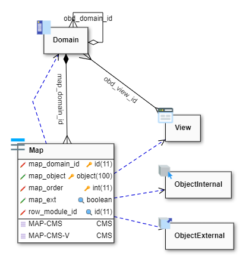
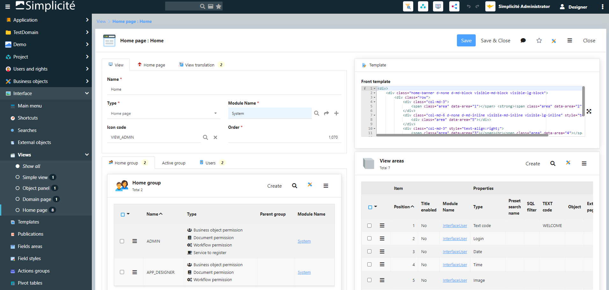
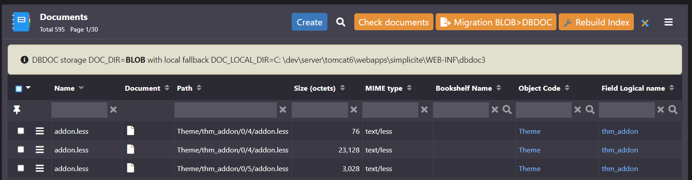

Version 6.0 release note
========================

:::danger[Warning]

This legacy minor version of major version 6 is **not maintained anymore**.

Make sure you upgrade to the current minor version of major version 6.

:::

Compatibility breaking changes
------------------------------

### JVM compliance

The target JVM compliance level for version 6 is 17 (LTS) even if it is still compiled with a JDK 11.

The platform is thus supposed to be on any JVM >= 17 (LTS or not) and should not be run on any older JVM anymore.

If you are using our Docker images (see below), you can safely use JVM 17 syntax and features in your Java code,
as images with a JVM older than 17 are no longer provided.

### Docker images

The Docker images for version 6 are built on an **AlmaLinux 9** OS base (vs a legacy CentOS 7 OS base for previous major versions' images).
The JVM variants are only for the **recent** Java LTS versions: 17 and 21 (default).

By default they are also using the plain `simplicite` user (vs the privileged `root` user for previous major versions' images).

Any customization of our images should thus be verified and refactored if needed.

### Deprecated repository objects

Deprecated objects:

- `ShortCutGroup`
- `PrintTemplateGroup`
- `CrosstabGroup`
- `ConstraintGroup`
- `ModelTemplateGroup`
- `Function` for `Domain` and `ObjectExternal`

All previous rights are migrated automatically to the new `Permission` object with this release:

- After migration your modules will have to be reexported to use the Permission object.
- Next release will delete deprecated objects, they are only hidden is this release.

### Hooks Rhino deprecation

- `Rhino` engine is now only used to implement calculated fields, simple expressions or back-end constraints.
- **Rhino scripts are no longer allowed to implement hooks** of internal/external objects, business processes, dispositions and adapters.

Upgrade will not be permitted if your modules still contain Rhino scripts instead of Java classes:

- Java uses compiled code = faster execution
- Native support of inheritance and overriding of methods
- Remote debug in usual IDE
- JUnit, more documented...

### Hooks deprecation

- `PlatformHooks.isMenuEnable` has to be refactored to `isMenuItemEnabled` with more parameters.
  See [this section](#core-changes) for details

### Ajax

- All synchronous Ajax calls have been deprecated for a while, they are now no more supported by the UI components.

### Meta-object virtual link based on `row_metaobject_id`

The internal additional field `row_metaobject_id` has been removed, the meta-object field support the link itself (thru a refSearchSpec):

- it allows several meta-object fields on a same object (previous versions only support one meta-object per object)
- the related Link is named `<child object>;<meta-object field name>` instead of `<object>;row_metaobject_id>`
- inlined panel in template has to be refactored with the new link name:
  - from `<div class="area" data-area="MyPanelObject;row_metaobject_id>"></div>"`
  - to `<div class="area" data-area="MyPanelObject;myMetaObjectField>"></div>"`
- the syntax is now more consistent with foreign-keys

### Translation refactored

- All `Translation` objects has a new field `tsl_object` to address any translatable entity.
- And `tsl_id` and `tsl_type` are not used anymore.
- The related legacy field `obo_delspec` is now hidden and deprecated

### Other compatibility breaking changes

- The platform hook `customStartPage` now throws exceptions.
  If you have implemented this hook you need to add `throws Exception` to the method declaration.

- The group `APP_DESIGNER` has been removed, the system only uses `ADMIN` or `DESIGNER`

- The `BarcodeTool`, `QRCodeTool` (and the new `DatamatrixTool`) takes now a resolution in DPI instead
  of a size argument for their image generation methods.

Core changes
------------

- New hook to limit user's access to menu item
  - `isMenuItemEnabled` with more parameters to limit access for status, enum or activity
  - `isMenuEnable` is deprecated but still present in this release, it should be refactored anyway as it will be removed in a next minor version

```java
public boolean isMenuItemEnabled(Grant g, MenuItem item,
	ObjectField field, MenuItem.State state, EnumItem enumItem, Activity activity);
```

- Unified new business object `Permission`
  - to replace old granted groups of `Shortcut`, `Crosstab`, `PrintTemplate`, `ConstraintGroup`, `ModelTemplateGroup`
  - new feature to authorize or restrict groups for `PlaceMap`, `TreeView`, `Search`, `Agenda` and `Timesheet`
  - use `Permission` to grant `External object` and `Domain` (Function is now dedicated to business objects only)

- Added permissions to override default **object field** access per group
  - allows to override 3 properties: Visible | Updatable | Required
  - applied if one group belongs to user's responsibilities


- Object `Export` definition has been updated to enum multiple
  - to specify allowed medias
  - older value "true" is mapped with "All" medias for upward compatibility


- Full export supports links thru meta objects (ex: to export Permissions with a parent object)

- `Map` with new unified object field `map_object`:
  - replace map_object_id for internal and external objects
  - replace map_process_id for business processes
  - allows new access to views and sub-domains



- Asynchronous action launched by the UI with **tracking**

  - The method signature can get a new parameter to implement the tracking
  - The back-end logs the progression
  - The front-end displays a modal dialog with the running tasks, durations and optionally a progress bar
  - The tracker can be stoppable, minifiable or closeable

Example

```java
/** Asynchronous action launched by the UI */
public String myAction(Action action, AsyncTracker tracker) {
	try {
		// Already running ?
		if (tracker.isRunning())
			return null;

		// Can close the dialog on UI
		tracker.setCloseable(true);
		// Can minify the dialog on UI
		tracker.setMinifiable(true);
		// Not minimized on startup
		tracker.setMinified(false);
		// STOP button on UI
		tracker.setStoppable(true);
		// 0%
		tracker.setProgress(0);
		// limit tasks size in memory
		tracker.setDepth(50);

		// Start the tracking
		tracker.start();
		tracker.add("MyAction has started");

		// Track the job 1
		tracker.push("Job 1");
		// ...
		tracker.message("doing something in job 1");
		// ...
		tracker.message("doing something else in job 1");
		tracker.error("something wrong");
		// ...
		tracker.pop("done");

		// 20%
		tracker.setProgress(20);

		// Check running periodically
		if (!tracker.isRunning())
			return null;

		// 30%
		tracker.setProgress(30);

		// Track the job 2
		tracker.push("Job 2");
		// ...
		tracker.pop("done");

		// ...
	}
	catch (Exception e) {
		// Assign the error on current task
		tracker.error(e.getMessage());
	}
	finally {
		// Stop tracking
		tracker.stop();
	}
	return null; // UI will displays a dialog with the tracking data
}
```

- Synchronous action with **tracking** of one internal asynchronous Job, and `tracker.addFile` example

```java
package com.simplicite.objects.MyModule;

import java.util.*;

import com.simplicite.util.*;
import com.simplicite.util.exceptions.*;
import com.simplicite.util.tools.*;
import com.simplicite.util.engine.JobQueue;
import com.simplicite.util.engine.Platform;
import java.io.File;

public class MyObject extends ObjectDB {
	private static final long serialVersionUID = 1L;
	private static final int STEPS = 10;

	/** Synchronous action launched by the UI with internal asynchronous Job */
	public String myAction(Action action, AsyncTracker tracker) {
		// Already running ?
		if (tracker.isRunning())
			return null;

		// init tracker
		tracker.setProgress(0);
		tracker.setMinifiable(true);
		tracker.start();

		JobQueue.push("myJob", new Runnable() {
			@Override
			public void run() {
				try {
					tracker.add("myAction has started");

					for(int i=1; i<=STEPS; i++){
						tracker.push("Job "+i);
						tracker.message("Sleep 1 second in job "+i);
						Thread.sleep(1000);
						tracker.pop("Job "+i+" done");
						tracker.setProgress(100*i/STEPS);
					}

					tracker.addFile("Download file", getExampleContentFileUrl());
				}
				catch (InterruptedException e) {
					tracker.message("Interrupted");
					Thread.currentThread().interrupt();
				}
				catch (Exception e) {
					// Assign the error on current task
					tracker.error(e.getMessage());
				}
				finally {
					tracker.stop();
				}
			}
		});
		return null; // UI will displays a dialog with the tracking data
	}

	private static String getExampleContentFileUrl() throws Exception{
		File f = FileTool.getRandomFile(Platform.getContentDir() + "/tmp", "async-file", "txt");
		if(!FileTool.writeFile(f, "File content"))
			throw new Exception("could not write file");
		return HTMLTool.getContentURL(f);
	}
}
```

Modal dialog during execution:


Minified toast at bottom with current task only:


- New action on business object to generate skeletons of resources `STYLES` + `CLASS`
- New serializable class `JSONObjectSerial` and `JSONArraySerial` to be used in serializable parameters of ObjectDB and Grant

- New **`Application`** to package modules
  - Inherited from `Module` with type 'Application': the top module of the hierarchy
  - Added an order on hierarchy
  - New export to group all modules in a same maven project

Example with the Demo and its dependencies as one big Application:


Export:


Import:


- Added a **type of View** to separate thru inheritance:
  - `Simple view` : standalone usage / menu
  - `Object panel` : view with function and constraint to be added in the object form
  - `Domain home` : home view of a business domain
  - `Home page` : granted home page to groups/users with theme and scope

Meta-model with 4 new objects

Example of the new Home view:



- New filter syntax for meta-object field to search in indexes: `<object name>#<user key filter>`

```java
// All users with 'martin' in the name
getField("myObjectField").setFilter("User#%martin%");
// All indexed objects with user-key starting with '12345'
getField("myObjectField").setFilter("%#12345%");
// Explicit User with row_id = 12
getField("myObjectField").setFilter("User:12");
```


- New configuration object **`ActionQueue`** in settings:
  - Replace the single pool of workers of previous versions
  - Separate system and application threads:
    - `AppQueue`: new default queue for all asynchronous actions
    - `SysQueue`: new system queue for internal asynchronous actions
  - Allows to create specific queues for simple jobs or bulk updates with a min/max pool of workers
  - Allows to assign a queue to any asynchronous `Action` or any `Crontab`
  - Allows to push a job by code to a queue
    `JobQueue.push("queueName", "my job name", oneRunnable, Thread.NORM_PRIORITY)`
  - The default queue is `AppQueue` if not specified
  - One history is displayed with sizes of queue and running workers in time (last 1000 metrics per queue)


- New monitoring panel with async queues metrics


- Added 2 properties on `External object`
  - nature: Basic, Responsive, Web-page, Web-service... with associated code snippet in Java
  - UI widget: allows to import the object as a UI component in views


- **Permalink** to expose user-friendly URL:
  - designer can set a permalink to override technical deeplink or tiny URL (without internal row_id)
  - a permalink uses a kebab-case syntax and is wrapped thru the new servlet `/ui/l/<permalink URI>`
  - the authentication mechanism is respected before accessing the permalink if the user is not yet connected
  - currently supported on:
    - `View`: direct access to a view or dashboard, ex: `/orders/sales-overview`
    - `Preset search`: direct access to a filtered/sorted object, ex: `/orders/list-of-last-pending-status`
    - `External object`: direct access to an external object page, ex with parameters: `/ext-page-name?status=pending&client=CLI0001`
  - business object form: the permalink is based on record data
    - with dynamic tokens in URI: `[USERKEY]`, `[VALUE:field]`, `[DATE]`, `[ROWID]`
    - a new column `row_permalink` is created in the DB table to store the calculated permalink per row on save
    - example: `/orders/order-[VALUE:demoOrdNumber]-created-[DATE]`

- Asynchronous Data export of module with tracking and progression


- new object hook `fieldEncryptDB` to encrypt/decrypt data into DB

```java
private String getKey() {
	// ZZZ set as a system parameter (make sure to configure it as "private") ZZZ
	//return getGrant().getParameter("MY_ENCRYPTION_KEY");
	// or
	// ZZZ pass this to the JVM by -Dmy.encryption.key=...
	//return System.getProperty("my.encryption.key");
	// or
	// ZZZ set this in the JVM environment
	return System.getEnv("MY_ENCRYPTION_KEY");
	// etc.
}

/**
 * Encrypt or decrypt the field value
 * @param f    Object Field
 * @param value Field value (encrypted or decrypted)
 * @param encrypt true to encrypt the value, false to decrypt
 * @param context create/update to encrypt, select/redolog to decrypt
 * @return encrypted or decrypted value
 */
public String fieldEncryptDB(ObjectField f, String value, boolean encrypt, String context) {
	if (f.getName().equals("mySensitiveField")) {
		return encrypt
			? EncryptionTool.encrypt(value, getKey())
			: EncryptionTool.decrypt(value, getKey());
	}
	return super.fieldEncryptDB(f, value, encrypt, context);
}
```

- Hook `fieldCompletion` with current values from UI:
  - Values are set in the tmp instance of object to keep the main object with DB values
  - Useful to get current UI values in hook to limit the completion depending on another fields

```java
@Override
public List<String> fieldCompletion(String input, String query, String context) {
	// 'this' in the tmp instance with current UI values
	String value = getFieldValue("anotherField");
	// Search something with value and query ...
	return result;
}
```

- Markdown module rewrite in JAVA (Documentation menu)

- `Object fields` panel has a new reflexive link to group referenced fields per foreign-keys
  - `obf_joined_id` is the reflexive link used by UI to group fields in a tree on list
  - `obf_ref_field_id` is still supported by the object loader to build the fields hierarchy (but will be removed in v6.1)


- Added `isExportTimestamp` and `setExportTimestamp` to allow timestamp export in CSV

- Robustness of hook calls:
  - Prevents infinite loop/stack overflow, ex: doing a save() in the postSave on a same instance
  - Tracks hook duration: log a warning after 2s by default
  - Allows to trace hooks and action method calls (in/out and time)
  - New log event `HOOK` at level INFO by default
  - New hooks `hookBegin`, `hookEnd`, `methodBegin`, `methodEnd` to customize behavior (cf [trace hooks](/docs/core/objects/businessobject-code-hooks#trace-hooks)):

```java
@Override
public void postLoad() {
	// no trace (the default)
	traceHooks(TRACE_HOOKS_NONE);
	// trace only implemented hooks (during test)
	traceHooks(TRACE_HOOKS_IMPLEMENTED);
	// trace only implemented hooks with main parameters (during test)
	traceHooks(TRACE_HOOKS_IMPLEMENTED_ARGS);
	// trace all hooks (verbose for training)
	traceHooks(TRACE_HOOKS_FULL);
}

@Override
protected void hookBegin(String hook, int maxTime, int maxStack, Object... args) throws HookException {
	// postUpdate may be long because of ...
	if ("postUpdate".equals(hook))
		maxTime = 10000; // warning after 10s in ms

	// default duration is 2s by default
	// default stack is set 20 to stop infinite calls loop => HookException
	super.hookBegin(hook, maxTime, maxStack);
}

@Override
protected long hookEnd(String hook) {
	long time = super.hookEnd(hook);
	// do something if postUpdate is too long
	if (time>10000 && "postUpdate".equals(hook)) {
		// notify the supervisor...
	}
	return time;
}

// Same for Action method
@Override
protected void methodBegin(String method, int maxTime, int maxStack) throws HookException {
	super.methodBegin(method, maxTime, maxStack);
}
@Override
protected long methodEnd(String method) {
	return super.methodEnd(method);
}
```

- Assisted DBDOC migration to import/export BLOBs
  - launched from the Documents list
  - async process with UI progression




UI changes
-----------

- The modeler can display the Meta-object Links
  - designer must specify which target objects will be drawn
  - with one template Link per target object with the origin set to object with the meta-object field
- Object Modeler with permission links

- New class `Simplicite.UI.BusinessObject` with all front hooks
  - Use the `CLASS` resource by object to define new hooks
  - New hooks support inheritance logic
  - Older hooks are used for compatibility reason (from `SCRIPT` resource) but do not support inheritance
  - `Simplicite.UI.BusinessObject` extends `Simplicite.Ajax.BusinessObject`: means that default Ajax function
    can be overridden on front (search, get, update...)
  - See the the JavaScript documentation of `Simplicite.UI.BusinessObject` to get the list of new hooks

Example:

```javascript
// Resource "CLASS" of object A
Simplicite.UI.BusinessObjects.A = class extends Simplicite.UI.BusinessObject {
	constructor(app, name, inst) {
		super(app, name, inst); // construct the Simplicite.Ajax.BusinessObject
		console.log("[A].constructor");
	}
	// Front hook when form is displayed
	onLoadForm(ctn, obj, params) {
		console.log("[A].onLoadForm");
	}
};

// Resource "CLASS" of object A2 (extends A)
Simplicite.UI.BusinessObjects.A2 = class extends Simplicite.UI.BusinessObjects.A {
	constructor(app, name, inst) {
		super(app, name, inst); // call A constructor first
		console.log("[A2].constructor");
	}
	// Override search (Promise with ajax call)
	search(filters, params) {
		console.log("[A2].search");
		return super.search(filters, params);
	}
	// Front hook when form is displayed
	onLoadForm(ctn, obj, params) {
		super.onLoadForm(ctn, obj, p); // call parent implementation
		console.log("[A2].onLoadForm");
	}
};
```

- `ActionGroup` to display actions in a dropdown button on list or form


- Improved `UserSession`: added remote address and user agent

- New **list tab** on object definition :
  - with 2 new properties **minifiable** and **minified**
  - to separate all List properties and simplify other tabs


- New domains for the designer menu:
  - Project: packaging settings with applications, modules, app-store...
  - Settings: technical settings with system parameters, license key, crontab, adapters...
  - User interaction: with news, user's feedback, social posts...
  - Translations menu has been moved into User interface
  - Web and Social domains have been removed

- New `View` template editor based on grid-stack rendering:
  - Fluid drag&drop to move and resize areas
  - Allows to drag&drop menu item in template to generate one object list (with specific filters and ordering)
  - Allows to import crosstab with specific options (rows/columns/values, grouping, filters...)
  - Allows to import chart with specific options (pie, bar, lines...)
  - Allows to import external object marked as UI widget


- Maintains current scroll-y of object form/list

- Object Fields can now be added to an Object's template in bulk


- Added new QRCode/barcode scanner rendering for short text and URL fields:


- Extended syntax for field type server-side validation: can now be a fully qualified static method class name
- Added EAN13 and EAN8 field type with server-side validation

- UI form's HTML text input type are now set to `number`, `tel`, `email` or `url` instead of plain `text`
  depending on corresponding configured field type

- Renamed webapp manifest from `manifest.json` to `simplicite.webmanifest`

- Added a minimalistic duplicates detection action on business objects (e.g. useful after changing the functional key fields)


- Added Web Content Accessibility from WCAG 2.1
  - More aria-label, tabindex, focus-visible...
  - New access keys for mouse free users
  - Mostly backported in v5.3
  - [Documentation](/docs/ui/wcag)

- Added search bar on menu (set `MENU_SEARCHABLE` system parameter to `yes` / `no` to display / hide) :


- Updated Search item on view:
  - Allows to define the item without a predefined search, only with the object name
  - `Home` instance of object can display its predefined-search bar in header (as the main instance)

- Added search bar on object forms:
  - Allows to focus and highlight a field in the object's form
  - Displayed on all objects by default
  - Is configured with the "Search on form" configuration field

- New action on module to manage `ALTER DB history` and oldvalues delivery:
  - To keep selected oldvalues during module export of renamed fields/columns and objects/tables, and to be applied to other instances during module import
  - To remove other histories when module has been delivered everywhere


- New template editor option on date field to set the property `data-autoopen` to auto-open the date picker when focusing the input.
The property is now set to false by default.


Post-release
------------

### 6.0.0 (2024-01-31) - initial release {#version-6.0.0}

- Initial release for minor version 6.0. See above for details.

### 6.0.1 (2024-02-23) {#version-6.0.1}

- Fixed patches (was causing home page to be broken when upgrading from v5)
- Added some missing logos/icons
- Fixed some styles in the admin theme
- Removed Rhino type proposal when creating a shared code
- Fixed UI `val` JS function for single or multiple enum fields for select2-based renderings
- Fixed various class/code configuration issues on typed external objects and associated snippets
- Increased robustness of login pages when no home page is defined for `public` user
- Modernized/simplified API tester page JS script with logout action
- Backported follow links on N,N pillboxes
- Fixed action buttons configured colors
- Fixed "Associate" button not showing on inherited objects
- Added `getAuthTokenInfo` hook to `PlatformHooks` for custom token processing
- Backported fix to prevent implicit fallback to unauthenticated user when calling the API endpoint
  with a malformed authorization header (e.g. omitting the `Bearer` auth type prefix in the `Authorization/X-Simplicite-Authorization` header value)
- Fixed Notification websocket events dispatched to all users
- Backported support for a monospace custom font in the themes + use of corresponding CSS variables
- Fixed create right check on trays
- Added status colors on summary presentation
- Fixed space-comma number format
- Backported `SHORTCUT_PREFS` for user's shortcuts displayed in header
- Fixed home instance of object in a Simple View without parent object
- Backported some styles fixes on the admin theme
- Fixed monospace long string fields rendering
- Fixed simple views visibility in the menu
- Added database vendor name in the health check
- Experimental JSON schema validation support for some settings (e.g. on REST mapped external object services)

### 6.0.2 (2024-03-01) {#version-6.0.2}

- Backported improvements on `Tool.toHumanReadableDate/Datetime` tools.
- Backported experimental custom HTML tags (`<simplicite-*/>`)
- Removed rhino snippets for ACE editor
- Removed outdated `responsive` disposition (Bootstrap 3)
- Backported **experimental** custom HTML tags `<simplicite-*>`
- Fixed "undefined" displayed in list size selector when in update list context

### 6.0.3 (2024-03-07) {#version-6.0.3}

- Uniformed outline styles for focused items
- Datetimepicker new `autoOpen` parameter to show/hide picker on focus
- New option in DOM of date field to hide picker on focus `<div class="field" data-autoopen="false">`
- Backported improvements on the UI code editor
- Backported error management improvements in getForUpdateOrCreate method

### 6.0.4 (2024-03-15) {#version-6.0.4}

- Backported fix for deleted bookmarked records
- Added new template editor option for date to set the property `data-autoopen` to auto-open the date picker when focusing the input
- Fixed previous changes on the UI code editor which were causing SQL errors on MySQL
- Fixed reset search spec on view items
- Added `api_`-prefixed business instance name to match `isWebServiceInstance()`

### 6.0.5 (2024-03-21) {#version-6.0.5}

- Fixed upgrade from v5 with PostgreSQL database
- Fixed fields visible on list only not showing in associate context
- Fixed `null` parent object in `initAssociate` hook for 1-N links

### 6.0.6 (2024-03-29) {#version-6.0.6}

- Added semver4j Java lib
- Updated AppStore for improved platform compatibility check
- Backported improvements on the JSON schema for module's settings
- Backported improvements and fixes on class field checks for disposition, adapter, internal and external objects and workflows
- Backported `repositoryUrl` Maven setting for module to allow use of an external Maven repository
- Backported default implementation of service object's `loadServiceConfig` = try to load JSON settings from search spec field
- Backported mapped REST service external object `success` hook
- Backported fix on some drop index statements for SQLServer

### 6.0.7 (2024-04-05) {#version-6.0.7}

- Backported fixes of some theme editor issues
- Backported fix on App store module installation
- Backported fix on regression for transition buttons styles
- Backported add of type in action metadata jSON (used by template editor)
- Backported fixes on the template editor vs embedded transition action buttons

### 6.0.8 (2024-04-17) {#version-6.0.8}

- Backported calculation of the dropdown max-height to apply the overflow-y
- Backported fix on predefined searches with filter=false (and not "0")
- Backported fix on module's action button styles
- Backported new widgets: `ChartjsExternalObject` (for arbitrary Chart.js charting)
  and `MustacheExternalObject` (for arbitrary Mustache template rendering)
- Backported instance naming for **isolated** object to `tmp_isolated_<name>_<date>`
  (was `tmp_<name>_<date>` before), allowing a `isIsolatedObject()` method
- `CHARTJS_VERSION` set by default to `3` (should have been done since first release of version 6).
  If you experiment issues with your custom pages using Chart.js v2 you can force the overridden value of this system parameter to `2`
- Backported icon change for collapsible components (chevron up/down)

### 6.0.9 (2024-04-23) {#version-6.0.9}

- Changed condition for allowing upgrade from version 5, now checks if a minimal previous revision is installed
  (instead of checking the latest previous revision patch checksum)
- Backported bulk association with N-N links rendered as pillbox
- Backported some robustness fixes when websockets are globally disabled
- Backported fix for Notification content exported in module as exploded JSON

### 6.0.10 (2024-05-03) {#version-6.0.10}

- Backported fix on response format for forbidden and internal server error sent by API external objects accepting JSON
- Backported the new platform hook `customErrorResponse` to override, if needed, some case of error responses
- Fixed sub-view async loading
- Backported JSON schema validation for import specifications

### 6.0.11 (2024-05-17) {#version-6.0.11}

- Fixed template editor creating new action
- Fixed confirm fields on list action
- Fixed row action with current values to confirm
- Fixed HTML editor in a dialog box

### 6.0.12 (2024-05-31) {#version-6.0.12}

- Backported fix on the color picker of theme editor
- Backported loading of SAML attributes into the session info
- Backported SAML config flexibility: allowed base64-encoded SAML certificate/keys in AUTH_PROVIDERS
- Backported fix on `initAction` call for state transition with confirmed action containing fields
- Backported fix on action translations/help fallback to any language
- Backported fix on the `AUTH_PROVIDERS` system parameter's JSON schema to allow also list of URLs in the `visible` attribute
- Upgraded the Marked 3rd party JS lib (aligned on the version used in next minor version 6.1)
- Backported robustness vs loading failure of the Marked and Highlight JS 3rd party libs

### 6.0.13 (2024-06-12) {#version-6.0.13}

- Backported `AuditTool.checkDeadLinks` to detect dead links in logs as SQL patch
- Backported fix to force the ENUM `loadList` before `initAction`
- Backported `server.compiler` JVM argument to disable the Java compiler when required (it is enabled by default).
  On Docker images this argument is set using the `COMPILER` environment variable.
- Backported fix on mishandling of "default" mail sender

### 6.0.14 (2024-06-24) {#version-6.0.14}

- Backported parameter `CRON_LOCK_OWNER` to force only one node (endpoint URL) to get the `CRON_LOCK` (no ping/no failover when the parameter is set)
- Backported fix label alignment in a search dialog on XS devise

### 6.0.15 (2024-07-05) {#version-6.0.15}

- Backported fix import module in a JSON format with Dataset in XML format
- Backported fix DataLink reset values on create
- Backported fix front constraint with updatable rule on ENUM
- Backported fix on mismatch between objects' and processes' cache max size
- Backported JSON schemas for widgets external objects' settings validation

### 6.0.16 (2024-07-15) - maintenance revision {#version-6.0.16}

- Backported fix re-apply back constraints on save
- Backported fix on associate backend messages for 0,n links
- Backported fix on multiple enums rendering with SVG icons
- Backported extra properties for Maven checkstyle plugin in module's `pom.xml`

### 6.0.17 (2024-07-25) - maintenance revision {#version-6.0.17}

- Backported removal of platform-level items from the application-level information
- Backported GPG signature support for Git commits, enabled by the `GIT_GPG_SIGNATURE_KEYID`
  system param which contains the GPG key ID (can be specified per-user)
- Backported fix missing View fields on Module Export in JSON format
- Backported fix export full on list into JSON format
- Backported `JSONAdapter` & `YAMLAdapter` refactoring to support arrays of objects
  and same business logic except format conversion
- Backported added a `DEL_DENIED` message on non deletable rows during a `deleteAll`

### 6.0.18 (2024-08-18) - maintenance revision {#version-6.0.18}

- Added `java.net.ConnectException` in service SystemTool.ping
- Backported fix reset boolean filter on select activity of process
- Backported fix on front revision cache on URL to reload `TEXT` cache
- Backported fix to hide the save button on a form reload when the `isUpdateEnable` becomes false
- Backported fix on textarea autosize on change event

### 6.0.19 (2024-08-30) - maintenance revision {#version-6.0.19}

- Backported fix on missing CSS `.btn-xs` for extra small button since Bootstrap 4
- Backported fix on delete cascade in case of `SimpleUser` inheritance (dead links on Responsibilities)
- Backported fix on meta-object delete cascade in case of inheritance (dead links on View Translation)

### 6.0.20 (2024-09-06) - maintenance revision {#version-6.0.20}

- Backported fix on foreign keys completion overflow + populate in the confirm dialog of action
- Backported allowance of grouped actions on list
- Backported fix on action call in a tree view
- Backported fix on `job_action` field size
- Backported fix on wrong button orientation of collapsed card
- Backported fix on notepad fields losing their current content in case of validation error of the form

### 6.0.21 (2024-09-13) - maintenance revision {#version-6.0.21}

- Backported fix on NPE when comparing module with a remote JSON format
- Backported fix to remove button of user filters' badge in case of a foreign key
- Backported fix on predefined search update in session cache
- Backported `minimal` value for `USE_HEALTH` system parameter to restrict healthcheck to monitoring-only data (no information on JVM, server, OS, ...)
- Backported fix to save undo/redo updates in redoLog
- Added PostgreSQL `websearch_to_tsquery` as default parser for fulltext search (inhibitable with param `PGSQL_TSQUERY=to_tsquery`)
- Backported fix on missing `ActionGroup` and `TranslateActionGroup` in module export JSON
- Backported `minimal` value for `USE_HEALTH` system parameter to restrict healthcheck to monitoring-only data (no information on JVM, server, OS, ...)
- Backported change on ping and healthcheck to return a `503` instead of a `500` in case of database unavailability

### 6.0.22 (2024-09-20) - maintenance revision {#version-6.0.22}

- Backported fix on download icon on preview page of multi-docs field
- Backported fix to disable preview & download on non saved multiple documents
- Backported optimization on `m_document` for multi-docs queries
- Backported new tags for publication templates (`[SYSPARAM:<parameter name>]` for substituting a system parameter
  and `[LABEL:<object name>:<-|+>]` for substituting singular (`-`) or plural (`+`) object label)

### 6.0.23 (2024-10-07) - maintenance revision {#version-6.0.23}

- Backported fix on completion dropdown in case of right/left side modal
- Backported fix on UI target object in some case of update
- Backported security fix: updated Lucene lib (see [this CVE warning](https://nvd.nist.gov/vuln/detail/CVE-2024-45772))

### 6.0.24 (2024-10-18) - maintenance revision {#version-6.0.24}

- Backported `AppLog.deprecation` variant with an `outdatedInVersion` argument
- Backported fix Permalink to external object with parameters
- Backported new UI helper for ENUM `field.ui.setList(lovname)` to set and redraw a list of values

### 6.0.25 (2024-10-28) - maintenance revision {#version-6.0.25}

- Backported fix on list rendering for multiple enums + default "tag" rendering color/background
- Backported fix on exportable fields on form
- Backported `blur` event on big-decimal field to restore the simplified rendering
- Backported fix on missing support for importing ZIP export files with JSON files
- Backported fix on missing support for JSON format (single file or ZIP) in the "apply" action of the `Dataset` object
- Backported optimization on fulltext search IN "BOOLEAN MODE" for MySQL
- Backported treeview opens the main instance of object to allow edit list
- Backported fix multi PlatformHooks `preSearchIndex`

### 6.0.26 (2024-10-31) - final maintenance revision {#version-6.0.26}

- Backported fix on action fields to avoid removing read-only and referenced fields on the 2nd call
- Backported fix on Checkstyle Maven settings for modules

> **Warning**: this is the **final** revision for this minor version 6.0, no further maintenance will be done on it.
> If you are still using it, please upgrade to the current minor version of major version 6.
