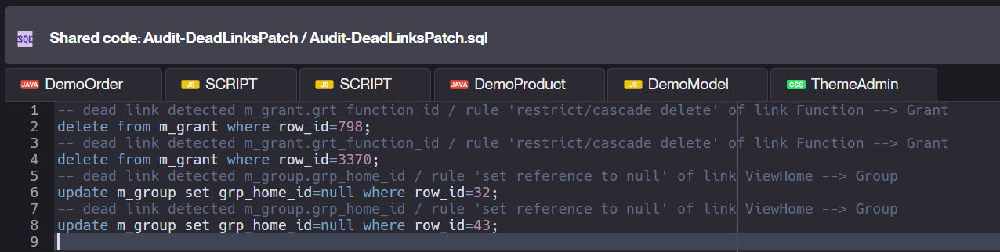
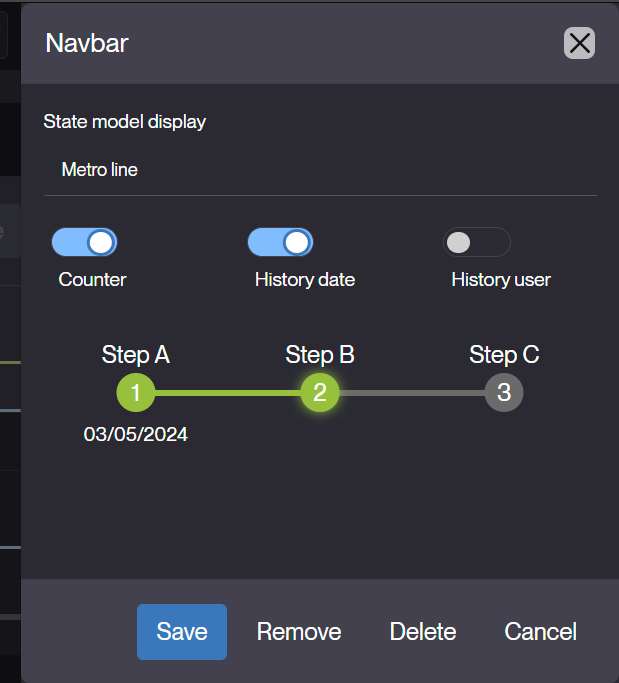
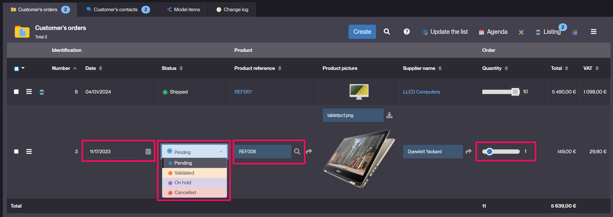
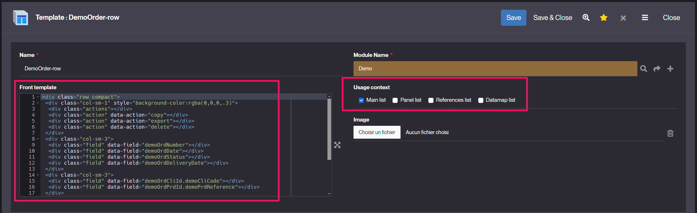
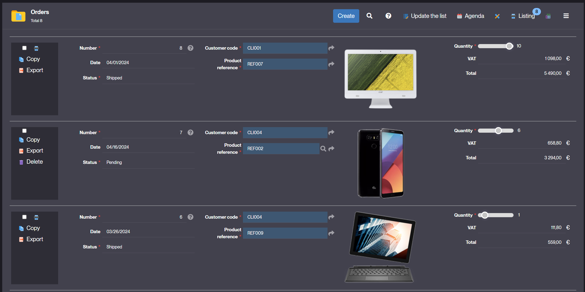
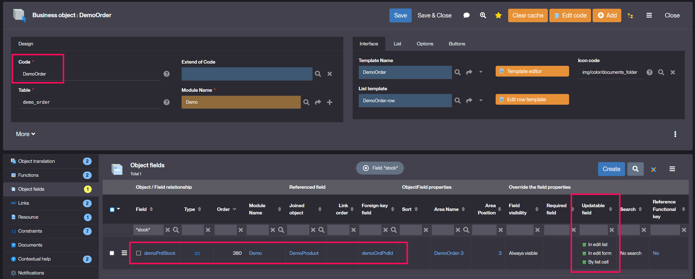
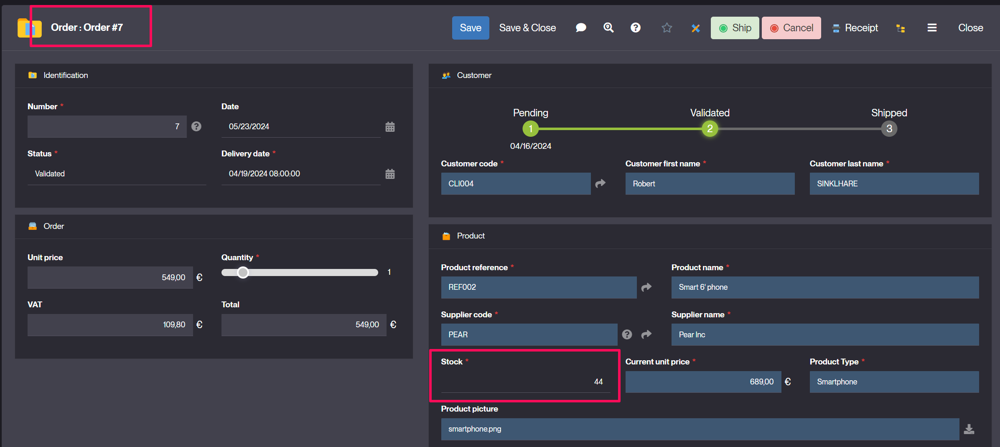

Version 6.1 release note
========================

:::danger
**Warning**: This legacy minor version of major version 6 is **not maintained anymore**.

Make sure you upgrade to the current minor version of major version 6.
:::

Compatibility breaking changes
------------------------------

- All deprecated methods from V3 and V4 have been removed
	- the legacy methods were already marked as deprecated in the logs a long time ago,
	- and had to be modified in V5.

- The deprecated `PlatformHooks.isMenuEnable` has been removed.
  See [minor version 6.0 release note](v6-0#core-changes) for refactoring instructions.

- No more internal EJB support to access the database:
	- Nothing to do when Simplicité is deployed on Tomcat,
	- This feature is no more used since Simplicité V3 (transaction support with XA services),
	- The webapp connects the database thru a monitored connections pool (JDBC),
	- APIs use internal cache to guarantee high performance while optimizing memory.

- Removed wrapper for Rhino hooks implementation:
	- Rhino has been removed for hook implementation since V6.0
	- Classes `ScriptedObjectDB`, `ScriptedProcessus`, `ScriptedDisposition`, `ScriptedExternalObject` and `ScriptedPlatformHooks` has been removed from platform
	- if necessary to be easily replaced by their primary class: `ObjectDB`, `Processus`, `Disposition`, `ExternalObject` and `PlatformHooks`

- The 3rd party **Unirest** lib v3 has been upgraded to v4 (core) which means you will have to modify
  all potential import statements in your java code from `kong.unirest.*` to `kong.unirest.core.*`.

- The 3rd party **PDFBox** lib v2 has been upgraded to v3 which means you will have to refactor
  any potential direct use of this library.

We also remind you that there have been some other compatibility breaking changes in the previous minor version:

- See [the release note of minor version 6.0](v6-0#compatibility-breaking-changes)

Deprecated features
-------------------

These are to be removed in the next minor version 6.2:

- Deprecated `Bootstrap V4` rendering: please check if the UI runs already with `BOOTSTRAP_VERSION=5`
- Deprecated `Fullcalendar V3`: it is strongly recommended to use `FULLCALENDAR_VERSION=5`
- Deprecated `Cordova` hybrid app for mobile device is no more supported, engine only uses the responsive UI directly in a browser and the WebPush feature

We also remind you that there have been some other compatibility deprecations in the previous minor version:

- See [the release note of minor version 6.0](v6-0#compatibility-breaking-changes)

Core changes
------------

- A single permission supports multiple profiles/groups to factorize rights rules

- Added a new platform hook `customErrorResponse` to override, if needed, some case of error responses.
  Typical usage would be for external objects to generate custom error pages/data for authentication errors.

- Added various JSON schemas for validation of JSON/YAML settings, etc.

- Added `AuditTool.checkDeadLinks` to detect dead links in logs and generate a SQL patch thru audit tool:




## UI changes {#uichanges}

- Added support for declaring a custom monospace font on a theme.
  Note that theme-level fonts are now using dedicated CSS variables instead of a generated `font-family` styles:
	- `--simplicite-font` for the main font
	- `--simplicite-font-mono` for the monospace font

- Added new **experimental** custom HTML tags to ease usage of standard UI components within custom pages/widgets:

- New state-model navbar
	- The related list of values can have a rendering
	- Each status needs to specify its role: milestone, optional, exception or hidden
	- 3 styles exist (pure CSS):
		- breadcrumb / arrows / metro-line
		- with 3 options: step counter / visited date / user login
	- Visited steps are based on the history table
	- Current step, optional and exception roles can have their own style
	- Non visited milestones (from list of values) are displayed after the visited ones

Examples based on the demo:


breadcrumb with links


breadcrumb with arrows


metro line style


metro line with 3 options: counter + user + date


- The `states-navbar` can be displayed anywhere on form with the template editor to edit options




- New dialog options:
	- `fullscreen`: to show the dialog in 100% of the container
	- `scrollable`: true by default to scroll the dialog body (false to scroll the page)

- `Field updatable` property is now a enum-multi to support the new option editable `by list cell`:


Result:



- List template to display rows without common table/tr/td
	- Define a HTML template with mapped fields and actions
	- Applies to dedicated context (main list, panel, datamap or ref picker)
	- Associate the template to the `List template` of business object




Result:



- New hook `isFieldUpdatableByListCell`
	- to specify when a field is editable by cell
	- by default the method checks if the field is updatable as follow:

```java
/**
 * Checks if the field is updatable by list cell
 * @param f object field
 * @return true if the field can be changed in a list cell
 */
public boolean isFieldUpdatableByListCell(ObjectField f) {
	return f!=null
		&& f.isUpdatableByListCell() // Defined as updatable by cell ?
		&& !isReadOnly() // not a read only mode ?
		&& !isReadOnlyFields() // not a final status with read-only fields ?
		&& !getName().endsWith(Globals.HIST_SUFFIX); // not a history object
}
```

- New hook `isFieldUpdatableByListCell` example
  - the hook allows to limit some instances or user's profiles:

```java
public boolean isFieldUpdatableByListCell(ObjectField f) {
	return super.isFieldUpdatableByListCell(f)
		&& isPanelInstance()
		&& getGrant().hasResponsibility("APP_MANAGER");
}
```

- Allows update on simple referenced fields (not userkey) thru the parent list or form
	- Set referenced field to be updatable in the object field definition
	- Saving parent will also save updated referenced objects

Example: set the Stock of Product updatable thru the Order (by form, edit list and/or cell)



The Stock will be updatable directly from one Order of the Product (within the form/list/cell):



- Instance name of view's item has been updated to isolate concurrent access on same object within several sub-views

```
<home|panel>_ajax_<objectName>_<viewName>_<itemPosition>
ex: home_ajax_DemoOrder_DemoHome_2
```

Post-release
------------

### 6.1.0-RC1 (2024-06-01) - release candidate 1 {#version-6.1.0-beta-RC1}

- Initial release candidate for minor version 6.1. See above for details.

### 6.1.0-RC2 (2024-06-24) - release candidate 2 {#version-6.1.0-beta-RC2}

- Added parameter `CRON_LOCK_OWNER` to force only one node (endpoint URL) to get the `CRON_LOCK` (no ping/no failover when the parameter is set)
- Fixed label alignment in a search dialog on XS devise
- Allows edit-cell on list with group-by option

### 6.1.0-RC3 (2024-07-01)- release candidate 3 {#version-6.1.0-beta-RC3}

- Edit row template: inhibit minified/grouped list to edit rows only
- Fixed import module in a JSON format with Dataset in XML format
- Fixed DataLink reset values on create
- Fixed front constraint with updatable rule on ENUM
- Allows templated list with group-by option in a sub-area
- Object summary body width forced to 100%

### 6.1.0-RC4 (2024-07-05) - release candidate 4 {#version-6.1.0-beta-RC4}

- Added a DOM index to identify inputs between several edit lists on a same object
- Fixed on mismatch between objects' and processes' cache max size
- Added missing JSON schemas for widgets external objects' settings validation

### 6.1.0-RC5 (2024-07-09) - release candidate 5 {#version-6.1.0-beta-RC5}

- Fixed re-apply back constraints on save
- Logging improvements during system patches application
- Allows several edit-cell on a same field/same record between 2 lists on a same view

### 6.1.0 (2024-07-10) - initial release {#version-6.1.0}

- Initial release for minor version 6.1. See above for details.
- Fixed ENUM multiple rendering with SVG icons

### 6.1.1 (2024-07-25) {#version-6.1.1}

- Added extra properties for Maven checkstyle plugin in module's `pom.xml`
- Removed platform-level items from the application-level information
- Added GPG signature support for Git commits, enabled by the `GIT_GPG_SIGNATURE_KEYID`
  system param which contains the GPG key ID (can be specified per-user)
- Fixed missing View fields on Module Export in JSON format
- Fixed export full on list into JSON format
- `JSONAdapter` & `YAMLAdapter` refactoring to support arrays of objects
  and same business logic except format conversion
- Added a `DEL_DENIED` message on non deletable rows during a `deleteAll`

### 6.1.2 (2024-08-05) {#version-6.1.2}

- Added `java.net.ConnectException` in service SystemTool.ping
- Allows direct upgrade from Simplicite 5.3
- Fixed reset boolean filter on select activity of process
- Fixed front revision cache on URL to reload `TEXT` cache
- Fixed non public shortcuts loading when a single group Permission has no other permitted groups declared

### 6.1.3 (2024-08-22) {#version-6.1.3}

- Fixed hide the save button on a form reload when the `isUpdateEnable` becomes false
- Fixed textarea auto-size on change event
- Fixed missing CSS `.btn-xs` for extra small button since Bootstrap 4
- Fixed `TranslateLink` filter

### 6.1.4 (2024-08-30) {#version-6.1.4}

- Fixed delete cascade in case of `SimpleUser` inheritance (dead links on Responsibilities)
- Fixed meta-object delete cascade in case of inheritance (dead links on View Translation)

### 6.1.5 (2024-09-06) {#version-6.1.5}

- Fixed foreign keys completion overflow + populate in the confirm dialog of an action
- Allowed grouped actions on list
- Added missing translations
- Fixed action call in a tree view
- Fixed `job_action` field size
- Fixed wrong button orientation of collapsed card
- Backported improvements on the counters widget
- Allowed `ObjectContext` message with suggestion
- Backported the permission merge action on list to merge same permissions on several groups
- Backported possibility to implement external object script as a Javascript class
  extending `Simplicite.UI.ExternalObject` (and overriding the `render` class function)
- Fixed notepad fields losing their current content in case of validation error of the form

### 6.1.6 (2024-09-13) {#version-6.1.6}

- Fixed NPE when comparing module with a remote JSON format
- Fixed remove button of user filters' badge in case of a foreign key
- Fixed predefined-search update in session cache
- Backported automatic conversion to PDF for a text publication template file (e.g. HTML, plain text, ...)
  with forced MIME type set to PDF
- Fixed save undo/redo updates in redoLog
- Added PostgreSQL `websearch_to_tsquery` as default parser for fulltext search (inhibitable with param `PGSQL_TSQUERY=to_tsquery`)
- Fixed missing `ActionGroup` and `TranslateActionGroup` in module export JSON
- Backported `minimal` value for `USE_HEALTH` system parameter to restrict health-check to monitoring-only data (no information on JVM, server, OS, ...)
- Backported change on ping and healthcheck to return a `503` instead of a `500` in case of database unavailability
- Backported the `customPingResponse` platform hook to customize the `/ping` JSON response if needed
- Added `AuditTool.checkValidateErrors(obj)` to validate all records of one object
- Added syntax validation of `View` name to respect the `CONFIG` regexp (on UI instance only for compatibility reason)

### 6.1.7 (2024-09-20) {#version-6.1.7}

- backported support action groups for transition buttons
- Backported fix on download icon on preview page of multi-docs field
- Backported fixes and improvements on audio/video document MIME types & preview
- Backported fix to disable preview & download on non saved multiple documents
- Backported accessibility improvements of multi-document field
- Backported optimization on `m_document` for multi-docs queries
- Backported new tags for publication templates (`[SYSPARAM:<parameter name>]` for substituting a system parameter
  and `[LABEL:<object name>:<-|+>]` for substituting singular (`-`) or plural (`+`) object label)

### 6.1.8 (2024-09-24) {#version-6.1.8}

- Backported UI tabs options for tabbed areas (tabs positioning and hiding labels)
- Fixed completion dropdown positioning
- Fixed tabs regression on script editor page

### 6.1.9 (2024-10-02) {#version-6.1.9}

- Upgraded 3rd party **PDFBox** lib from v2 to v3, note that this might require refactoring of any code using directly this library,
  which should not be the case except for very specific needs
- Fixed missing ref counters on tabs
- Backported `isDataLinkInstance()` to identify the object during its data synchronization (in addition to batch/api usage)
- Linked list improvement to support `ENUM_MULTI` as target field
- `UIField.redraw` improvement to draw missing field in the container
- Fixed completion dropdown in case of right/left side modal
- Supports XML import of `Map` and `Translate` exported from V5.3 with legacy fields

### 6.1.10 (2024-10-07) {#version-6.1.10}

- Fixed UI target object in some case of update
- Security fix: updated Lucene lib (see CVE warning https://nvd.nist.gov/vuln/detail/CVE-2024-45772)

### 6.1.11 (2024-10-18) {#version-6.1.11}

- WCAG accessibility improvements (table, datetime picker...)
- Added support for paginated search with previous V5 syntax (without pagenum in lambda function)
- Forced the search position to popup when the list has a row template (no search by column)
- Added `AppLog.deprecation` variant with an `outdatedInVersion` argument
- Fixed Permalink to external object with parameters
- Added `ignoreCanClose` and `ignoreCanSaveClose` on creation dialog to get always the save+close buttons
- Backported new UX in objects selection with preview of selected items
- New UI helper for ENUM `field.ui.setList(lovname)` to set and redraw a list of values

### 6.1.12 (2024-10-28) {#version-6.1.12}

- Fixed list rendering for multiple enums + default "tag" rendering color/background
- Fixed exportable fields on
- Added `blur` event on big-decimal field to restore the simplified rendering
- Added log to trace sql query on dead record during import XML
- Fixed missing support for importing ZIP export files with JSON files
- Fixed missing support for JSON format (single file or ZIP) in the "apply" action of the `Dataset` object
- Optimization on fulltext search IN "BOOLEAN MODE" for MySQL
- Treeview opens the main instance of object to allow edit list
- Fixed multi PlatformHooks `preSearchIndex`

### 6.1.13 (2024-11-04) {#version-6.1.13}

- Fixed action fields to avoid removing read-only and referenced fields on the 2nd call
- Fixed module's pom.xml `outputFileFormat` element error
- Backported static method `Grant.getUserFullName(userId, orLogin)` to get any user's fullname

### 6.1.14 (2024-11-13) {#version-6.1.14}

- Fixed Cron `ImportXML` to support BLOB storage with XML and ZIP file
- Reverted behavior of index search on PostgreSQL for basic text-only searches (e.g. completions)
- Implicit default MIME type for template/method publications is set to HTML (this fixes issues with PDF conversion using forced MIME type)
- Backported `USE_LANGS=yes/no`to allow user to change language on UI
- Backported improvements on UX for editing resources and print templates (and deprecated print templates using UI templates)
- Forced workflow activity to `scrollTop=0`

### 6.1.15 (2024-11-22) {#version-6.1.15}

- Backported unit tests I/O service improvement allowing the use of the importspec syntax
- Robustness on object field to set hidden legacy field `obf_ref_field_id` to null when `obf_joined_id` is empty on UI
- Renamed/merged `[UI_]EDITOR_PREFS` system parameters to `CODE_EDITOR_PREFS`
- Changed slider fields rendering on lists to be consistent with form
- `Alert.send` returns the `pre/postAlert` message to be used by caller
- Fixed external objects parameters issues now return a "Bad Request" response (HTTP 400)

### 6.1.16 (2024-11-28) {#version-6.1.16}

- Backported `SAVE_BEFORE_QUIT` dialog on process activity
- Fixed minor regression on onboarding widget
- Backported improvements on the developments artifacts of the exported/committed module (checkstyle for Java code, JSHint for JS code)
  this allows adding control steps in CI/CD pipelines to ensure better code quality
- Updated Docx4j libs (and all related Apache commons libs) due to incompatibility with recent Microsoft Word versions
- Fixed tiny URL in case of a deployment with a specific context root
- Fixed form "more" button toggle to ignore extendable fields of embedded lists
- Fixed sticky header of list into a collapsed area

### 6.1.17 (2024-12-13) {#version-6.1.17}

- Draw read-only enumeration field with tag rendering on form
- Fixed missing front constraints on the publication template form
- Backported the experimental `SimplePDFBoxAdapter`
- Improved robustness of partial clear cache reloading for transitions
- Backported unit tests execution over I/O improvements/fixes
- Fixed ENU translation of "Tray menu"
- Workaround to fix a Bootstrap 5.3.3 issue on Modal (chrome warning on a forced `aria-hidden=true`)
- Added missing JARs reloading after a "Save all" compilation success in the code editor
- Fixed colors of list of values `DOC_LEGAL_STATUS`
- Fixed select reference context to preserve the copyId + HTML field in read-only
- Backported refactoring of Google Maps features to use `AdvancedMarkerElement` instead of `Marker`
- Backported improvements on the developments artifacts of the exported/committed module (ESLint for JS code)
- Fixed "no search" option in panel instances

### 6.1.18 (2024-12-17) {#version-6.1.18}

- Backported improvements on the developments artifacts of the exported/committed module (added StyleLint for CSS/LESS code and improved ESLint for JS)
- Fixed search access when `md.search` is `none`
- Fixed missing enumeration access on menu when the field is read-only
- Fixed missing `USE_DEEPLINKS` backported system parameters in patches

### 6.1.19 (2025-01-06) {#version-6.1.19}

- Fixed search _null/not null_ checkboxes
- Backported `ExternalObject.display` can return an `InputStream`
- Added TEXT `SAVE_BEFORE_QUIT_PROCESS` to differentiate it from `SAVE_BEFORE_QUIT`
- Added to dialog "save before quit" a `data-context` with the object or process name to customize related CSS
- Fixed `initAction` object data in a row context of list
- Fixed `ServletTool.getPermaLinkFromRequest` to preserve possible permalink parameters

### 6.1.20 (2025-01-16) {#version-6.1.20}

- Preserve URL parameters in `PermaLinks.deeplink` when user is not connected first
- Fixed associate loading within dialog on save
- Fixed populate service in a creation context
- Fixed `change` bindings to apply some front constraints in a workflow
- Fixed initConfirmAction rowId of record on a panel instance
- Fixed apply field constraints with old status during save

### 6.1.21 (2025-01-31) {#version-6.1.21}

- Backported `getRefFieldTargetObject` hook
- Updated vulnerable Java libs
- Fixed badge filter from enum in menu
- Backported improvements on the DB access page
- Backported audit errors in case of outstanding Rhino scripts

### 6.1.22 (2025-02-12) - maintenance revision {#version-6.1.22}

- Backported security fix in `JSONTool.jsonUser`
- Backported fix on contextual values on panel before calling `initRefSelect` hook
- Backported fix on `AppLog` in database with related asynchronous task
- Backported improvement of logging + fallback to internal authentication provider if `AUTH_PROVIDER` is not defined
- Backported workaround for bootstrap issue 41005 (cause aria-hidden issues on chrome https://github.com/twbs/bootstrap/issues/41005)
- Backported fix on activity initialization when containing one ACE editor
- Backported removal of duplicate function create for historic objects
- Backported default implementation of service objects' `selectService` hook
  to select matching item form the current list (as set by the `searchService` supposed to be called before)

### 6.1.23 (2025-02-20) - maintenance revision {#version-6.1.23}

- Backported fix on CSS beautifier script loading in code editor
- Backported `Redolog` panel to merge children changes in the parent object
- Backported fix of empty `getParentObjectRefField()` in `initRefSelect` during completion

### 6.1.24 (2025-03-07) - maintenance revision {#version-6.1.24}

- Backported fix to remove the "save before quit" dialog during record deletion
- Backported fix on "spring" layout on the modeler
- Backported [from v6.3](v6-3#new-helper-methods) the `ServletTool.success` helper method

### 6.1.25 (2025-03-19) - maintenance revision {#version-6.1.25}

- Backported `[ROOT]` and `[URL]` tokens in expressions
- Backported implicit rewrite from `*/` to `*/index.html` in static contents
- Backported fix on audit widget to show only the "Start audit" button
- Backported fix on missing flush in API grants' object pools when clearing cache of a single business object or external object
- Backported [changes on scope of `ObjectCore.(re)setAllFields*` helper methods](v6-3#changed-scope-of-helper-methods)
- Backported fix extend button of UI monitoring

### 6.1.26 (2025-03-28) - maintenance revision {#version-6.1.26}

- Backported [from 6.3](v6-3#platform--module-version-check) major version check when importing a module: importing modules exported from
  a higher major versions is now denied as it may have unexpected results
- Backported fix on meta-object cascade delete without explicit list

### 6.1.27 (2025-04-01) - maintenance revision {#version-6.1.27}

- Fixed issues on syntax checking warning messages

### 6.1.28 (2025-04-11) - maintenance revision {#version-6.1.28}

- Backported [from v6.3](v6-3#mail-service-configuration) support for `MAIL_SERVICE` overriding by the same name environment variable (or `mail.service` JVM property)
  and backported support for YAML syntax instead of JSON

### 6.1.29 (2025-04-25) - maintenance revision {#version-6.1.29}

- Backported [from v6.3](v6-3#maven-skip-tests) default modules' Maven `skipTests` to `true` to prevent unit tests to be processed,
  by default, outside of a live instance
- Backported [from v6.3](v6-3#improvements-of-the-generic-openidconnect-provider) improvements of the generic OpenIDConnect provider
- Backported [from v6.3](v6-3#new-helper-methods) new `getText` helper methods on `PDFTool` to extract raw text content of a PDF document
- Backported fix workflow to re-eval data expressions in case of backward/forward
- Backported [from v6.3](v6-3#environment-variable-based-configurability) `[ENV:<environment variable name>]` substitutions in expressions
- Backported fix on loss of datetime input in a dialog

### 6.1.30 (2025-05-12) - final maintenance revision {#version-6.1.30}

- Backported fix on module diff when using exploded JSON format

> **Warning**: this is the **final** revision for this minor version 6.1, no further maintenance will be done on it.
> If you are still using it, please upgrade to the current minor version of major version 6.
