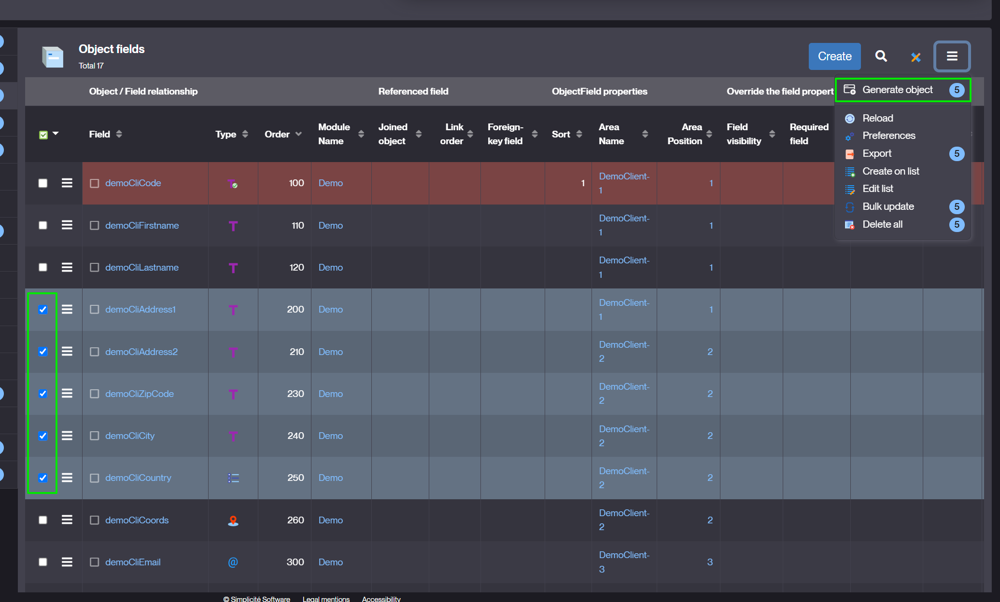
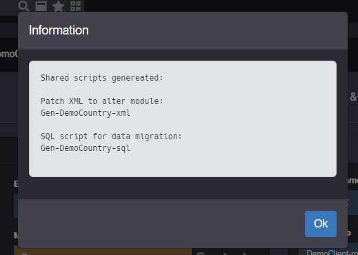
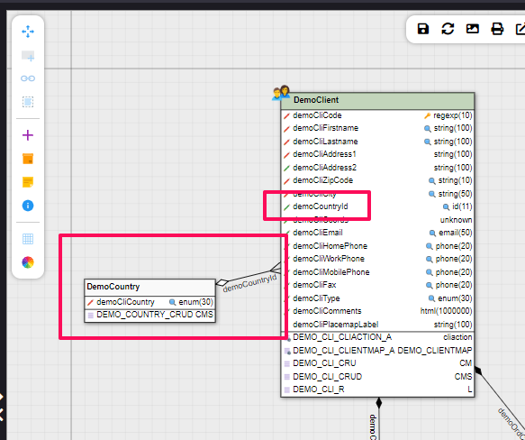
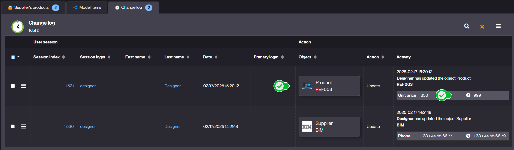

Version 6.2 release note
========================

:::danger[Warning]

This legacy minor version of major version 6 is now in its **short term maintenance** till Aril 15th 2026**.

Make sure you upgrade to the current minor version of major version 6.

:::

Technical documentation
-----------------------

All the technical documentation is available from the [platform website](https://platform.simplicite.io), in particular:

- the [JavaDoc](https://platform.simplicite.io/6.2/javadoc/)
- the [JSDoc](https://platform.simplicite.io/6.2/jsdoc/)

Compatibility breaking changes
------------------------------

- Due to 3rd party components, the platform is now compiled using a **JDK 17**, it will **not** run on a JVM of version < 17

- **Bootstrap** v4 and **datetimepicker** v4 have been removed, the UI runs now exclusively with bootstrap5 engine
  (since Simplicité V5)
- **Fullcalendar** v3 has been removed, it is strongly recommended to use `FULLCALENDAR_VERSION=5`
- **Cordova** hybrid app for mobile device is no more supported, engine only uses the responsive UI directly
  in a browser and the WebPush feature
- A dependency of **commons-vfs2** including an indirect old **okhttp** lib has been upgraded removing this lib,
  there are no plans to include an up-to-date okhttp3 lib because unirest is a good alternative of this lib and is explicitly included
- A minimal length of 25 characters is now required for the I/O password denoted by the `io.password` JVM property
  or the `IO_PASSWORD` environment variable shorter password is now ignored (with an explicit warning at startup)

Included but not yet enabled by default:

- **Chart.js** v4, default charting (e.g. pivot tables' charts) still relies on v3

### Previous minor versions' compatibility breaking changes

Please note that there have also been compatibility breaking changes in previous minor versions:

- See [the release note of minor version 6.0](v6-0#compatibility-breaking-changes)
- See [the release note of minor version 6.1](v6-1#compatibility-breaking-changes)

Deprecations
------------

### Deprecated iText

The legacy iText Java lib usage has been deprecated, no default components relies on it any longer.
This lib will be removed in next major version v7.

- `PDFTool` methods have been deprecated. It is recommended to migrate to PDF generation
  using [HTMLToPDFTool](https://platform.simplicite.io/6.2/javadoc/com/simplicite/util/tools/HTMLToPDFTool.html)
  or [PDFBox](https://pdfbox.apache.org/).
- If continued use of iText is necessary, it can still be integrated as an additional third-party library. However,
  it is strongly advised to purchase a license and use an up-to-date version due to
  [the licensing and security matters associated with iText 2.1.7](https://kb.itextpdf.com/it5kb/can-itext-2-1-7-itextsharp-4-1-6-or-earlier-be-use).
- The native PDF exports (lists and module documentation) have been migrated to PDFBox.

### Previous minor versions' deprecations

Please note that additional compatibility deprecations were introduced in previous minor versions:

- See [the release note of minor version 6.0](v6-0#compatibility-breaking-changes)
- See [the release note of minor version 6.1](v6-1#deprecations)

Core changes
------------

### New action to anonymize a user

- with options to sanitize the user (infos, rights, preferences and social interactions)
- extendable with a new PlatformHooks `anonymizeUser`


```java
/**
 * Anonymize a user
 * @param login user login to sanitize
 * @param rights true to delete all user's responsibilities
 * @param prefs true to delete all user's preferences (user filters, searches, parameters)
 * @param social true to delete all interactions (social, alert, notif)
 * @param randomizedLogin optional value to randomize the login everywhere in DB (timestamps, sessions history, redolog...)
 */
@Override
public Message anonymizeUser(String login, boolean rights, boolean prefs, boolean social, String randomizedLogin) {
	// sanitize the user infos, rights, preferences and social interactions
	Message m = super.anonymizeUser(login, rights, prefs, social, randomizedLogin);
	if (m.isOk()) {
		// add custom anonymization here...
	} else {
		// denied
	}
	return m;
}
```

### JSON Backend messages

> no more formatted messages with hashtags "#"

- APIs `Message.formatXXX` will now return JSON messages
- JSONs are serialized to String to be compatible with returns of java hook (pre/postValidate, pre/postSave...)
- Legacy format with "#" is still supported but deprecated (i.e. `code:text#level#field`).
- It is strongly recommended to change/use one of the `Message.formatXXX` to format a message (on validate, save...)

```json
{
	code: "MY_ERROR_CODE", // static TEXT to be translated on UI
	text: "optional additional text in user language",
	field: "myField", // optional related field on UI
	level: "ERROR", // TEXT, INFO, WARNING, ERROR
	actions: [{ action definition }...], // optional list of call to actions
	params: { suggest: "Suggested value" } // optional suggestion of syntax
}
```

### New action to generate object

- a referenced object (0,1) or an aggregated object (0,n) from existing object fields
- designer selects some fields from the object-fields panel
- and sets the linked object name, prefix and table
- then choose the user-key for the new object
- the action generates 2 shared scripts: a patch XML and SQL to migrate the business model and the data
- when XML is applied, the designer must complete the generated object (user-key, rights, user menu...)
- the SQL script can be applied in several instances (dev, test, prod...)
  - populate the new table with distinct values from existing records
  - update the new foreign keys to/from the new table

1. Select fields and click on "Generate object"

   

2. Set the link properties and confirm

   

3. Generate the patches

   Example after generating a reference table from distinct countries of customers:

   
   
   

4. Apply them to get the object with migrated data

   Designer must finalize the configuration of the generated object.

  

  

### `customPingResponse` Platform hook

- Added a new `customPingResponse` platform hook to customize the `/ping` JSON response, e.g.:

```java
@Override
public JSONObject customPingResponse(String status, String error) {
	return new JSONObject()
		.put("myCustomStatus", "The status is: " + ("OK".equals(status) ? "All good" : "Houston we have a problem"))
		.put("myCustomError", Tool.isEmpty(error) ? null : "The error is: " + error);
}
```

### Other changes

- New shared script type to apply `XML patches`

- Cascade deletions will always call `pre/postDelete` hooks (no more parameter `DELETE_CHILD_HOOK=no`)

- Added automatic conversion to PDF for a text publication template file (e.g. HTML, plain text, ...)
  with forced MIME type set to PDF

- Added `minimal` value for `USE_HEALTH` system parameter to restrict healthcheck to monitoring-only data
  (no information on JVM, server, OS, ...)

- Changed ping and healthcheck to return a `503` instead of a `500` in case of database unavailability

- Added new tags for publication templates:

  - `[SYSPARAM:<parameter name>]` for substituting a system parameter
  - `[LABEL:<object name>:<-|+>]` for substituting singular (`-`) or plural (`+`) object label

- New instances of object during a `DataLink` synchronization:

  - Needs a dedicated user for datalink API to isolate those instances in objects pool
  - Allows distinct rules in hooks:
    - `isDataLinkInstance() && isBatchInstance()`: detect a pull from a host (cron job: bulk resync)
    - `isDataLinkInstance() && isWebServiceInstance()`: detect a push to hosts (REST/PUT: single record)

- New object accessor `forceGroupByFields` to change the group-by fields to search:

```java
boolean previousGroupBy = obj.canGroupByFields();
List<ObjectField> previousFields = obj.getGroupByFields();
try {
	obj.setGroupByFields(true);
	obj.forceGroupByFields(new String[] { "myField1", "myField2" });
	List<String[]> rows = obj.searchGroupBy(false, 1000);
	for (String[] row : rows) {
		// count per myField1,myField2 (last column)
		String count = row[row.length-1];
		// row with field operators (sum, avg...) per myField1,myField2
		obj.setValues(row);
		// ...
	}
}
finally {
	// restore
	obj.setGroupByFields(previousGroupBy);
	obj.setGroupByFields(previousFields);
}
```

- Added static method `Grant.getUserFullName(userId, orLogin)` to get any user's fullname

- Added the ability to configure an explicit "pepper" string for internal password "salting"
  using the `HASH_PASSWORD_PEPPER` environment variable or the `hash.password.pepper` JVM property.
  This is only taken into account if internal password hashing is enabled (system parameter `SALT_PASSWORD` = `yes`).
  The default "pepper" strategy is still used without this explicit "pepper" string. Note that adding
  or changing it requires **all users' passwords** to be changed.

- Added a new adapter base class `SimplePDFBoxAdapter` using the PDFBox library.
  It provides hooks to process the text content of the PDF,
  the PDF document information (title, ...), and the potential form fields entered in a fillable PDF

- `ExternalObject.display` can return an `InputStream` (from a file or anything huge) to be sent by packets in the HTTP response

- New filter "not in" on ENUM field to search unknown LOV values, displayed as "(other)" on UI.

- New `getRefFieldTargetObject` hook to override the target record of a referenced field :

```java
@Override
public String[] getRefFieldTargetObject(String rowId, ObjectField field, String[] row) {
	if (field.getFullInput().contains("myForeignKey")) {
		rowId = getFieldValue("myOtherFkValue"); // target id
		String t[] = new String[3];
		String target = "MyOtherObject";
		t[0] = target; // target object
		t[1] = "the_ajax_"+target; // main target instance
		t[2] = rowId; // target id
		return t;
	}
	return null;
}
```

UI changes
----------

### The `Call to action` of backend message is now implemented in the alert dialog

- a backend action can now return other call-to-actions
- actions to call must be granted to user
- with the type hidden to avoid direct access thru list or form

### New `hasChangedFields` to determine the global `hasChanged` flag on form

- The property `hasChanged` has been improved so that it only triggers if a field has actually been modified
  (different from the base value)
- For example, if the user changes a field twice and returns to its original value,
  the dialog "quit without saving" will no longer appear.

- It is now possible - and recommended - to implement a `ResponsiveExternalObject` JavaScript script
  as a **JavaScript class** extending `Simplicite.UI.ExternalObject`
  with an override of the `render` class function, e.g.:

```javascript
Simplicite.UI.ExternalObjects.MyExtObj = class extends (
  Simplicite.UI.ExternalObject
) {
  async render(params, data) {
    this.ctn.find(".mycls").html("Hello world!");
    // or $('#myid').html('Hello world!');
  }
};
```

### New UI tabs options for tabbed areas

- Tabs positioning on top/left/right/bottom
- Allows to hide all tab labels (to display only icons)
- Configurable on template editor


### New UX in object multi-selection (eg used by the associate/pillbox dialog)

- Added a preview of selected items on the right side of dialog
- Allows to do several searches without losing previous selections
- Allows to easily remove all or each item


- Optimized menu calls to update counters using a new search service with forced group-by by enum

```javascript
obj.search({}, { groupby: true, groupbyfields: ["myEnumField"] })
.then(list => ...}
```

### New **end-user's dashboards**

- New group `DASHBOARD_MAKER` to build business dashboards
- New shortcut granted to group `DASHBOARD` to access the dashboards overview
- `DASHBOARD_MAKER` can edit its own dashboards, rename and delete
- It can also share them with other groups (with new group type `dashboard sharing`)


### New user's filters on View

- Allows to add a search bar (new view item) with optional time period and fields
- The item triggers a new event with users's filters `{ fromDate, toDate, fields... }`
- The filters are applied to lists, charts and pivot tables (having a date/period or matching filtered fields)
- External objects have to implement a new handler when they are concerned by filters
- New front helper to apply view's filters to a business object: `obj.applyFilters(filters)`

For example:

```javascript
$("#myWidget")
  .addClass("js-view-filters")
  .on("ui.view.filters", (e, filters) => {
    e.stopPropagation();
    // Apply the filters to widget components
    myobj.applyFilters(filters);
    // Redraw the widget
    myWidget.render();
  });
```


- Improved UX for editing resources and print templates (and deprecated print templates using UI templates)

### Added `SAVE_BEFORE_QUIT_PROCESS` dialog on process activity with several choices

- `Save` the current form/activity
- `Quit` the activity but keep the process in memory
- `Abandon` the process
- `Cancel` : stay on the current activity


- Color picker has been upgraded to `spectrum-colorpicker2` v2.0.10

- New style helper on `Action` form:
  - to preview a generated button with selected colors
  - to check the level AAA of WCAG contrast (minimum 4.5)


- New style helper on `List code` form:


### Removed ajax call within constraints on UI

- `[SYSPARAM:name]` is now replaced with session parameter `app.sysparams['name']`
- `[PARAM:name]` is replaced with the instance local parameter `obj.locals['name']`

### `Bookmarks` on list

- The record bookmark can be displayed on list item in button options
- The list can be filtered on "my bookmarks" only


- `Redolog` panel merges children changes in the parent object

Ex: product changes are visible with the supplier changes



Post-release
------------

### 6.2.0-RC1 (2025-01-23) - release candidate {#version-6.2.0-beta-RC1}

- Initial release candidate for minor version 6.2. See above for details.

### 6.2.0-RC2 (2025-01-31) - release candidate 2 {#version-6.2.0-beta-RC2}

- Fixed some minor Sonar issues
- Added improvements on the DB access page
- Fixed badge filter from enum in menu
- Updated JClouds libs
- Added audit errors in case of outstanding Rhino scripts

### 6.2.0-RC3 (2025-02-07) - release candidate 3 {#version-6.2.0-beta-RC3}

- Fixed regression on DB access
- Used secure random instead of plain random generator
- Security fix in `JSONTool.jsonUser`
- Various minor fixes

### 6.2.0 (2025-02-10) - initial release {#version-6.2.0}

- Initial release for minor version 6.2
- Fixed UI issue with inlined 0,1 link: its child lists will be hidden to preserve only one parent object in form
- Added missing constant `ObjectDB.LIST_READ`

### 6.2.1 (2025-02-13) {#version-6.2.1}

- Fixed contextual values on panel before calling `initRefSelect` hook
- Fixed `AppLog` in database with related asynchronous task
- Improved logging + fallback to internal authentication provider if `AUTH_PROVIDER` is not defined
- Workaround for bootstrap issue 41005 (causes [aria-hidden issues on chrome](https://github.com/twbs/bootstrap/issues/41005))
- Fixed activity initialization when containing one ACE editor
- Removed duplicate function creation for historic objects
- Added default implementation of service objects' `selectService` hook
  to select matching item form the current list (as set by the `searchService` supposed to be called before)

### 6.2.2 (2025-02-20) {#version-6.2.2}

- Fixed CSS beautifier script loading in code editor
- Fixed empty `getParentObjectRefField()` in `initRefSelect` during completion
- Backported [from v6.3](v6-3#child-objects-change-logs) `Link.setMergeRedologs(true)` to retrieve child redologs in parent panel `Change logs`
- Backported [from v6.3](v6-3#improvements-on-external-objects) UI external objects class metadata + `getResourceURL` and `service` functions
- Backported [from v6.3](v6-3#ocr-library) integration of tesseract.js JS lib for basic client-side OCR

### 6.2.3 (2025-03-07) {#version-6.2.3}

- Fixed useless "save before quit" dialog during record deletion
- Fixed "spring" layout on the modeler
- Backported [from v6.3](v6-3#new-helper-methods) the `ServletTool.success` helper method
- Backported [from v6.3](v6-3#custom-health-check) the `customHealthCheck` platform hook for custom health check
- Backported [from v6.3](v6-3#improved-openapiswagger-schemas) improvements on OpenAPI/Swagger schemas
  (missing descriptions and `maxLength` on string attributes)

### 6.2.4 (2025-03-19) {#version-6.2.4}

- Fixed action `ObjFieldGenerateObject` without clear cache
- Backported [from v6.3](v6-3#environment-variable-based-configurability) `[ROOT]` and `[URL]` tokens in expressions
- Backported [from v6.3](v6-3#custom-disposition-simplification) implicit rewrite from `*/` to `*/index.html` in static contents
- Fixed audit widget to show only the "Start audit" button
- Backported [from v6.3](v6-3#improved-openapiswagger-schemas) improvements on OpenAPI/Swagger schemas of generic APIs
- Backported [from v6.3](v6-3#improved-mapped-api-configuration) improvements on OpenAPI/Swagger schemas of generic APIs
- Backported [from v6.3](v6-3#development-mode) restrictions in development mode
- Fixed missing flush in API grants' object pools when clearing cache of a single business object or external object
- Backported [from v6.3](v6-3#changed-scope-of-helper-methods) changes on scope of `ObjectCore.(re)setAllFields*` helper methods
- Fixed extend button of UI monitoring

### 6.2.5 (2025-03-28) {#version-6.2.5}

- Backported [from 6.3](v6-3#platform--module-version-check) major version check when importing a module: importing modules exported from
  a higher major versions is now denied as it may have unexpected results
- Fixed meta-object cascade delete without explicit list
- Backported [from v6.3](v6-3#mermaid-widget) the Mermaid widget
- Backported [from v6.3](v6-3#improved-annotations) annotations improvements

### 6.2.6 (2025-04-01) {#version-6.2.6}

- Fixed incorrect syntax of system upgrade SQL statement for SQLServer
- Fixed regression on date period search
- Fixed issues on syntax checking warning messages

### 6.2.7 (2025-04-11) {#version-6.2.7}

- Fixed bookmark deletion from popup
- UI menu: hide the anchor of a single domain (no accordion)
- Backported [from v6.3](v6-3#mail-service-configuration) support for `MAIL_SERVICE` overriding by the same name environment variable
  (or `mail.service` JVM property) and backported support for YAML syntax instead of JSON

### 6.2.8 (2025-04-25) {#version-6.2.8}

- Backported [from v6.3](v6-3#maven-skip-tests) default modules' Maven `skipTests` to `true` to prevent unit tests to be processed,
  by default, outside of a live instance
- Backported [from v6.3](v6-3#improvements-of-the-generic-openidconnect-provider) improvements of the generic OpenIDConnect provider
- Fixed crosstab chart when grouping date per day (`dateGroup='D'`) and field is a datetime
- Backported [from v6.3](v6-3#new-helper-methods) new `getText` helper methods on `PDFTool` to extract raw text content of a PDF document
- Fixed workflow to re-eval data expressions in case of backward/forward
- `$ui.previewDocument` of image will have same rendering as Image field
- Fixed form with 0,1 inlined object containing embedded 0,n panels
- Fixed menu with only 1 domain and 1 object
- Backported [from v6.3](v6-3#environment-variable-based-configurability) `[ENV:<environment variable name>]` substitutions in expressions
- Fixed loss of datetime input in a dialog

### 6.2.9 (2025-05-16) {#version-6.2.9}

- Improved `selectWithoutFilters(rowId)` to exclude the bookmarks filter
- Backported [from v6.3](v6-3#go-to-definition-generalization) generalization of "go to definition" icons
  (view, pivot table, activity, external object, ...)
- Fixed module diff when using exploded JSON format
- Fixed URI mapping which was not preserving `/health.html` formatted health check page
- Backported [from v6.3](v6-3#environment-variable-based-configurability) `[ENV:<environment variable name>]` substitutions
  in module settings and system parameters
- Backported [from v6.3](v6-3#environment-variable-based-configurability) the possibility to override a system parameter
  by an environment variable named `SIMPLICITE_SYSPARAM_<system param name>`
- Fixed list, don't display min/max selector if both have same value
- Fixed missing import origin for dataset imports

### 6.2.10 (2025-05-22) {#version-6.2.10}

- Fixed export of indexed search
- Fixed missing environment variable re-substitutions for system admin singleton after UI update
- Fixed the client tab ID in the case of a tab duplication on Chrome
- Backported [from v6.3](v6-3#environment-variable-based-configurability) `[PROP:<JVM property name>]` substitutions in module settings and system parameters
- Fixed non removed Google font options for CSS declarations (e.g. `Quicksand:wght@300..700` => `Quicksand`)
- Backported [from v6.3](v6-3#improvements-on-external-objects) `getFilename` hook for `ExcelDocumentExternalObject` (and legacy `PDFDocumentExternalObject`)
- Added mention of the the `origin` module remote Git URI (if defined) to avoid ambiguities vs the instance's module Git URI.
  Note that in [v6.3](v6-3#module-git) this legacy custom page is replaced by a dedicated business object exposing the same features

### 6.2.11 (2025-06-20) {#version-6.2.11}

- Fixed missing image wrapping around `[MODEL:]` tags in module's raw Markdown publication
- Backported [from v6.3](v6-3#custom-disposition-simplification) simplifications for custom dispositions
- Fixed form-inlined publication buttons styles
- Fixed dashboard core-cache after UI deletion
- Fixed no "goto definition" button to `View` for `DASHBOARD_MAKER`
- Fixed parent form reload in case of edit-cell in a child panel
- Fixed module filtering in case of reset and populate foreign keys
- Added module filtering support on groups displayed in the _Authorization_ step of the _Create Activity_ system business process
- Fixed signature pad resizing (`fromDataURL` with `ratio=1`)
- Fixed used fields displayed in the "Unused fields" section of the template editor

### 6.2.12 (2025-06-27) {#version-6.2.12}

- Fixed float rendering with progress bar
- Fixed list exports within a view containing multiple instances of the same object
- Backported [from v6.3](v6-3#custom-disposition-simplification) improvements on custom disposition
- Fixed reference field event handling with enum fields

### 6.2.13 (2025-07-18) {#version-6.2.13}

- Fixed textual crosstab without value axis (count)
- Fixed follow link on N,N pillbox creation
- Changed behavior of status `Readonly fields` not to be applied on action confirm fields by default
- Improved platform's "garbage collection" tasks to avoid dropping auth-only sessions as "unknown" sessions
- Improved `$tool.dialog` to close first the same dialog if it already exists
- Backported [from v6.3](v6-3#custom-logout-confirmation-page) the `customLogoutConfirmPage` new platform hook
- Fixed nonce consistency check on OpenIDConnect providers with `"jwt_check_nonce": true`
- Fixed OpenIDConnect auth provider's errors sent on the platform's redirect URI (e.g. when the user authentication has failed or was cancelled)

### 6.2.14 (2025-07-31) {#version-6.2.14}

- Fixed issue where `initRefSelect` used incorrect parent values for newly created rows in list updates
- Reverted JSON rendering on some system parameters using JSON syntax to avoid unordered "random" JSON reformatting
- Fixed XML import to delete the previous `m_document` record in case of empty document
- Logout for Keycloak OpenIDConnect authentication provider is now purely generic
- Fixed edit-cell of referenced fields in case of populate
- Set HTTP status and headers by default in the response before calling the `customErrorResponse` platform hook
  (this avoids potential side effects if the hook does not do it explicitly)
- Formats the syntax of a permalink instead of the suggestion on save
- Fixed issue where the "Use form" setting was ignored for minified lists

### 6.2.15 (2025-08-15) {#version-6.2.15}

- Fixed displayed label for `[DATETIME:offset]` expression
- Fixed tinymce min-height on list edit
- Fixed placeholders not displayed in action fields
- Fixed social posts dialog reloading when a post is added
- Fixed do not truncate rich text on validate but return an error
- Fixed eval of calculated fields in history objects
- Fixed row context during bulk update
- Fixed list pagination of activity form
- Fixed list column order preferences

### 6.2.16 (2025-09-11) {#version-6.2.16}

- Fixed select2 pillbox style with colored multi-enum
- Removed "less" button on list edit = extended list only
- Fixed configuration object counters with module filter
- Fixed object summary reloading on "design audit" panel
- Fixed field help on list column

### 6.2.17 (2025-10-02) {#version-6.2.17}

- Fixed `populateForeignKey` in case of multi-reflexive links
- Fixed list's column orders when no areas are displayed
- Fixed issue where the list ordering preference was shown even when the object's configuration wasn't relevant (i.e. no field areas visible on the list)
- Backported [from v6.3](v6-3#new-helper-methods) new `Tool.before/after` date comparison shorthand methods
- Fixed missing standard packages/classes in the public Java API (e.g. the annotations package)
- Fixed resource name of generated external object's JavaScript resource (`CLASS` instead of legacy `SCRIPT`)

### 6.2.18 (2025-10-31) {#version-6.2.18}

- Fixed XML import final `status KO` in case of unknown references after recycling
- Fixed multi-doc fields preview
- Fulltext search with inherited objects, to fix the completion of the Home view in the Group form
- Backported [from v6.3](v6-3#new-helper-methods) new `Tool.lower/upper/capitalize` null-safe string case manipulation methods
- Backported [from v6.3](v6-3/#qol) "Now" button on datetime picker
- Upgraded Bootstrap JS/CSS libs from legacy revision 5.3.3 to current revision 5.3.8
- Backported [from v6.3](v6-3/#compatibility-breaking-changes) change on the `jwt_claims_mappings` mappings of the generic
  OpenIDConnect authentication provider (use of the ID token instead of the access token for this type of mappings)
  This change is needed to allow the access token to be a "dummy" token in some cases. It has no impact another type
  of mappings is used (e.g. the usual `userinfo_mappings`)
- Backported [from v6.3](v6-3#copypb) cascade copy of pillbox links
- Fixed `hookBegin` code snippet
- Fixed `ModelWorflow` when assigning the begin/end activities to the first actor

### 6.2.19 (2025-12-05) {#version-6.2.19}

- Security fixes
- Backported [from v6.3](v6-3#development-mode) additional restrictions in development mode
- Backported [from v6.3](v6-3#javascript-console-tool) the `$console` global variable (as an alias to the
  browser's `console`) global for forward compatibility
- Fixed business object database table renaming with forced rebuild indexes to rename them with the new table name
- Fixed UI async tracker when started in minified mode
- Fixed `/io` page in case of non root deployment
- Updated vulnerable JFreeChart Java lib and BootBox and Vue additional JS libs
- Fixed import specification file reading when calling it from the I/O endpoint using the `modulesimport` service
- The ping endpoint (`/ping`) is now reading the protected `PATCH_LEVEL` system parameter (instead of the `VERSION` that may be deleted)
  this avoids potentially falsely negative ping responses.
- Fixed NN pillbox with create context in case of copy
- Backported [from v7.0](v7-0#optional-importspec-version) change on the `version` to be optional (if not present no version check is done).
  Note that the improvement on the Git tag has not been backported.
- Updated vulnerable JGit (and associated Apache sshd) Java libs and XTerm additional JS lib
- Module filter: allows system fields on permission
- Prevented permalinks to match platform URIs
- Fixed missing `initUpdate` on state transition from a row action on list
- Fixed duplicates of auto-incremented fields

### 6.2.20 (2026-01-02) {#version-6.2.20}

- Updated Java libs
- Backported [from v6.3](v6-3#version-6.3.0-beta-RC2) addition of missing `com.simplicite.util.engine.PlatformHooksInterface` in public classes
  and removed legacy backward-compatibility class `com.simplicite.util.PlatformHooksInterface`
- Backported [from v6.3](v6-3#version-6.3.0-beta-RC2) fix to force a metadata reloading for UI instances with a parent object
- Backported [from v6.3](v6-3#version-6.3.0-beta-RC2) fix create button on list activity to use the hook `isCreateEnable`
- Backported [from v6.3](v6-3#version-6.3.0-beta-RC2) fix on environment variables and/or JVM properties substitutions in module's settings

### 6.2.21 (2026-01-15) - maintenance revision {#version-6.2.21}

- Backported [from v6.3](v6-3#version-6.3.0-beta-RC5) fix for "Readonly form" contextual helps not displaying
- Backported [from v6.3](v6-3#version-6.3.0-beta-RC5) fix `displayForm` parent object context of inlined object
- Backported [from v6.3](v6-3#version-6.3.0) fix for inlined forms via a virtual link not using the SQL filter

### 6.2.22 (UNRELEASED) - maintenance revision {#version-6.2.22}

- Backported [from v6.3](v6-3#jclouds-openstack-swift) deprecation warnings for OpenStack swift cloud storage operations
  as swift is not supported anymore by OpenStack. Note that in v6.3 these warnings are marked _outdated_
  and the whole support for OpenStack swift will be completely removed in v7.0.
- Backported [from v6.3](v6-3#version-6.3.1) fix do not `followLink` on html/rich text
- Backported [from v6.3](v6-3#version-6.3.1) fix for inlined objects displayed as tabs showing default templates
- Backported [from v6.3](v6-3#version-6.3.1) fix on mapped API not returning "raw" JSON for long text fields with JSON rendering
- Fixed redondant search reference filters
- Backported [from v6.3](v6-3#version-6.3.2) fixed counter widgets layout issues
