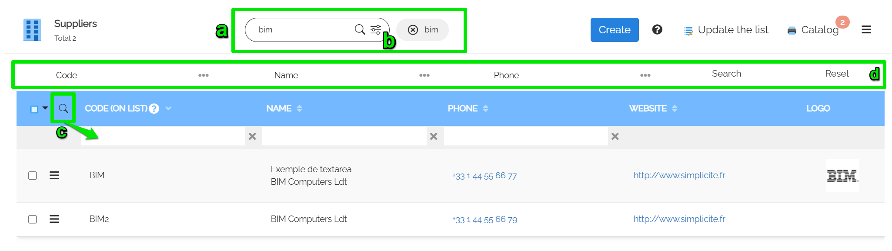
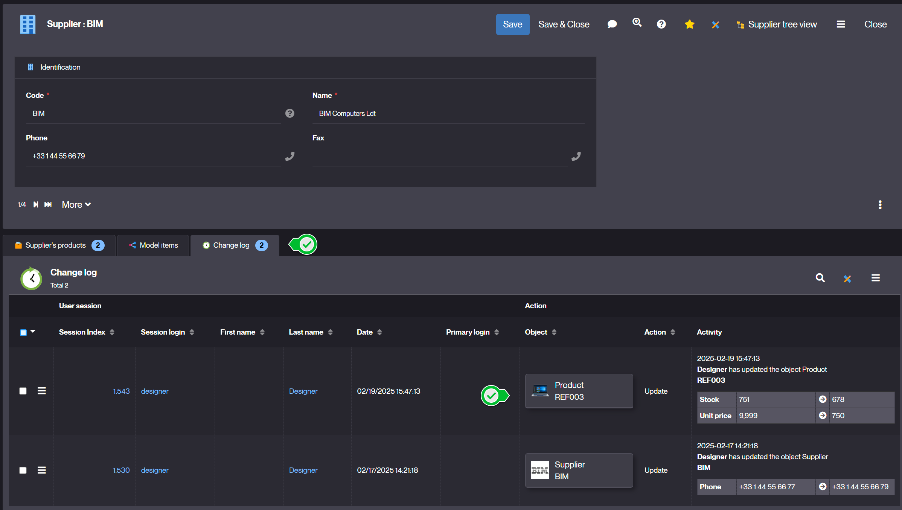
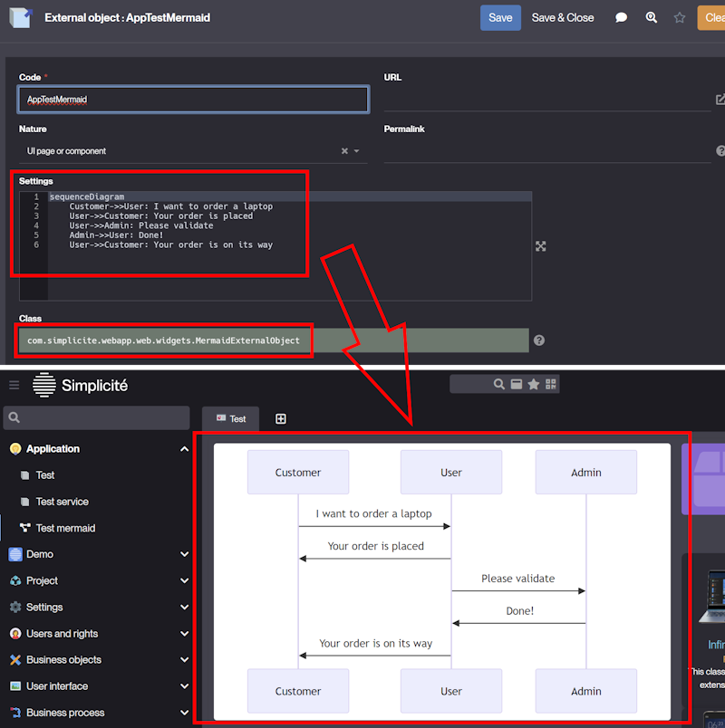

Version 6.3 release note
========================

:::warning[Warning]

This release note corresponds to the **next** (and final) minor version of major version 6.

It is now in **BETA** stage. It means it is not **yet suitable for production** but should now be used for development and testing
on the projects planned for delivery **after** its release.

:::

Compatibility breaking changes
------------------------------

The following changes may require action depending on project requirements:

- Certain development-oriented features and tools are now limited to [development mode](#development-mode).
  This change does not impact projects directly, but development instances **should** now be started in development mode,
  particularly when working in external IDEs or when using Maven-level tasks such as linting or SonarQube code analysis.
- The legacy _FranceConnect_ an _LinkedIn_ authentication providers have been removed (they were previously deprecated
  in earlier minor versions).
  Configuration as a generic OpenIDConnect authentication provider remains possible (the generic OpenIDConnect provider
  is also compatible with the _FranceConnect+_ authentication service).
  There is no impact unless the legacy _FranceConnect_ and/or _LinkedIn_
  authentication provider was actively used.
- The previous implementation of the generic OpenIdConnect authentication provider was using
  the access token for the `jwt_claims_mappings` mappings (which was inappropriate because the access token
  can be a "dummy" token in some cases). It has been changed to use the ID token instead (which is the right approach).
  This change has no impact if this type of mappings is not used (e.g. if the usual `userinfo_mappings` type of mappings is used).
- Some deprecated methods and constants that have been marked "for removal" for several previous versions have been finally removed.
  They were already generating compilation errors in the previous versions so they are supposed to have been already refactored.
- The outdated legacy library `commons-discovery` has been removed. If required, it may still be added as a custom shared library,
  though this is highly unlikely.
- The export objects' selection & ordering for a Dataset have been moved within the **Dataset**,
  and shall no longer be declared on the object's form with `exportorder`. Although it only affects the **Datasets** users,
  if your datasets were created using the previous way, you're only 1 click away to convert it ([see this document](make/project/datasets.md#using-62-or-earlier)).

Please note that there have also been compatibility breaking changes in previous minor versions:

- See [the release note of minor version 6.0](v6-0#compatibility-breaking-changes)
- See [the release note of minor version 6.1](v6-1#compatibility-breaking-changes)
- See [the release note of minor version 6.2](v6-2#compatibility-breaking-changes)

Deprecations
------------

The following deprecated features may be removed in future releases and should be updated to anticipate their removal:

- Some new methods and constants have been marked deprecated and should be refactored accordingly
  to the proposal (see Javadoc and/or deprecation logs). They are not yet marked "for removal"
  thus won't generate compilation errors but only warnings.
- The **GoogleMap** helper JS tool `gmap.js` is now deprecated and will be removed in the next major version.
  Custom code relying on it should be refactored to use the **Leaflet** helper JS tool, which provides
  an abstraction layer for map service providers.
  Existing GoogleMaps inclusion methods will still include the GoogleMaps JS library,
  but code using the helper functions provided by `gmap.js` should be updated to use the GoogleMaps JS API directly.
- All classes related to legacy grant hooks are now in final deprecation stage. Grant hooks have been deprecated
  since major version 5 in favor of platform hooks, the refactoring of user session level logic to `PlatformHooks`
should have already been done. All grant hook related stuff will be removed in next major version 7.

Please note that additional compatibility deprecations were introduced in previous minor versions:

- See [the release note of minor version 6.0](v6-0#compatibility-breaking-changes)
- See [the release note of minor version 6.1](v6-1#deprecated-features)
- See [the release note of minor version 6.2](v6-2#deprecated-features)

### iText deprecated

In particular the legacy **iText** library will be removed in next major version v7 and there will be also breaking change impacts
on the associated helpers `PDFTool` and `PDFDocumentExternalObject` helper classes that are still fully designed for iText in v6.
Projects using iText or the related helper classes should be refactored to use the **PDFBox** libraries before upgrading to v7,
as iText support will be removed (code will not compile in v7).

### Google Map deprecated

Google Maps features are now deprecated and will be removed in next major version v7.
It is replaced by the **Leaflet** component described in the new feature below.

### Deprecated Ajax service call with a callback function

Function callback as (first) parameter are still supported in 6.3 but the Ajax services return Promises since V6.0.
Those functions should be moved in a `then` statement before upgrading to V7 (unsupported in future V7).

Example for a search service:

```js
// Deprecated syntax: this callback is still called (for V5 compatibility)
obj.search(list => { ... }, filters);
// Should be refactored to promise syntax (since V6)
obj.search(filters).then(list => { ... });
```

Features
--------

New features for the end-user

### Cartographical search

- searchable fields of "coordinates" type open a clickable map to select coordinate


- the map renderer has been migrated to the [Leaflet](https://leafletjs.com) library (instead of Google Maps)
  for coordinate fields and placemaps
- a new `MAP_SETTINGS` system parameter allows for tile server configuration
  - it is configured to use [OpenStreetMap.org](https://www.openstreetmap.org) by default
  - Google Map's tiles are still configurable if necessary
  - on-premise tile servers are also easily configurable

### Context menu on lists

Added context menus to lists. When multiple rows are selected, only bulk operations are shown,
while single selections display row-specific actions.


### Quick list ordering

This feature allows user to reorder records using a persistent integer field of the business object.

New object field _Re-orderable_ property on the integer field:


with 3 options to persist the recalculated orders in this field:

- Allows the user to reorder the rows in a list by drag&drop
- Re-numbering thru bulk action the current search with an increment value
- Reorder in case of create/update a row to an existing order


### UI guides

UI guides are tours for usage onboarding.

#### Group GUIDE_MAKER

This responsibility adds a new menu to access guides for makers:

- User guides: full definitions with steps settings and permissions
- Guide usages: to track who used a guide and when
- Guide recorder: helper to build a tour skeleton during UI usage


Guides can be:

- defined to be launched from any view, home page, business object and external object
- accessible during a limited period
- permitted to user groups
- defined with many steps
  - into a single page
  - or several asynchronous pages/dialogs
  - with user interaction (to click on button, complete fields...)

The guide recorder is still experimental and will be improved in a future release:

- The maker runs the journey by right-clicking on the step elements with minimal properties,
- Simplicite then creates a guide skeleton with generic DOM selectors,
- The designer must update/complete the tour to be operational with the necessary permissions.

#### Group GUIDE_USER

- The user needs the responsibility `GUIDE_USER`.
- Permitted guide can be automatically launched (once per user), or replayed with a button.


### Other Quality of Life improvements {#qol}

- On lists, <kbd>Ctrl</kbd>+<kbd>Click</kbd> to select a line
- Added a new setting, `Display "Select All / Unselect All" option`, for lists of values, which enables
  a "Select All / Unselect All" feature for multiple enumeration fields
- Added a "Now" button to datetime pickers to set the field's value with the current date and time

Enhancements
------------

Features enhancements for the end-user

### Enhanced list search UX

- a) Indexed/fulltext search can be displayed at the top of the list
- b) Full search on dialog (or docked on left) is a separated button (no more toggle between search modes)
- c) Search by column is a small toggle button in the columns header
- d) A specific search bar can be added to the top or side of the list



- e) When searching a reference, multiple references can now be selected at once.


Extended search options for reference and datamap picker:

- Supports the search template if present
- Supports dialog and indexed search if allowed on object
- Forces the search by columns (even if not checked on object for backward compatibility)
- Disables the docked mode and predefined searches (not suitable for a popup)


:::note

Goes hand in hand with "[Enhanced search configuration](#enhanced-search-configuration)"

:::

### Search helper on a floating date

New search property on `date` or `datetime` field: `search with helper`


The user can edit complex searches based on fixed or current date.

For example to search a period:

- from 4 months ago
- up to the next 15 days


is converted to new filter syntax with floating date:

`>=[DATE:-4m] and <=[DATE:15d]`

### Child objects change logs

Retrieve redo logs of child object into the parent `Change log` panel:

- new `Link` option `Show change logs`
- or by code `getLink("DemoProduct","demoPrdSupId").setMergeRedologs(true)`


Example: Product updates are visible in the Supplier `Change log` panel



### Cascade copy of N,N pillbox links {#copypb}

When copying an object, its links rendered as pillboxes are also temporarily duplicated and editable before saving the copy.
The related link definition must enabled the `copy cascade` option (as a field `copy` option).

### Process abandon and Undo XML

Now the process **Abandon** on UI always applies the Undo XML even if the system param `USE_UNDO_REDO = no`: this flag only applies on UI header buttons.

- by default a screenflow is undabale, but a long process not
- designer has to override the process hook `isUndoable()` to change the rule

### Linked list in case of empty parent value

The parent code/value is now optional to define a default list on the child field when the parent ENUM is empty/not selected.

Maker Experience
----------------

Features enhancements for the designer

### Improved annotations

All annotations now include a `desc` attribute that can be used to document the related class/method.
New annotations have also been added to annotate the business and external objects' hooks.

E.g.

```java
@BusinessObjectAction(desc = "This actions corresponds to the MY_ACTION configured action")
public String myActionMethod(Action action) {
	(...)
}
```

### Mermaid widget

A new configurable external object class (`MermaidExternalObject`) allows to display Mermaid charts.

E.g.



The chart specification can be either **static** as in the example above (set in the _Settings_ field)
or **dynamic** using the dedicated hook `getMermaidChartSpec`.

E.g.

```java
package com.simplicite.extobjects.MyModule;

import com.simplicite.util.ObjectDB;
import com.simplicite.util.Tool;
import com.simplicite.util.tools.Parameters;

public class AppTestMermaid extends com.simplicite.webapp.web.widgets.MyMermaidExtObject {
	private static final long serialVersionUID = 1L;

	@Override
	public String getMermaidChartSpec(Parameters params) {
		// Embedded in a business object?
		String obj = params.getParameter("object");
		if ("MyObject".equals(obj)) {
			// Retrieve the current business object instance
			ObjectDB o = getGrant().getObject(params.getParameter("inst"), obj);

			// Generate a dynamic specification using the current record of the business object instance
			return
				"graph LR\n"
				+ "  subgraph \"" + o.getDisplay() + "\"\n"
				+ "    subgraph \"" + o.getFieldValue("myField") + "\"\n"
				+ "      " + o.getFieldValue("myOtherField") + "\n"
				+ "    end\n"
				+ "  end\n";
		}
		// Else, defaults to the static specification
		return super.getMermaidChartSpec(params);
	}
}
```

### "Go to definition" generalization

New contextual buttons to go to the component's definition, available for:

- View
- Crosstab
- Activity
- Timesheet
- TreeView
- External object

### Enhanced search configuration

- a) 4 new properties to allow search on list (column, dialog, docked, index)
- b) preview of indexed fields when the object is indexable
- c) allows to edit a search-bar template added to the list


Edit search template on list:


:::note

Goes hand in hand with "[Enhanced list search UX](#enhanced-list-search-ux)"

:::

### Module Git

The legacy `ModuleGIT` external object has been removed. Its features are now available on the `ModuleCommit` business object
linked to the `Module` object.

This business object now displays the Git tag(s) of each commit and a new row-level action allows to put a tag on a given commit
(the push action now also pushes the tags):


### Modeler search

New search prompt to outline items on model:


### User Data Anonymization

New field and link properties to identify the user's data to Anonymize:

- Field: removes or randomizes the DB value
  - in `m_user` (ex `usr_first_name`, `usr_last_name`...)
  - or columns in other tables (with a foreign-key to m_user)
- Link: deletes or removes the relationship during anonymization
  - following the link deletion rule (ex: delete cascade of user's `UserSysParam`, `GuideUsage`...)

The anonymize action is now available on list to anonymize several users in a same time.

The properties will be used in a future versions:

- to anonymize other business data  (ex: order amount...)
- to audit data to anonymize for verification and communication

### Helper to build the History object

New action on object definition to build the history object/table:

- Specify if the history is in descending order
- Select the fields to be historized


Then the action creates or updates the history object:

- with technical fields `row_idx`, `created_by_hist` and `created_dt_hist`
- and the foreign key `row_ref_id` to parent object with its referenced key fields
- and the selected fields to be historized on parent updates


Finally this object can be updated manually by designers.

### New Simplicite logo CSS

The new logo has been integrated into the core CSS with classes that can be assembled to achieve the desired logo:

- Color:
  - `logo-color`: colored logo (50x50 by default)
  - `logo-back`: black version
  - `logo-white`: white version
- Size:
  - `logo-xs`: extra small (1rem = 16px at 100% scale)
  - `logo-sm`: small (2rem = 32px)
  - `logo-md`: medium (4rem = 64px)
  - `logo-lg`: large (8rem = 128px)
- Animation:
  - `logo-progress`: with loading animation

Example: `<div class="logo-white logo-lg logo-progress"></div>`


### Code Editor improvements

:::info

The detailed information for those features can be found [in this document](docs/docs/codeeditor.md)
offering more comprehensive explanations on what is now available in the **Code Editor**.

:::

#### Java-Language-Server

Integration of a **Java-Language-Server** to Simplicité developers' environment, bringing smart-editing features
like _live auto-completion_, _signature help on hover_ or _live linting_.

The related new interactions are thus:

- **Hover** on code elements to get specifications (signature & linting message)
- **Ctrl-Space** keyboard shortcut is now for asking explicit completion

#### Reworked Snippets Workflow

Removed the initial apparition of snippets through **Ctrl-Space** to replace it with a dropdown in the editor's header,
that can be triggered both by clicking the button or using the **Ctrl-Q** keyboard shortcut.

Technical
----------

Technical enhancements and features

### New FeatureFlags

A new class to manage the new features with the default activation.

- `FeatureFlag.TRUNCATE_TOO_LONG_TEXT.isActive()`: `true` by default to truncate on save too long text
  (except rich text: html, json, grid, notepad...), `false` to return an error
- `FeatureFlag.IMAGES_IN_EXCEL_EXPORTS.isActive()`: `false` by default (because experimental in 6.3, see below),
  true to allow export of images in excel
- `FeatureFlag.HISTORY_DIFF_MODE.isActive()`: `true` by default to see the difference between 2 rows in list of object history
- `FeatureFlag.JAVA_LANGUAGE_SERVER.isActive()`: `false` by default to see enable the experimental LSP features in the code editor

Some flags are overridable, to do so maker has to create a system parameter `FEATURE_FLAGS` globally (and per user).

For example, the flag name is in lower case:

```json
{
  "truncate_too_long_text": false,
  "images_in_excel_exports": true
}
```

and to override a flag per user session by code (in `PlatformHooks.postLoadGrant`):

```java
// to activate a feature flag only for a profile
if (getGrant().hasResponsibility("ONE_ADMIN_GROUP")) {
	// do not truncate data on validate, returns an error if a text is too long
	FeatureFlag.TRUNCATE_TOO_LONG_TEXT.setActive(getGrant(), false);
	// export images in excel
	FeatureFlag.IMAGES_IN_EXCEL_EXPORTS.setActive(getGrant(), true);
}
```

> Overridable features will be migrated over time in future releases.

### Rows difference in Object history

A new calculated field `row_diff` has been created to generate on search the difference of a record
with its previous one (`row_id` based). It is now used for History object, but can be added in other objects.


- History generation will add this field to object, but designer can place this field into object
- History object with active `FeatureFlag.HISTORY_DIFF_MODE` will automatically add this field (for previous 6.3 object)

It is activated by default, and overridable through the system parameter `FEATURE_FLAGS`:

```json
{
  "history_diff_mode": false
}
```

### Grouping of object histories

The previous feature, which allows merging redologs in the same parent object panel, has been extended to history panel.

The `Link` property between the object and its `Historic` has been changed to support 2 flags:


- `redologs`: same as 6.2 to merge children redologs in the parent list
- `history table`: new flag to show children history in the parent history panel
  - grouped by user-keys and ordered by date
  - with the `row_diff` column to quickly see the updated fields
  - respecting the visibility rules on the fields (which was not possible with system redologs)


### Images in excel exports

An experimental feature allows to include images in excel exports, although it comes with the following limitations:

- image anchoring does not work as expected (images don't follow the lines/columns when reordering)
- images adapt to default row size, which is quite small
- it can severely affect the exported file size, so image inclusion will be made optional in the future

In the meantime, it can be activated through the system parameter `FEATURE_FLAGS`

```json
{
  "images_in_excel_exports": true
}
```


### ECJ Java compiler

The platform now uses the **Eclipse Java batch Compiler** (ECJ) instead of the JDK compiler.

This is transparent and more efficient. It also allows to deploy the platform on a JRE
instead of a JDK keeping Java custom code compilation possible.

:::tip[Reminder]

Java compilation can be explicitly enabled or disabled using the `server.compiler` JVM argument (defaults to `true`)
which is driven by the `COMPILER` environment variable in our Docker images.

:::

Compiler options can be adjusted using the `JAVA_COMPILER_OPTIONS` system parameter (default: `-g`).
For example, this allows temporarily ignoring certain types of warnings in custom code.
Note: compilation warnings are non-blocking but should be resolved rather than ignored.

The list of possible compiler options are described
[in the Eclipse documentation](https://help.eclipse.org/latest/index.jsp?topic=%2Forg.eclipse.jdt.doc.user%2Ftasks%2Ftask-using_batch_compiler.htm).

### Javascript console tool

New global variable `$console`, by default:

- uses the default navigator `console`
- `$console.error` logs the stack trace + UI alert
- `$console.info|log|warn` can be overridden

`$app.info|warn|error...` are still accessible but it is strongly recommended to use `$console` instead.

### Server side events

New servlet `/ui/sse` (asynchronous) to push messages from server to clients thru https

Example to bind a `myEvent` message:

#### Server side

```java
ServerSideEvent.push("myEvent", new JSONObject().put("info","hello"), userId);
```

`userId: null` to notify all registered clients or a specific user.

#### Client side

Simply add an event listener on `ui.ready`

```javascript
$ui.sse.addEventListener("myEvent", e => {
	let d = JSON.parse(e.data);
	console.log("myEvent message: " + d.info + " at time = " + d.time);
});
```

Predefined server side events:

- `ping`: simple ping thru SSE
- `close`: close the SSE connection
- `reset`: reopen the SSE connection
- `sysparam`: new system parameter flag to push changes from `grant.setParameter("MYPARAM","value")` to client in `$ui.sysparams.MYPARAM="value"`
- `objparam`: push an object parameter to UI in `obj.locals.MYPARAM`
- `enumCounters`: refresh counters in menu when enum or status has changed during save

### Improvements on external objects

#### Server side

- Added `getFilename` hook for `ExcelDocumentExternalObject` (and legacy `PDFDocumentExternalObject`)

#### Client side

- Improved JS class `Simplicite.UI.ExternalObject`:
  - Set metadata `(name, id, URL)` + business object context if any
  - Added `getResourceURL` function to get URL of external object's resources
  - Added `service` function to call server-side `service` hook

### Floating date search

New filter syntax with offset on date or datetime from today's date:

- `[DATE<:offset>]`
- `[DATETIME<:offset>]`
- `offset` = a signed number with unit ('y'ears, 'm'onths, 'w'eeks, 'dw' days no week-end,
  'd'ays, 'h'ours, 'm'inutes, 's'econds, 'ms')

Examples

```java
// last 3 months
fieldDate.setFilter(">=[DATE:-3m]");
// in next 15 days
fieldDate.setFilter(">=[DATE] and <=[DATE:15d]");
// before next 12 hours
fieldDatetime.setFilter("<[DATETIME:+12h]");
```

This syntax can be used in predef-search of views/home page.

### Custom health check

Added a new `customHealthCheck` platform hook for custom health checks, e.g.:

```java
@Override
public void customHealthCheck(HttpServletRequest request, HttpServletResponse response, boolean minimal) throws Exception {
	AppLog.info("Custom health check called from " + request.getRemoteAddr());

	ServletTool.success(request, response, new JSONObject()
		.put("status", "OK")
		.put("date", Tool.toDatetime(new Date())));
}
```

### Custom logout confirmation page

Added a new `customLogoutConfirmPage` platform hook for a custom logout confirmation page, e.g.:

```java
@Override
public void customLogoutConfirmPage(HttpServletRequest request, HttpServletResponse response) throws Exception {
	// ZZZ must use a "try with" to commit HTTP response ZZZ
	try (PrintWriter out = response.getWriter()) {
		out.print("Bye bye!");
	}
}
```

### Improved OpenAPI/Swagger schemas

The OpenAPI/Swagger schemas of generic APIs have been improved to comply with stricter compliance rules:

- Added missing descriptions on definitions (business objects, errors, ...).
- Added missing `maxLength` constraints for string type attributes in OpenAPI schemas

### Improved URI mappings

It is now possible to use the API endpoint (`/api`) endpoint in URI mappings provided that it does not override
a reserved subpath of this endpoint (e.g. not `/api/rest`).

E.g.

```json
[
	(...)
	{ "source": "^/api/v1/myapi1(.+)$", "destination": "/api/ext/MyExternalObjectAPI2$1" },
	{ "source": "^/api/v1/myapi2(.+)$", "destination": "/api/ext/MyExternalObjectAPI2$1" },
	(...)
]
```

### Improved mapped API configuration

For mapped API external objects:

- Added generic mapping capabilities with case conversions, e.g.

```json
{
	"name": "My mapped API",
	"objects": [ "DemoSupplier", "DemoProduct" ], // or "modules": [ "Demo" ]
	"objectsCase": "pascal",
	"fieldsCase": "snake",
	"pathsCase": "kebab"
}
```

- Made `/ping` operation optional (using `"ping": true|false` in configuration, `true`
  by default for backward compatibility) and added associated `ping` hook
- Added optional `/health` operation (using `"health": true|false` in configuration, `false`
  by default for backward compatibility) with associated `health` hook

### Development mode

In development environments, the `DEV_MODE` environment variable must be set to `true`.

Failing to do so will prevent the use of the following features:

- the `devinfo` services (e.g. used by VSCode plugin)
- the `/maven` embedded Maven repository
- [reminder] Java code formatting (which requires some additional JVM capabilities to be enabled)

The development mode is enabled by the `server.devmode=true|false` JVM argument
(positioned by the `DEV_MODE` environment variable in Docker containers)

### Changed scope of helper methods

The `ObjectCore.(re)setAllFields*` helper methods used to iterate on all fields except technical fields (row ID and timestamp fields).

This is an issue in v6 where the characteristics of referenced fields may have an influence on the object behavior
(e.g. setting them updatable means the referenced record can be updated from the referring object).

These referenced fields are thus now also ignored in these helper methods.

### Platform / module version check

A module exported from a higher major version for the platform (e.g. from the future major version 7)
will now be refused **at module import** as it may cause unexpected results.

Importing modules exported from lower major version is still supported.

### `beforeSave` and `afterSave` front hooks

`Simplicite.UI.BusinessObject` contains 2 new `beforeSave` and `afterSave` front hooks:

```javascript
/**
 * Front hook before calling Ajax object.save()
 * @param ctn Form container
 * @param obj Object (same as this)
 * @param index record index (edit list)
 * @param cbk callback(true|false) (must return 'true' to continue or 'false' to stop/reject promise)
 */
beforeSave(ctn, obj, index, cbk) {
	cbk && cbk(true);
}

/**
 * Front hook after calling Ajax object.save()
 * @param ctn Form container
 * @param obj Object (same as this)
 * @param index record index (edit list)
 * @param cbk callback(true|false) (must return 'true' to continue or 'false' to stop/reject promise)
 */
afterSave(ctn, obj, index, cbk) {
	cbk && cbk(true);
}
```

:::note

Previous hooks `form.beforesave` and `form.beforesave` are still available but it is recommended to use the class BusinessObject.

:::

### Mail service configuration

It is now possible ti use YAML syntax instead of JSON for the mail service configuration.

:::note

Due to the generalization of the [system parameter configurability](#environment-variable-based-configurability)
it is recommended to use `SIMPLICITE_SYSPARAM_MAIL_SERVICE` instead
of `MAIL_SERVICE` environment variable previously described here (using this one is now considered as deprecated)

:::

### Maven skip tests

The `skipTests` Maven property is now set by default in the `pom.xml` files of the module.
The reason is that in the great majority of cases the unit tests are supposed to be processed
within a live Simplicité instance, not locally.

It it however possible to change this behavior by explicitly setting the `"skipTests": false`
in the `"maven: {...}"` block of the module's settings.
In this case, unit tests can be launched locally if none require processing within a live Simplicité instance.

### Improvements of the generic OpenIDConnect provider

The additional authorize URL parameters `acr_values` and `prompt` parameters are now supported in the `AUTH_PROVIDERS` system parameter.

The `nonce` string used by the protocol has also been increased with some additional randomness.

### Environment variable based configurability

- Added `[ROOT]`, `[URL]`, `[ENV:<environment variable name>[:<default value>]]`
  and `[PROP:<JVM property name>[:<default value>]]` substitutions in expressions
- Added the above `[ENV:]` and `[PROP:]` substitutions in module settings
- Added the above `[ENV:]` and `[PROP:]` substitutions in **loaded** values of system parameters
  (this does not apply to raw system parameter values read from the database using `Grant.getSystemParam("...")`)
- Added the possibility to override a system parameter by an environment variable named `SIMPLICITE_SYSPARAM_<system param name>`
  (this applies only to **loaded** values of system parameters)

### New helper methods

- `ServletTool.success(request, response, JSONObject)` for success (HTTP code 200) responses
- `PDFTool.getText(File|bute[])` to extract raw text content of a PDF document
- `Tool.before/after` date comparison shorthand methods
- `Tool.lower/upper/capitalize` null-safe string case manipulation methods

### Custom disposition simplification

A new  `StaticSiteExternalObjectDisposition` custom disposition helper class has been added.

The principle of this class is to store the credentials (auth token and Ajax key) in the browser's session storage
and redirect to a "static site" external object.

If this external object uses the frontend JS lib (of version 3.1.*+) these credentials are automatically
used to retrieve the current's session grant.

The low level `HTMLTool` class has been improved to provide disposition-related get resource methods.

An implicit rewrite has been added from `*/` to `*/index.html` in "static site" external object contents.

### OCR library

- The tesseract.js JS lib  has been integrated to provide with basic client-side OCR

### Docker health check

Docker images now enables a **default** health check command (`HEALTHCHECK`) calling the ping endpoint (`/ping`)
with an call interval of 1 minute and a 3 seconds timeout (after a start period of 10 minutes during which
the call interval is of 30s):

```text
HEALTHCHECK --interval=60s --timeout=3s --start-period=600s --start-interval=30s CMD curl --fail http://localhost:8080/ping || exit 1
```

When implementing a custom ping endpoint response, ensure compatibility with this **default**
health check command or modify the command accordingly.

:::tip

The default values of the intervals, timeout and start period should be fine for most cases but may be adapted
in some **very particular** cases (e.g. where start time is very long because it waits for a slow external system to start up).

:::

### Simplified ObjectDB search

New API to search records and apply a lambda function on each row:

```java
// search for each row
obj.search((index,count) -> {
	// - index: current row number from 0 to count-1
	// - count: number of rows found
	// - here obj is already loaded with the row values
	String id = obj.getRowId();
	obj.setFieldValue("myField", "blah");
	obj.save();
	// ...
	if (error)
		return false; // stop the loop
	return true; // continue
});
```

Unlike other paginated search methods, this API guarantees that the lambda function,
with potential update/delete on requested data, will not corrupt the search pagination:

- first it makes a paginated search to find all matching row Ids
- then it loops on those Ids to make for each row a select and call the lambda function

All thread-safe access to `ObjectDB` are now facilitated with the builder `BusinessObject` described below.

### New BusinessObject API

The new `BusinessObject` class works like a builder to chains classic data access methods
and above all, stacks the data without applying them to the `ObjectDB` instance
before the final DB operations in a single synchronized block (with select, setValues, validate and save, etc.):

- Auto-close interface to destroy isolated object or restore the initial definition (with `preserveContext`)
- Can change the user rights locally and work on any instance of object
- Applies all hooks (init, pre/post...)
- Resets and changes filters/orders
- Manages the Undo/Redo stack (if not `ignoreRedolog`)

Sample to search and update one isolated instance of User

```java
try (BusinessObject bo = getGrant().getBusinessObject("User")) {
	bo
	// add create/read/update/delete rights
	.withCRUD(true, true, true, true)
	// use those filters on search
	.filters(Map.of(
		"usr_login", "bob%",
		"usr_lang", "ENU"
	))
	// count from DB
	.count(n -> AppLog.info("count = " + n))
	// search for each row
	.search((index, count, obj) -> {
		try {
			// here the record is already set in object fields
			String login = obj.getFieldValue("usr_login");
			AppLog.info("update languages of login = " + login);
			// update values
			bo
			.withValues(Map.of(
				"usr_lang", "FRA",
				"usr_lang_pref", "FRA"))
			.validateAndSave()
			// select values from DB
			.values(o -> AppLog.info("values = " + String.join(",", o.getValues())));
			return true; // continue
		}
		catch (GetException | ValidateException | SaveException e) {
			AppLog.error("There was an error", e);
			return false; // stop the loop
		}
	})
	.then(obj -> {
		AppLog.info("usr_lang = " + obj.getFieldValue("usr_lang"));
	});
}
finally {
	// nothing to do
	// - Auto-close without specific instance = destroy the instance
	// - Previous user rights are restored on MyObject
}

// Example to stream a search without pagination (uses huge memory)
try (BusinessObject bo = getGrant().getBusinessObject("User")) {
	bo
	.filter("usr_login", "bob%")
	.filter("usr_lang", "ENU")
	// search in memory List<String[]>
	.stream()
	.forEach(row -> {
		// in memory stream needs to set the record into object before update
		try {
			bo
			.forUpdate(row)
			.withValue("usr_lang", "FRA")
			.validateAndSave();
		}
		catch (ValidateException | SaveException e) {
		}
		// related ObjectDB accessor
		ObjectDB obj = bo.getObject();
		AppLog.info("language = " + obj.getFieldValue("usr_lang"));
	});
}
```

Sample to upsert (create if not exists, update if exists) and call one action:

```java
try (BusinessObject bo = new BusinessObject(getGrant(), "MyObject")) {
	bo
	.getTmpObject() // or getInstance("MyInstance")
	.withAllAccess(); // = withCRUD(true, true, true, true)
	.preserveContext() // keep the instance definition to be restored on close
	.forCreateOrUpdate(Map.of(
		"myKeyField1", "bob",
		"myKeyField2", "123"))
	.withValue("myField1", "value1")
	.withValue("myField2", "value2")
	.validateAndSave(msg -> AppLog.info("save = "+msg))
	.returns(msg -> AppLog.info("msg = "+msg))
	.action("MyActionName",
		Map.of("param1", "value1"),
		msg -> AppLog.info("action result = "+msg));
}
catch (GetException | ValidateException | SaveException | ActionException e) {
	AppLog.error("There was an error", e);
}
finally {
	// nothing to do
	// - Auto-close with preserveContext = restore "tmp" (or "MyInstance") previous definition
	// - Previous user rights are restored on MyObject
}
```

### Custom document storage

3 platform hooks have been added to allow custom document file storage: `readDocument`, `writeDocument` and `deleteDocument`.
Typical usage can be using specific external cloud storage (like S3 object storage) for some business objects and/or fields.

All 3 hooks receive as argument the relative/absolute path of the file to read/write/delete to allow
fine-grained management of target storages.

There is a [comprehensive example module](https://github.com/simplicitesoftware/module-minio)
using a custom S3 (Minio server) storage for one particular business object.

:::note

These hooks are the first building block of a future enhancement of the standard documents storage configuration.
They are still to be considered as **experimental** as their signature might change in next versions.

:::

### Nodes purge

A new `SYS_CLEAR_NODES` has been added to purge nodes and a corresponding `purgenodes` I/O service is also now available.

### Import specification improvements

#### Optional version check

The `version` attribute can now be omitted to avoid version check. If the attribute is absent the import is processed regardless
of the current version of the module if already imported.

This can be useful, for instance, to force the re-import of a module.

#### Git tag import

When the import specification of a module uses a Git repository the `version` attribute (if set) is now used to try to match a Git tag:

- if a matching Git tag is found the import is done on the tag (note that the cloned Git repository is then in **"detached HEAD" state**)
- if no matching Git tag is not found the behavior is the usual behavior

#### JSON archive format support

The JSON format `.tar.gz` archives are now supported by the import specification mechanism.
Previously, only the XML format `.zip` archives were supported.
