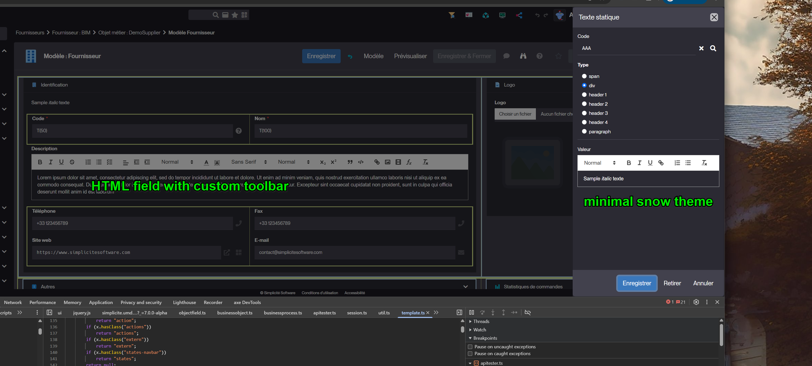
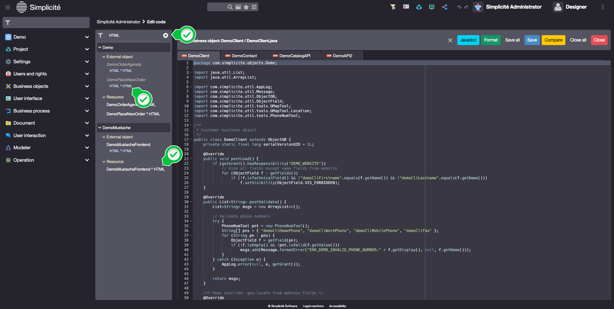

Version 7.0 release note
========================

:::danger
**Warning**: This release note corresponds to the **future** first minor version of the **next** major version 7.

It is in **EARLY ALPHA** heavy development stage. It means it is **ABSOLUTELY not yet suitable for production** nor just for development and testing.

This release note is also in its early redaction stage.
:::

Compatibility breaking changes
------------------------------

Among the reasons for this version to be the first minor version of a new **major** version are the changes at the level of the underlying technical components:

- JVM level
- Tomcat version

### JVM related

The platform is now compiled at **JVM level 21** (vs 17 for previous major version 6 and 11 for previous major version 5).

There is no impact unless certain Java APIs, which have been deprecated for several versions and may have been removed from the JVM, are used.

:::note
The `latest` Docker images have been built with JVM 21+ since major version 6 (JVM 25 for this major version 7). Deprecated Java API usage would already have resulted in compilation warnings or errors within the platform; therefore, the JVM level change at platform level should not have further impact.
:::

### Tomcat related

The target Tomcat version for major version 7 is now **Tomcat 11**.

Tomcat 11 uses Jakarta EE 11 instead of JEE 8, which was used in previous Simplicité version's Tomcat 9 target. As a result, imports such as `javax.servlet.*` **must** be updated to `jakarta.servlet.*`. Typically, the usage of these packages occurs in the following platform hooks: `customStartPage`, `customErrorResponse`, and `customAuth/customAuthPage`.

### Third party components related

#### Server-side components

The following **outdated third party Java libs** have been removed:

- legacy Apache commons `commons-fileupload` **v1** library,
  note that the `commons-fileupload2-*` **v2** libraries are present since major version 5

:::tip
If these libraries are required and refactoring is not possible, they may be re-added as needed.
:::

As announced in the [version v6.2 release note](v6-2#deprecated-features) (and recalled in the [version v6.3 release note](v6-3#deprecations)):

- The legacy **iText** libraries have been removed and the associated helpers `PDFTool` and `PDFDocumentExternalObject`
  have been completely refactored to use the PDFBox libraries.
  Any code written for iText and/or with the help of the above helper classes **must** be rewritten accordingly.

As announced in the [version v6.3 release note](v6-3#deprecations):

- The deprecated **GoogleMap** helper JS tool `gmap.js` has been removed. Custom code relying on this tool should be refactored to use the **Leaflet** helper JS tool, which provides an abstraction layer over map service providers.
Note that existing GoogleMaps inclusion methods continue to include the GoogleMaps JS library, but code relying on helper functions from `gmap.js` may require refactoring to use the GoogleMaps JS API directly.

#### Client-side components

The historical locations of Bootstrap libs have (finally) been changed.

This **may** have an impact only if included specifically using hardcoded paths (e.g. in a standalone external object page).

This should not be the case, as Java methods are provided to include these libraries properly without requiring knowledge of their locations (see below).

:::tip
There is no reason to re-include these Bootstrap libs specifically within a custom component
of the **generic UI** because they are already included.
:::

The changed locations are:

- Bootstrap: `/scripts/jquery/bootstrap5/*` to `/scripts/bootstrap5/*`
  (the Java methods `HTMLTool.bootstrapJS/bootstrapCSS` should be used instead of hardcoded paths).
- Bootstrap date/datetime picker: `/scripts/jquery/bootstrap5-datetimepicker/*` to `/scripts/bootstrap5-datetimepicker/*`
  (the Java methods `HTMLTool.bootstrapDatetimePickerJS/bootstrapDatetimePickerCSS` should be used instead of hardcoded paths).

### Long text fields behavior vs truncation

- `FeatureFlag.TRUNCATE_TOO_LONG_TEXT` is set to `false` by default.
  - the UX/UI is not impacted because field inputs are already limited to the max size
  - but the API create/update will get an error if a data is too long (against data truncation in 6.3)

### UI constant `Simplicite` refactored as ES module

The new ES module `Simplicite` has been refactored to clean its root data. Now the `Simplicite` interface contains only:

- `Simplicite.Globals` contains now all global variables from back-end: application infos `ROOT`, `URL`, `FULL_VERSION`, `ENDPOINT`... and user's common properties `LOGIN`, `LANG`, etc.
- `Simplicite.Application` has been preserved (same as `$app`) to contain all model constants: `CONTEXT_*`, field `TYPE_*`, `TRUE`/`FALSE`, etc.
- `Simplicite.Ajax`: unchanged namespace of model layer with ajax services to `Session`, `Grant`, `BusinessObject`, `BusinessProcess`, etc.
- `Simplicite.UI`: unchanged namespace of UI layer, controllers and viewers
- `Simplicite.Diagram`: SVG diagram modeler

### Unsupported Ajax service call with a callback function

As announced in 6.3 release notes, the function callback as (first) parameter are no more supported in Ajax services.
Those functions **should** be moved in a `then` statement before upgrading to V7.

Example for a search service:

```js
// Wrong syntax: this callback won't be called and filters not applied correctly
obj.search(list => { ... }, filters);
// Good syntax with promise since V6
obj.search(filters).then(list => { ... });
```

Deprecations
------------

### JVM related

All JVM core APIs marked as deprecated since version 17 **should** be refactored to prevent future potential JVM-level compatibility issues (see above).

### TinyMCE V6

This old verison of this HTML editor is not maintened anymore and the latest version 8 is only for commercial usage.
The UI will now use the open-source Quill (see below).

Features
--------

- Nothing so far...

Enhancements
------------

- HTML editor `TinyMCE` has been replaced by [Quill V2](https://quilljs.com)
   - With new `$ui.options.quillOptions` to define the default toolbar, with the theme `snow`
   - `$ui.options.tinymceOptions` and the loader `$ui.loadTinyMCE()` still load the `TinyMCE V6`, but they are now deprecated and no more used by the generic UI.



Basic usage in your UI component (external object, hooks...):

```js
$ui.loadQuillEditor(() => {
  // Set value with DOM content
  const div = $("#mydiv").html('<b>Hello world</b>');
  const q = new Quill(div[0], { theme: 'snow' });
  div.data("quill", q); // attach the quill instance for further usage
  q.update();
});

// ... and later to get HTML from editor
const html = $("#mydiv").data("quill").getSemanticHTML();
```

- Date-time picker has been replaced by [flatpickr](https://flatpickr.js.org)
  - previous one can be loaded but is deprecated
  - `flatpickr` supports dark/light themes with many features: pick a period, or several dates/times, exclude dates, show 2 months...
  - plugins have been added to show buttons (today/now, reset, close), and to pick a year or a month directly according to the field rendering,
  - manage focus and toggle button for accessibility, arrow keys to change day (+ctrl to change month/year), enter/esc,
  - `flatpickr(input, options)` can be used directly in specific input/component
	- and the API `UIFieldDatetime.datePicker` to get an input group with a date-picker is still compatible with previous implementation:

```js
/**
 * Get a datepicker input-group
 * @param ctn optional container to append the picker (default is the input-group)
 * @param options options
 * @param options.input optional input element (create one if not specified)
 * @param options.type $ui.TYPE_DATE (default) or $ui.TYPE_DATETIME or $ui.TYPE_TIME
 * @param options.rendering optional field rendering
 * @param options.autoopen true to open the picker on click
 * @param options.clear true to add a clear button
 * @returns input group with input and buttons
 * @function
 */
UIFieldDatetime.datePicker(ctn: Container | null, options?: {
		input?: JQuery,
		type?: number,
		rendering?: string,
		autoopen?: boolean,
		clear?: boolean
	}): JQuery;
```

Maker Experience
----------------

- Integrated a search bar in the code editor to find a specific source file


Technical
----------

- Nothing so far...

### Docker images

No impact is expected when using the standard images.

For customized images at the Tomcat level, note that version 7.x images use Tomcat 11, which may have slight differences in configuration files compared to Tomcat 9 used previously. Review and adapt customization Dockerfiles as necessary.

### Simplicité Instances Manager (SIM)

See [this document](../add-to-sim/v7.md) for details on how to add version 7.0 on an existing SIM server
