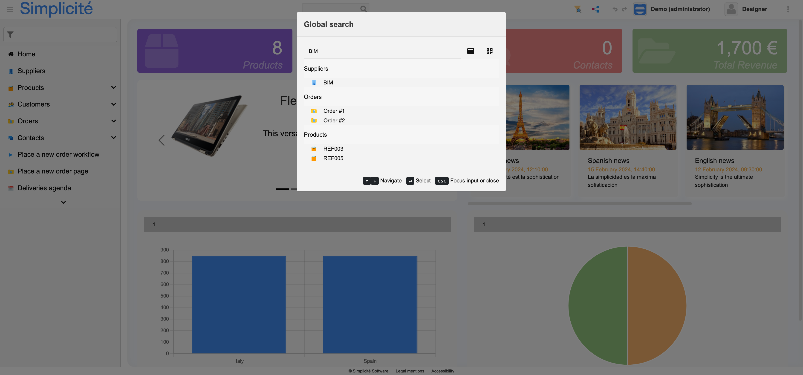

Version 7.0 release note
========================

:::danger[Warning]

This release note corresponds to the **future** first minor version of the **next** major version 7.

It is in **EARLY ALPHA** heavy development stage. It means it is **ABSOLUTELY not yet suitable for production**
nor just for development and testing.

This release note is also in its early redaction stage.

:::

Compatibility breaking changes
------------------------------

Among the reasons for this version to be the first minor version of a new **major** version are the changes
at the level of the underlying technical components:

- JVM level
- Tomcat version

### JVM related

The platform is now compiled at **JVM level 21** (vs 17 for previous major version 6 and 11 for previous major version 5).

There is no impact unless certain Java APIs, which have been deprecated for several versions and may have been removed
from the JVM, are used.

:::note

The `*-latest` Docker images have been built with JVM 21+ since major version 6 (JVM 25 for this major version 7).

Deprecated Java API usage should already have resulted in compilation warnings or errors within the platform; therefore,
the JVM level change at platform level should not have further impact.

:::

### Tomcat related

The target Tomcat version for major version 7 is now **Tomcat 11**.

Tomcat 11 uses Jakarta EE 11 instead of JEE 8, which was used in previous Simplicité version's Tomcat 9 target.
As a result, imports such as `javax.servlet.*` **must** be updated to `jakarta.servlet.*`.

Typically, the usage of these packages occurs in the following platform hooks: `customStartPage`, `customErrorResponse`, and `customAuth/customAuthPage`.

:::warning

For customized Docker images at the Tomcat level, note that version 7.x images use Tomcat 11, which may have slight differences
in configuration files compared to Tomcat 9 used previously. Review and adapt potential customizations of your Dockerfiles as necessary.

:::

### Third party components related

#### Server-side components

##### Removed libs

The following **outdated third party Java libs** have been **removed**:

- legacy Apache commons `commons-lang` library,
  note that the `commons-lang3` library is present since major version 5
- legacy Apache commons `commons-collections` library,
  note that the `commons-collections4` library is present since major version 5
- legacy Apache commons `commons-fileupload` library,
  note that the `commons-fileupload2-*` libraries are present since major version 5

:::tip

If these libraries are required and refactoring is not possible, they may be re-added as needed.

:::

##### Removed iText lib

As announced in the [version v6.2 release note](v6-2#deprecations) (and recalled in the [version v6.3 release note](v6-3#deprecations)):

- The legacy **iText** libraries have been removed and the associated helpers `PDFTool` and `PDFDocumentExternalObject`
  have been completely refactored to use the PDFBox libraries.
  Any code written for iText and/or with the help of the above helper classes **must** be rewritten accordingly.

##### Removed grant hooks

As announced in the [version v6.3 release note](v6-3#deprecations):

- All classes related to legacy grant hooks have been removed. Grant hooks have been deprecated since major version 5
  in favor of platform hooks, the refactoring of user session level logic to `PlatformHooks` should have already been done.

#### Removed system parameters

The following deprecated system parameters have been removed:

- `GOOGLE_FONT`, theme level fonts must be used instead

#### Client-side components

##### Librairies locations changes

The historical locations of Bootstrap libs have (finally) been changed.

This **may** have an impact only if included specifically using hardcoded paths (e.g. in a standalone external object page).

This should not be the case, as Java methods are provided to include these libraries properly without requiring knowledge
of their locations (see below).

:::tip

There is no reason to re-include these Bootstrap libs specifically within a custom component
of the **generic UI** because they are already included.

:::

The changed locations are:

- Bootstrap: `/scripts/jquery/bootstrap5/*` to `/scripts/bootstrap5/*`
  (the Java methods `HTMLTool.bootstrapJS/bootstrapCSS` should be used instead of hardcoded paths).
- Bootstrap date/datetime picker: `/scripts/jquery/bootstrap5-datetimepicker/*` to `/scripts/bootstrap5-datetimepicker/*`
  (the Java methods `HTMLTool.bootstrapDatetimePickerJS/bootstrapDatetimePickerCSS` should be used instead of hardcoded paths).

##### Removed GoogleMaps helper lib

As announced in the [version v6.3 release note](v6-3#deprecations):

The deprecated **GoogleMap** helper JS tool `gmap.js` has been removed. Custom code relying on this tool should be refactored
to use the **Leaflet** helper JS tool, which provides an abstraction layer over map service providers.

Note that existing GoogleMaps inclusion methods continue to include the GoogleMaps JS library,
but code relying on helper functions from `gmap.js` may require refactoring to use the GoogleMaps JS API directly.

##### Removed legacy ChartJS

- The legacy **ChartJS** version 2 has be removed, as is the support for legacy version 3 in the standard charts.
  The standard charts now use version 4 only. Any custom code written for legacy version 3 (or 2) should be refactored for version 4.

### Security-related

After several security audit it appears some of the highly recommended [security guidelines](/docs/security) are not always taken into account
in production which leads to unintentional potential risks.

Therefore it has been decided to change some elements to be more **secure by default**.

These changes requires some explicit configuration to get the same behavior as it was by default in previous versions.

#### Default value for security-related system parameters

The following system parameters have new default values:

- `USE_IO`: the default value is now `no` (no access to the I/O endpoint)
- `USE_IO_TESTER`: the default value is now `no` (no access to the I/O tester page)
- `USE_API_TESTER`: the default value is now `no` (no access to the API tester page)
- `HTTP_HEADER`: the default value now is the one indicated in the [security guidelines](/docs/security).
  This has an impact if you use JS scripts, CSS styles sheets, images, ... from external URLs.
  If so you should customize this system parameter (in particular the `Content-Security-Policy`) accordingly
  to your use case (see the description of the system parameter for the usual cases: GoogleFonts, OpenStreetMaps, ...).

:::tip[Reminder]

Any system parameter can be overridden by the corresponding environment variable `SIMPLICITE_<name of the system parameter>`.
They can also use `[ENV:<name of an environment variable>]` substitutions to be fully or partially overridden.

:::

#### God mode mode disabled by default

For security reasons the critical "god mode" feature (allowing to change user) is not only driven
by the `GOD_MODE_USER` system parameter (which can be overriden on a per user basis) but also can be
globally enabled/disabled by the `platform.godmode` JVM argument.

In previous versions this JVM argument **default value** was `true` (enabled), now it is `false` (disabled).

Therefore to enable this feature you **must** now explicitly set this JVM argument to `true`.

:::tip

In Docker images the value of this JVM argument can be set by the `GOD_MODE` environment variable.

:::

#### Development mode restrictions

Some additional features have been restricted to **development mode**:

- The `DBAccess` page is now only accessible when **in** development mode

As a reminder the development mode is driven by the `platform.devmode` JVM argument.

:::tip

In Docker images the value of this JVM argument can be set by the `DEV_MODE` environment variable.

:::

### Long text fields behavior vs truncation

- `FeatureFlag.TRUNCATE_TOO_LONG_TEXT` is set to `false` by default.
  - the UX/UI is not impacted because field inputs are already limited to the max size
  - but the API create/update will get an error if a data is too long (against data truncation in 6.3)

### UI constant `Simplicite` refactored as ES module

The new ES module `Simplicite` has been refactored to clean its root data. Now the `Simplicite` interface contains only:

- `Simplicite.Globals` contains now all global variables from back-end: application infos `ROOT`, `URL`, `FULL_VERSION`, `ENDPOINT`...
  and user's common properties `LOGIN`, `LANG`, etc.
- `Simplicite.Application` has been preserved (same as `$app`) to contain all model constants: `CONTEXT_*`,
  field `TYPE_*`, `TRUE`/`FALSE`, etc.
- `Simplicite.Ajax`: unchanged namespace of model layer with ajax services to `Session`, `Grant`, `BusinessObject`,
  `BusinessProcess`, etc.
- `Simplicite.UI`: unchanged namespace of UI layer, controllers and viewers
- `Simplicite.Diagram`: SVG diagram modeler

### Unsupported Ajax service call with a callback function

As announced in 6.3 release notes, the function callback as (first) parameter are no more supported in Ajax services.
Those functions **should** be moved in a `then` statement before upgrading to V7.

Example for a search service:

```javascript
// Wrong syntax: this callback won't be called and filters not applied correctly
obj.search(list => { ... }, filters);
// Good syntax with promise since V6
obj.search(filters).then(list => { ... });
```

### Linting configuration files changes

The configuration files of the various module code linting features have been renamed with an explicit extension
to reflect not only the actual content of these files but also the needs of current linters vs modern configuration syntaxes:

| Old name                    | New name                        |
|-----------------------------|---------------------------------|
| `.checkstyle-configuration` | `.checkstyle-configuration.xml` |
| `.jshint-configuration`     | `.jshint-configuration.json`    |
| `.eslint-configuration`     | `.eslint-configuration.mjs`     |
| `.stylelint-configuration`  | `.stylelint-configuration.mjs`  |

:::warning

The case of `.stylelint-configuration` is more than just an additional extension to the file name,
the content of the configuration was using the legacy JSON syntax, now it uses the modern JavaScript syntax.

:::

To migrate your existing module linting configurations (depending on your modules' settings not all are potentially present) you need to:

- **Rename** your Checkstyle configuration if present (e.g. `mv .checkstyle-configuration .checkstyle-configuration.xml`)
- **Rename** your JSHint configuration if present (e.g. `mv .jshint-configuration .jshint-configuration.json`)
- **Rename** your ESLint configuration if present (e.g. `mv .eslint-configuration .eslint-configuration.mjs`)
- **Refactor** as JavaScript your StyleLint configuration if present (e.g. `mv .stylelint-configuration .stylelint-configuration.mjs`)

**Alternatively** you can just commit your module so as the new configuration files are generated and compare your existing configuration files
to the newly generated ones (which also contains new rules). Once merged you can remove the old configuration files.

### jClouds OpenStack Swift

The OpenStack Swift protocol is not supported anymore, the related the related methods in the `CloudStorageTool` helper class
and the corresponding Apache jClouds lib (Maven ID: `org.apache.jclouds.api:openstack-swift`) have been removed.

If you still need it you can re-add the library specifically and re-implement the calls using the API of this lib.

Deprecations
------------

### JVM level

All JVM core APIs marked as deprecated since version 17 **should** be refactored to prevent future potential
JVM-level compatibility issues (see above).

### TinyMCE

The UI will now use the open-source **Quill** component instead of TinyMCE (see below).

:::note

The TinyMCE libs (v6) will be kept in this minor version 7.0 of the platform, but they **will be removed** in next minor version 7.1.

If you have some custom UI components using directly TinyMCE you should refactor them to use Quill or use the abstraction layer of the UI API.

:::

Features
--------

### Clipboard-able fields

Added a "Copy to Clipboard" setting for _Long Text_ and _HTML Content_ fields.
Click the **clipboard** icon next to these fields to copy their visible content.

### Manual API tokens

An action has been added to manually create an API token for predefined durations.

:::tip

This action is implemented at the `SimpleUser` level and thus can be granted to any inherited objet of this low level user object.
It is by default granted to administrator profiles on the `User` system object.

:::

Enhancements
------------

### Mentioned notification

A mentioned user (@user) will receive a notification (`SocialPostMention` notification) when a post is created.

:::note

Notification channels / content can be overridden via User interaction > Notifications > Notifications > SocialPostMention.

:::

### Flatpicker datetime picker

Date-time picker has been replaced by [flatpickr](https://flatpickr.js.org):

- previous one can be loaded but is deprecated
- `flatpickr` supports dark/light themes with many features: pick a period, or several dates/times, exclude dates, show 2 months...
- plugins have been added to show buttons (today/now, reset, close), and to pick a year or a month directly
  according to the field rendering,
- manage focus and toggle button for accessibility, arrow keys to change day (+ctrl to change month/year), enter/esc,
- `flatpickr(input, options)` can be used directly in specific input/component
- and the API `UIFieldDatetime.datePicker` to get an input group with a date-picker is still compatible with previous implementation:

```javascript
/**
 * Get a datepicker input-group
 * @param ctn optional container to append the picker (default is the input-group)
 * @param options options
 * @param options.input optional input element (create one if not specified)
 * @param options.type $ui.TYPE_DATE (default) or $ui.TYPE_DATETIME or $ui.TYPE_TIME
 * @param options.rendering optional field rendering
 * @param options.autoopen true to open the picker on click
 * @param options.clear true to add a clear button
 * @returns input group with input and buttons
 * @function
 */
UIFieldDatetime.datePicker(ctn: Container | null, options?: {
		input?: JQuery,
		type?: number,
		rendering?: string,
		autoopen?: boolean,
		clear?: boolean
	}): JQuery;
```

### Global search UI

Refresh of the global search UI



Maker Experience
----------------

### Source file search

Integrated a search bar in the code editor to find a specific source file


Technical
----------

### Quill editor

The `TinyMCE` HTML editor has been replaced by [Quill](https://quilljs.com)

- With new `$ui.options.quillOptions` to define the default toolbar, with the theme `snow`
- `$ui.options.tinymceOptions` and the loader `$ui.loadTinyMCE()` still load the `TinyMCE V6`, but they are now deprecated
  and no more used by the generic UI.


Basic usage in your UI component (external object, hooks...):

```javascript
$factory.Quill().then(Quill => {
  // Set value with DOM content
  const div = $("#mydiv").empty();
	const quill = new Quill(div[0], { theme: 'snow' });
	const delta = quill.clipboard.convert({ html: "<p>Hello world</p>" });
	quill.updateContents(delta, "silent");
  div.data("quill", quill); // attach the quill instance for further usage
});

// ... and later to get HTML from editor
const html = $("#mydiv").data("quill").getSemanticHTML();
```

### JDBC drivers location

The JDBC drivers JAR are now located in the webapp's `WEB-INF/lib` along with other 3rd party libs.

They have therefore been removed from the pre-configured Tomcat 11 package used on the SIM servers
and embedded in our standard Docker images.

### Optional importspec version

The `version` attribute can now be omitted to avoid version check. If the attribute is absent the import is processed regardless
of the current version of the module if already imported.

This can be useful, for instance, to force the re-import of a module.

### Git tag importspec

When the import specification of a module uses a Git repository the `version` attribute (if set) is now used to find a Git tag:

- if the Git tag specified on the `version` attribute is found, the import is done on the tag
  (note that the cloned Git repository is then in **"detached HEAD" state** on which no commit, push or pull is possible,
  you can still delete it if needed).
- if the Git tag specified on the `version` attribute is not found in the repository, an error is raised
- if no `version` attribute is specified, the repository is checked out on the head

### External objects HTTP headers

It is now possible to add custom HTTP headers to the external objet's response
(the related methods are `addHTTPHeaders`, `removeHTTPHeaders` and `getHTTPHeaders`).

Note that these headers are added after the platform sets the content type &nd cache-related headers,
so only set such headers as custom headers if you know exactly what you are doing.

### JSON schema tools improvements

The `JSONSchemaTool` JSON schema helper class now has a constructor with an explicit JSON schema version argument (`VERSION_*` constants).
The **default** constructor now uses by default the _Draft v7_  JSON schema version

### Custom build artifacts

By setting a `custom` flag to `true` in a module's configuration (in the `maven` block), its Maven's `pom.xml` (and Gradle's `*.gradle`) artifacts are
preserved instead of being regenerated at each commit (these files are still generated but with a `.default` extension).

This allows customization of these files such as adding plugins, reports, etc.

Adding Java dependencies is also possible (and useful to compile outside of Simplicité)
This requires that the concerned dependencies have been added to the platform, typically by following [this procedure](/docs/operation/docker/#adddependencies)
(adding the dependencies in these files does not add them to the platform).

The `README.md` is also now preserved, the module's documentation is now generated as `<module name>.md`.

### Well known endpoints

The `/.well-known` base URI now provides authentication-related standard ("well known") endpoints:

- `openid-configuration`/`oauth-authorization-server` OpenIDConnect/OAuth2 provider configuration metadata
  (note that by default the exposed provider is the internal one but you can set another one by adding the `"default": true`
  setting to any of your OpenIDConnect/OAuth2 providers)
- `oauth-protected-resource` OpenIDConnect/OAuth2 protected resource metadata

### Docx4j libs in light variant

The "light" variant now includes the Docx4j Java libs.

### Improved REST mapped API

The REST mapped API has now an **experimental** support for permalink-like unique keys instead of row IDs.

:::warning

At that stage the only permalink expressions compatible with REST mapped API are 1-level URI like `/<mapped object name>-<permalink expressions>`
where `<permalink expression>` can be `[USERKEY]` or a combination of `[VALUE:<field name>]` and dashed `-`.

:::

### Dedicated code editor object instances

The UI code editor now uses dedicated object instances (instead of temporary instances before), this prevents some potential deadlock cases.
